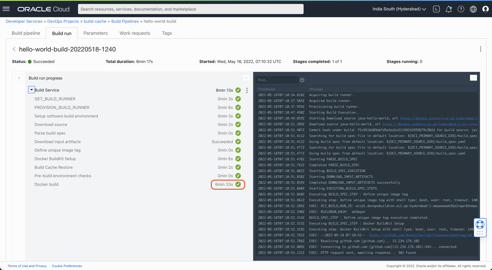
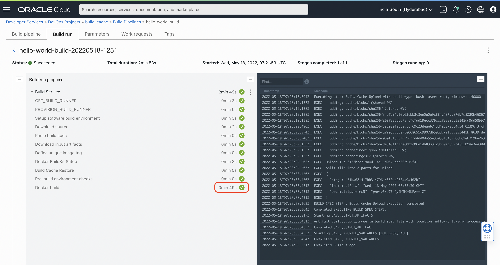

# OCI DevOps - Speed up builds with caching

Most of the time the build time is consumed in downloading or preparing certain build dependancies like maven dependencies, node_modules, pip dependancies, etc... This document talks about on how to reduce time by caching those dependencies for the subsequent runs. 

In this way, the first run would take full time to download and setup build dependancies. But the subsequent runs will be more efficient through the cache.

For this, sample java maven-based application is used to demonstrate build caching.

### Prerequisites/Assumptions
* Assumed you are already familiar with OCI DevOps. Please refer [Documentation](https://www.oracle.com/devops/devops-service/)
* To know how to run the this maven project in your local. Please refer [this](./SETUP-PROJECT.md)
* Assumed that you are using docker build inside your `build_spec.yaml`

### Overview of Changes
For any project, you may tweek `build_spec.yaml` to enable build cache.

#### Step 1:
Docker BuildKit is installed to enable few advanced docker build commands for caching.
```
  - type: Command
    name: "Docker BuildKit Setup"
    timeoutInSeconds: 140
    command: |
      wget https://github.com/docker/buildx/releases/download/v0.8.2/buildx-v0.8.2.linux-amd64 -O docker-buildx
      mkdir -p ~/.docker/cli-plugins
      mv docker-buildx ~/.docker/cli-plugins/
      chmod +x ~/.docker/cli-plugins/docker-buildx
      docker buildx install
```
#### Step 2
`Build Cache Restore` stage is used to download the pre-uploaded cache from OCI Object Storage.

```
  - type: Command
    name: "Build Cache Restore"
    timeoutInSeconds: 140
    command: |
      oci os object get --bucket-name build-cache --file ${BUILD_CACHE_OS_FILE_NAME} --name ${BUILD_CACHE_OS_FILE_NAME} && unzip ${BUILD_CACHE_OS_FILE_NAME}
      echo "Done..."
```

#### Step 3
In actual build stage, below comands are used in the place of regular `docker build`.
```
  - type: Command
    name: "Docker build"
    command: |
      export DOCKER_BUILDKIT=1
      export DOCKER_CLI_EXPERIMENTAL=enabled
      docker buildx create --use
      docker buildx build -t="hello-world-java" --cache-from=type=local,src=./cache --cache-to=type=local,dest=./cache --load .
      echo "DONE"
```

#### Step 4
`Build Cache Upload` stage is added to collect the generated build cache and upload to OCI Object Storage bucket. This is used for subsequent builds.

```
  - type: Command
    name: "Build Cache Upload"
    timeoutInSeconds: 140
    command: |
      rm ${BUILD_CACHE_OS_FILE_NAME} && zip -r ${BUILD_CACHE_OS_FILE_NAME} cache/*
      oci os object put --bucket-name build-cache --file ${BUILD_CACHE_OS_FILE_NAME} --force
```

### Results

#### Before OCI Build Cache


#### After OCI Build Cache


### Contributors 

- Author : Ashok CM
- Collaborators : NA
- Last release : May 2022

