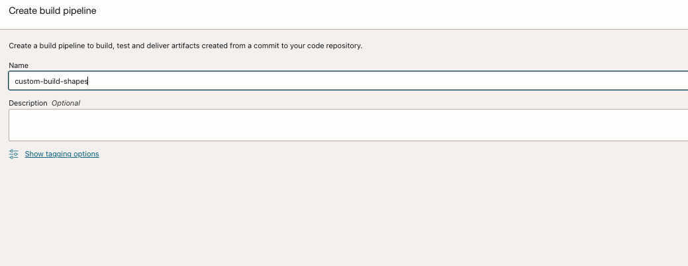
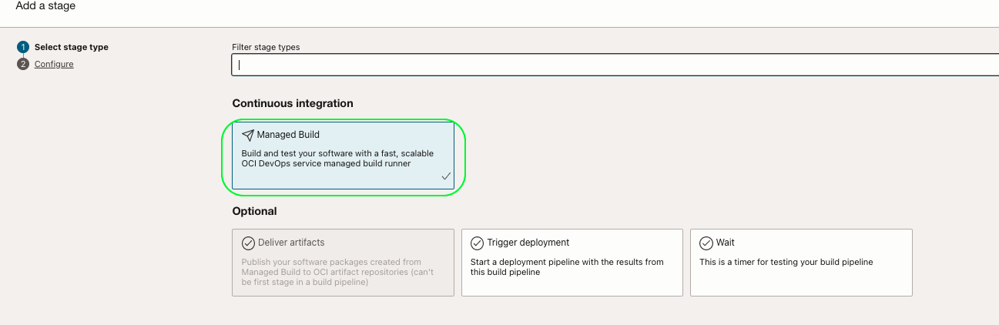
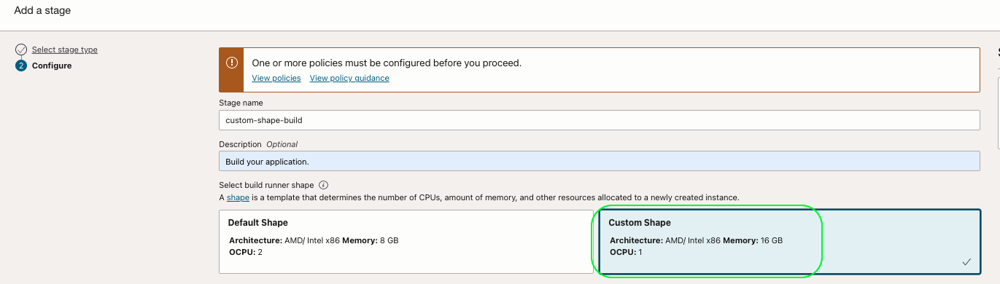
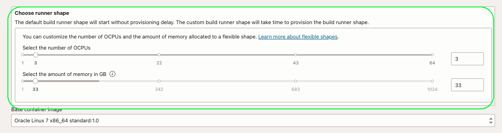
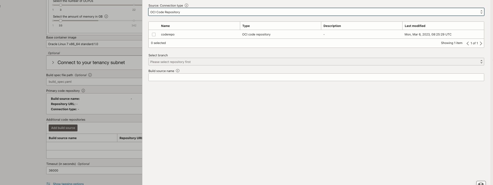
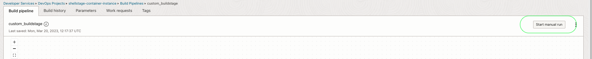
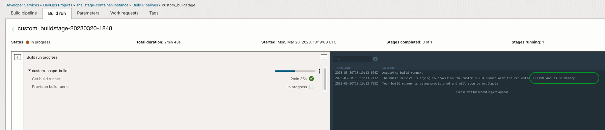

# A sample to use `Custom Shapes` within OCI Build pipelines.

The feature enables developers to select their preferred CPU and memory for their managed build stage.

   ```
   $ git init oci-build-custom-shapes
   $ cd oci-build-custom-shapes
   $ git remote add origin <url to this git repo>
   $ git config core. sparse checkout true
   $ echo "oci-build-examples/oci-build-custom-shapes/*">>.git/info/sparse-checkout
   $ git pull --depth=1 origin main

   ```

Procedure to use the illustration
-------

- Create OCI Notifications topic - https://docs.oracle.com/en-us/iaas/Content/Notification/Tasks/create-topic.htm#top
- Create OCI DevOps projects and associate with the topic - https://docs.oracle.com/en-us/iaas/Content/devops/using/create_project.htm#create_a_project
- Enables logs for the DevOps project.
- Create a dynamic group with the below rules.
```java
ALL {resource.type = 'devopsbuildpipeline', resource.compartment.id = 'OCID OF YOUR COMPARTMENT'}
```
- Create an identity policy with the below statements.
```java
Allow dynamic-group <NAME OF THE DYNAMIC GROUP> to manage ons-topics in compartment <NAME OF THE COMPARTMENT>
```
- Create an `OCI Code repo`
- Push the whole contents here to the OCI CODE REPO created.
- Create a build pipeline.
  

- Use `+` and add a `custom managed build stage`.
  

- Select `custom shape`
  

- Choose runner shapes `OCPUs` and `Memory` using the slide bars.
  

- Associate the code repo as the `primary source code` for the stage.



- Click `Add`
- Click the `Start manual run` option and run a build stage.



The custom build shape option will create a build runner with the desired OCPU and Memory and start the build run. The concerned resources are managed by building service internally and are not visible to customer tenancy. Based on the resource using the concerned price will be charged back to the user.



- The build will continue and display some of the default values from the build runner machine.
- Along with the custom shape option, the default build runner option will be retained for use cases that can fix within the defined resources.

Read more
---

- OCI DevOps service - https://docs.oracle.com/en-us/iaas/Content/devops/using/home.htm
- Details about OCI Anomaly detection and workshop -.

- There are reference samples available within the directory [ai-data-references](ai-data-references) to set up the anomaly detection project /model and run execution using [OCI CLI](https://apexapps.oracle.com/pls/apex/r/dbpm/livelabs/run-workshop?p210_wid=819&p210_wec=&session=107963899615339).

Contributors
===========

- Author: [Rahul M R](https://github.com/RahulMR42).
- Collaborators:
- Last release: March 2023

### Back to examples.
----

- 🍿 [Back to OCI Devops Build sample](./../README.md)
- 🏝️ [Back to OCI Devops sample](./../../README.md)

