A way (workaround) to execute commands on to a Windows machine using OCI Run command agent from OCI Build Pipeline
------


Objective
---
- Create an OCI DevOps build pipeline.
- Create a windows host and enable compute run agent.
- Execute commands on Windows hosts and fetch the result.

   ```
   $ git init oci-devops-connect-to-windows-from-buildmachines
   $ cd oci-devops-connect-to-windows-from-buildmachines
   $ git remote add origin <url to this git repo>
   $ git config core.sparsecheckout true
   $ echo "oci-build-examples/oci-devops-connect-to-windows-from-buildmachines/*">>.git/info/sparse-checkout
   $ git pull --depth=1 origin main

   ```

Audience: OCI Advanced users.

Procedure to use the illustration
-------

### Compute instance.

- Create an OCI Compute instance with Windows operating system.

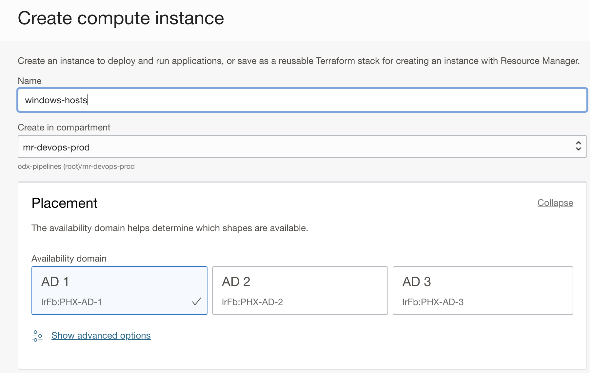

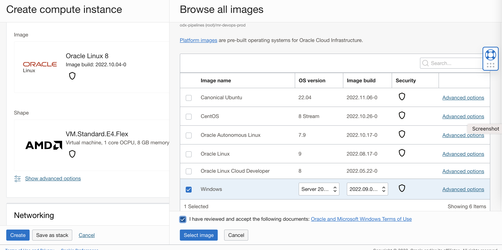

- Provide `VCN`, and `Subnet` information. A public IP address is optional, as we will be using the `OCI Run command agent` it does not need a public IP address for the connection.

- Ensure that the `Compute Instance Run command` agent is enabled.

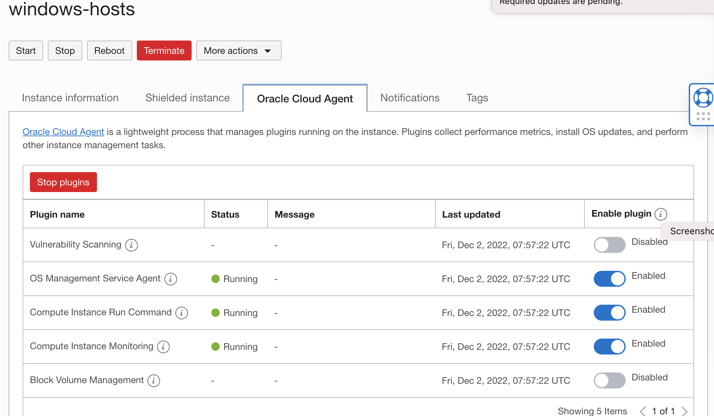

### OCI identity setup.

- Create a dynamic group for computing instance/s with the below rule.
```java
All {instance.compartment.id = 'OCID OF WINDOWS HOST'}
```
- Create a dynamic group for the DevOps build pipeline with the below rule.

```java
ALL {resource.type = 'devopsbuildpipeline', resource.compartment.id = 'OCID OF OCI COMPARTMENT'}
```

- Create the below identity policies.
```java
Allow dynamic-group <NAME OF THE DG FOR BUILD PIPELINE> to manage objects in compartment <NAME OF THE COMPARTMENT>
        
Allow dynamic-group <NAME OF THE DG FOR BUILD PIPELINE> to manage ons-topics in compartment <NAME OF THE COMPARTMENT>
        
Allow dynamic-group <NAME OF THE DG FOR BUILD PIPELINE> ons-topics in compartment <NAME OF THE COMPARTMENT>

Allow dynamic-group <NAME OF THE DG FOR BUILD PIPELINE> to use instance-agent-family in compartment <NAME OF THE COMPARTMENT>
        
Allow dynamic-group <NAME OF THE DG FOR COMPUTE INSTANCES> to use instance-agent-family in compartment <NAME OF THE COMPARTMENT>
        
Allow dynamic group <NAME OF THE DG FOR COMPUTE INSTANCES> to manage objects in compartment <NAME OF THE COMPARTMENT>

```

### Object Storage.

- Create an `object storage bucket.

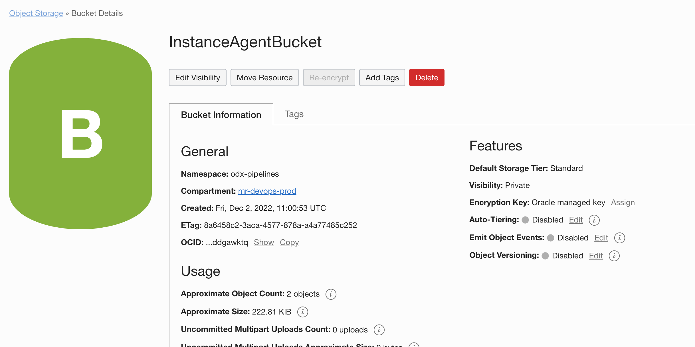


### OCI DevOps.
- Create an OCI notification topic - https://docs.oracle.com/en-us/iaas/Content/Notification/Tasks/managingtopicsandsubscriptions.htm#createTopic

- Create a DevOps project - https://docs.oracle.com/en-us/iaas/Content/devops/using/create_project.htm#create_a_project

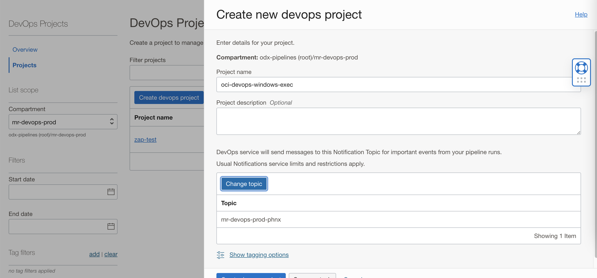

- Enable logging for the DevOps project.


Click on Code Repository within the DevOps project resource and click on `Create repository. - https://docs.oracle.com/en-us/iaas/Content/devops/using/create_repo.htm

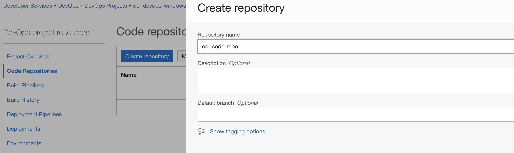

- Using the `ssh` or `https` method and push the whole content to the OCI Code repo - refer to details here - https://docs.oracle.com/en-us/iaas/Content/devops/using/clone_repo.htm

- Click on Build pipelines within DevOps project resources and click on Create build pipeline- https://docs.oracle.com/en-us/iaas/Content/devops/using/managing_build_pipelines.htm

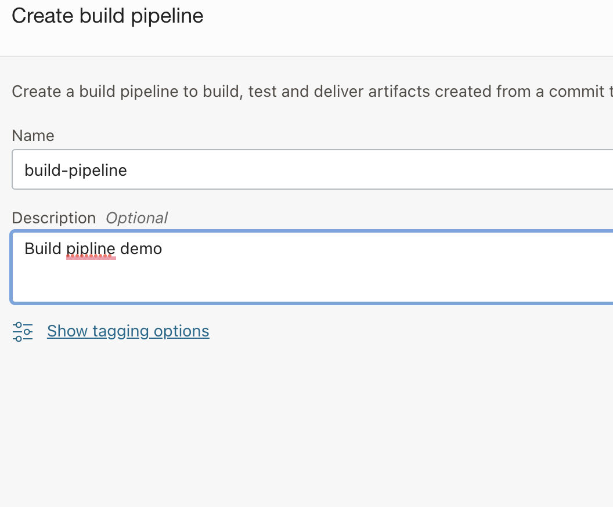

- Use `+` and add a stage.

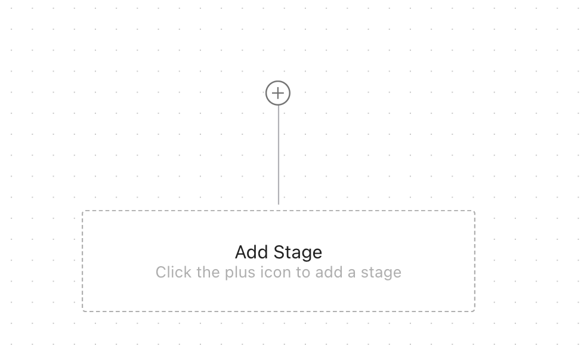

- Add a `Managed Build stage`.

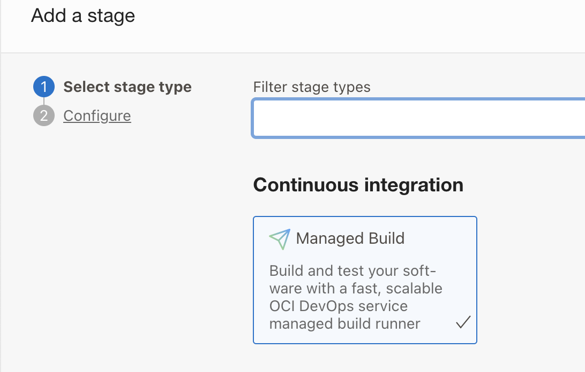

- Provide the details and connect to the `OCI Code repo` as the primary source name.

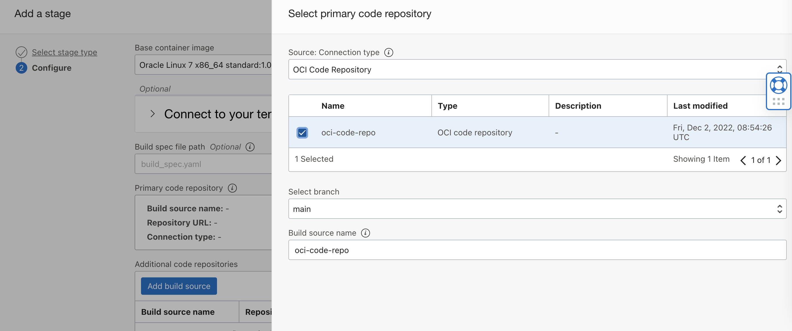

- Click `Add`.

- Add below `Build parameters` and actual values.

```java
- OBJECTSTORAGE_NAMESPACE: OBJECT STORAGE NAMESPACE
- OBJECTSTORAGE_BUCKET: OBJECT BUCKET NAME
- INSTANCE_OCID : COMPUTE INSTANCE(WINDOWS) OCID
- OCI_REGION : OCI Region identifier
```

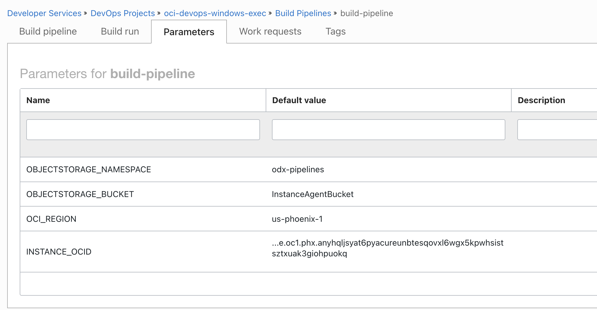


### Validate the execution.

- Within the `Build pipeline` click `Start manual run`

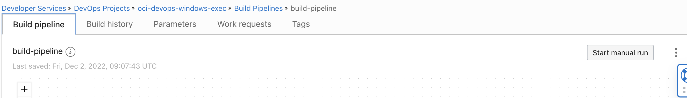

- Wait for all the steps to finish.

- Validate the execution via build logs.
- Verify the input and output file via object storage.
  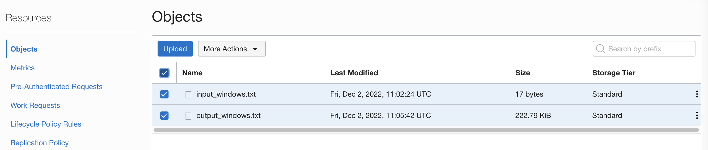
- Verify the run command execution status via the instance `run command` option.
  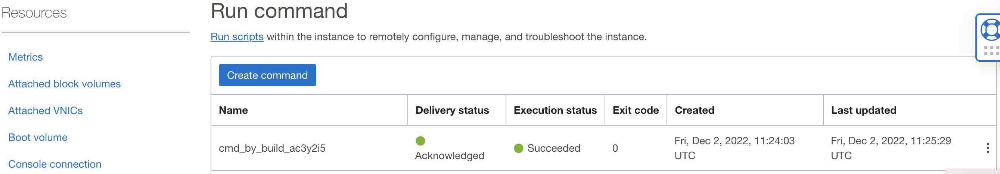
- For any error during the execution you may do a trial run of `run command` against the compute instance from OCI Compute console view, validate the policies and groups and verify the build parameter
- The `TIMEOUT_IN_SECONDS` value within build_spec.yaml file for the compute run command agent invoke is  based on samples here, please update accordingly


Read more
---

- OCI DevOps service - https://docs.oracle.com/en-us/iaas/Content/devops/using/home.htm
- OCI Compute run command agent - https://docs.oracle.com/en-us/iaas/Content/Compute/Tasks/runningcommands.htm

Contributors
===========

- Author: [Rahul M R](https://github.com/RahulMR42).
- Collaborators:
- Last release: December 2022

### Back to examples.
----

- 🍿 [Back to OCI Devops Build sample](./../README.md)
- 🏝️ [Back to OCI Devops sample](./../../README.md)

