# Access resource with Private IP from OCI Build runner

This sample shows how to access resources which are with private IP addresses from an OCI Build runner.

## Accessing Private Virtual Network from Build runner

- You can access self-hosted repositories (GitLab Server and Bitbucket Server) with private IP from the Managed Build stage. With the private access configuration, you can write commands in the build specification file to access the private endpoints in your Virtual Cloud Network (VCN). During the build, the service-managed build runner facilitates the connection from the build stage to your tenancy subnet. Using FastConnect or other IPSec VPN peering solutions, you can also create a connection to access your on-premises code repository from an OCI DevOps build runner.

## Specific instruction to clone only this example.

   ```
   $ git init oci-devops-pa-with-private-oke
   $ cd oci-devops-pa-with-private-oke
   $ git remote add origin <url to this git repo>
   $ git config core. sparsecheckout true
   $ echo "oci-build-examples/oci-devops-pa-with-private-oke/*">>.git/info/sparse-checkout
   $ git pull --depth=1 origin main

   ```

## Objectives

- Create an [Container Engine for Kubernetes (OKE)](https://docs.oracle.com/en-us/iaas/Content/ContEng/home.htm)
- Associate OCI DevOps Build runner via Private Access endpoints.
- Test and validate the access


## Procedure to use this illustration.

###OCI Notifications
- Create an OCI notification topic - https://docs.oracle.com/en-us/iaas/Content/Notification/Tasks/managingtopicsandsubscriptions.htm#createTopic

### OCI Container Engine for Kubernetes (OKE)
- Create  Container Engine for Kubernetes (OKE) Cluster using Quick workflow - https://docs.oracle.com/en-us/iaas/Content/ContEng/Tasks/contengcreatingclusterusingoke_topic-Using_the_Console_to_create_a_Quick_Cluster_with_Default_Settings.htm#create-quick-cluster

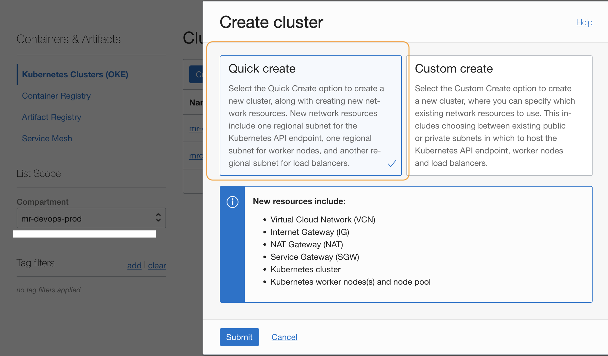

- Select `Private endpoints` and `Private workers`.


- Make a note of OKE's Cluster Id.

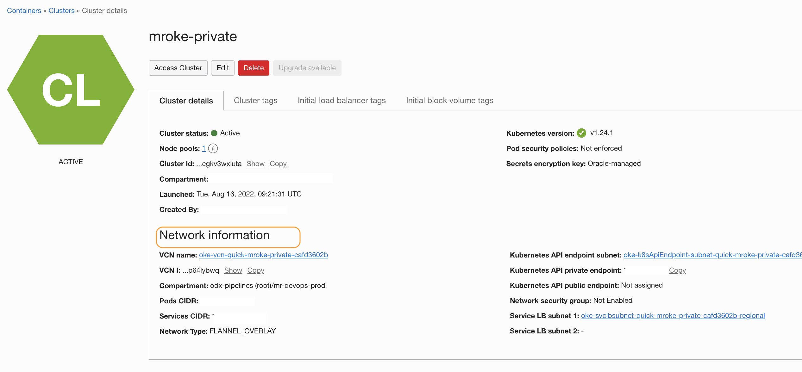

💡Specific note on the network setup
- When you build OKE via wizard it will set up necessary VCN, subnet, gateways, route tables etc.
- But if you are using custom workflow for OKE or connection for any other resources from build runner, ensure to set up NAT or Service gateway accordingly.
- When using with a Private access endpoint, the Build runner instance is considered as a private instance in your VCN during the network setup. Using only an internet gateway does not allow egress to the internet from a private subnet. Therefore, the VCN must have a Network Address Translation (NAT) gateway or service gateway with routing rules to forward traffic configured in the routing table for the private access configuration to succeed in the Managed Build stage.

### Validate VCN

- As we have used the `Quick workflow`, it has created the VCN and necessary details.
- From `OKE details` identify `VCN Name` and click on the link.


- There will be 3 subnets, one for endpoint, one for the load balancer and another one for nodes.


- Check the `Route tables` and check the `Route Table` for private subnets. There will be a `NAT Gateway` for access to the internet and a `Service Gateway` to access the OCI services.

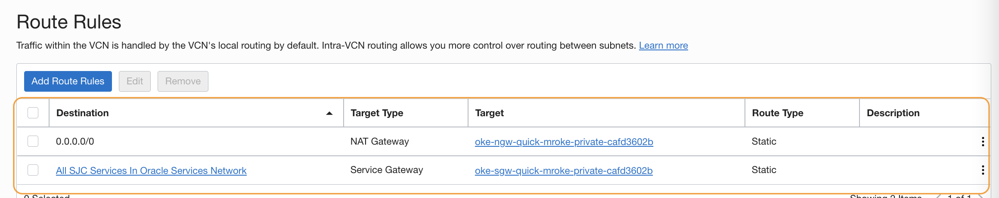

### OCI DevOps.

- Create a DevOps project - https://docs.oracle.com/en-us/iaas/Content/devops/using/create_project.htm#create_a_project.
  Associate with the notification topic.

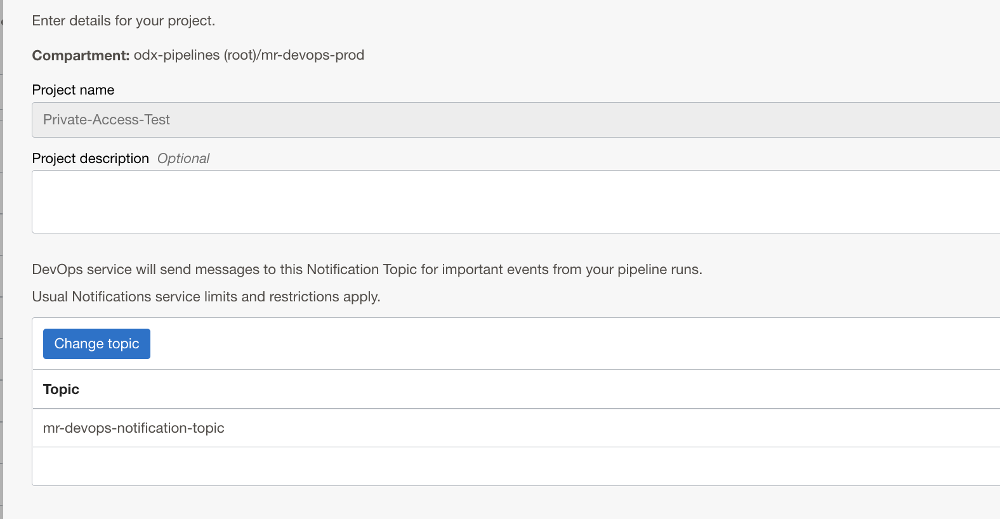

- Ensure to enable the logs for the DevOps project.

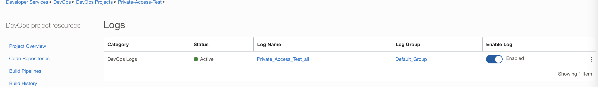

- Create an OCI code repo - https://docs.oracle.com/en-us/iaas/Content/devops/using/create_repo.htm#create_repo and push this content to the repo.

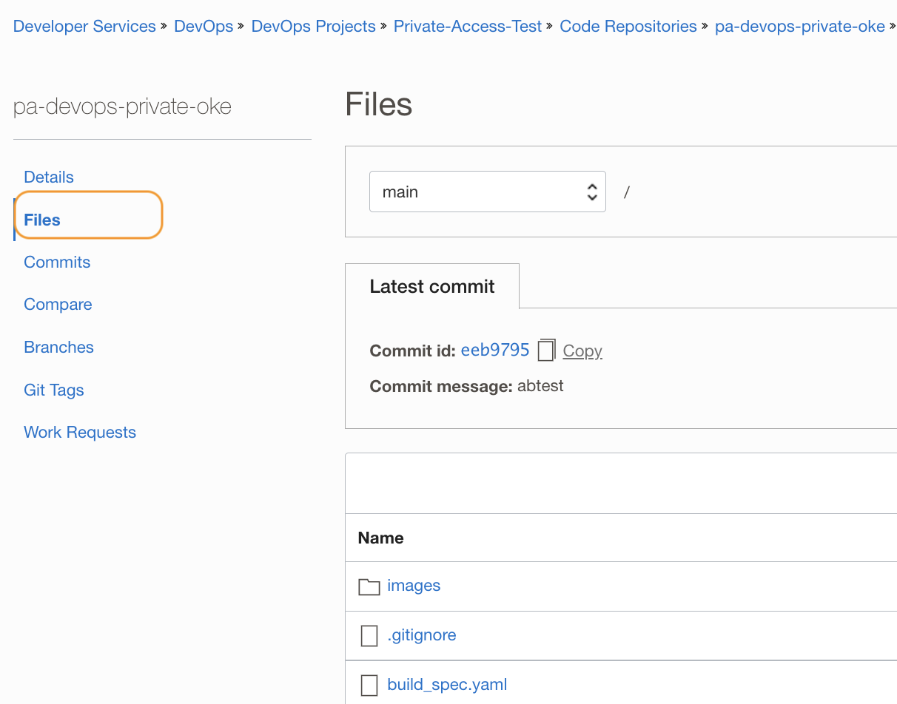

- Create an OCI Build pipeline - https://docs.oracle.com/en-us/iaas/Content/devops/using/create_buildpipeline.htm

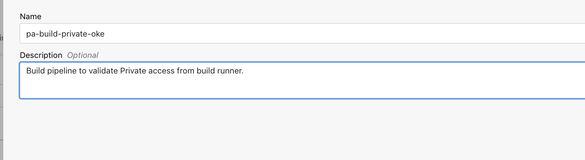

- Add the below parameters to the build pipeline with proper values.

  - KUBECTL_VERSION - Version of the kubectl to be used - https://kubernetes.io/releases/,Example:1.24.0
  - OCI_OKE_OCID - Cluster ID of the OKE, Example: ocid1.cluster.oc1.us-sanjose-1.xx
  - OCI_REGION - OCI Region, Example: us-sanjose-1

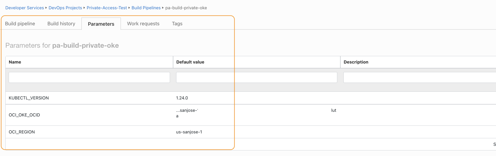


- Use the `+` and add a `Managed Build` stage.

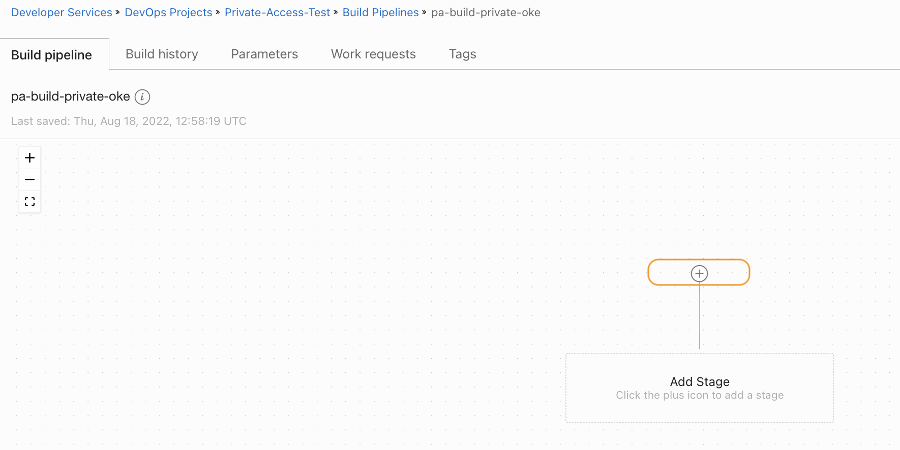

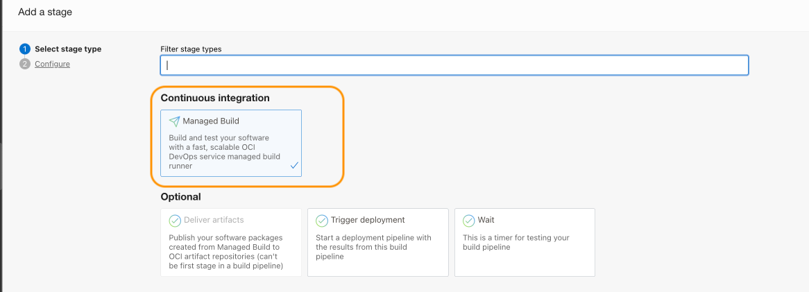

- Provide a `Stage name` and `Stage description(Optional)`.

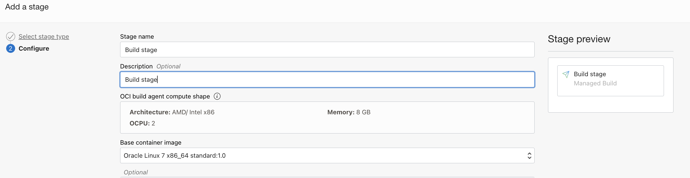

- Click on `Connect to your tenancy subnet`
- Select the VCN same as that of our private OKE.
- Select oke-node subnet.

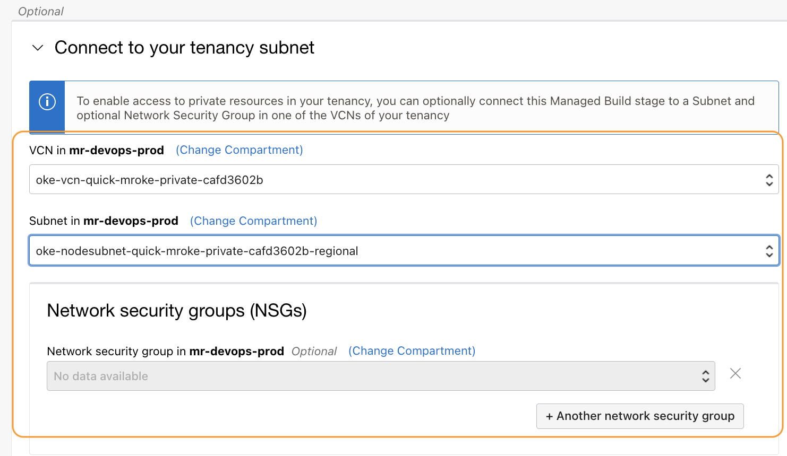

- Click `Select` under `Primary code repository` and select the code repo of type `OCI Code Repository` created.

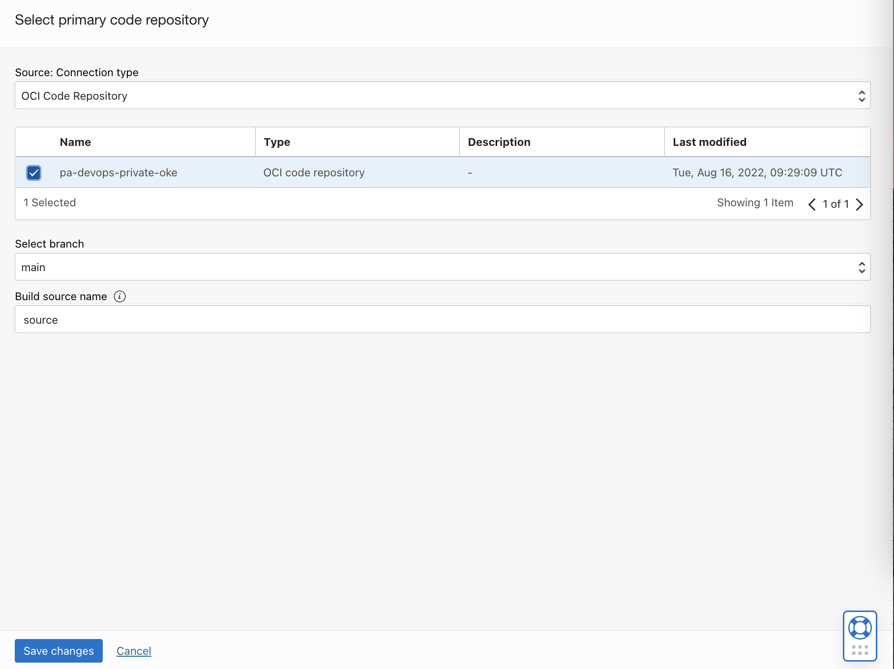

- Click `Add`


- Here the `Focus` is on accessing private IP-based resources from the build pipeline, to do so we are using sample kubectl actions, but the same can be extended as a full pipeline with other stages and connected to the deployment pipeline as well.

### Let's test

- Within the build pipeline, click `Start manual run` and start the pipeline.

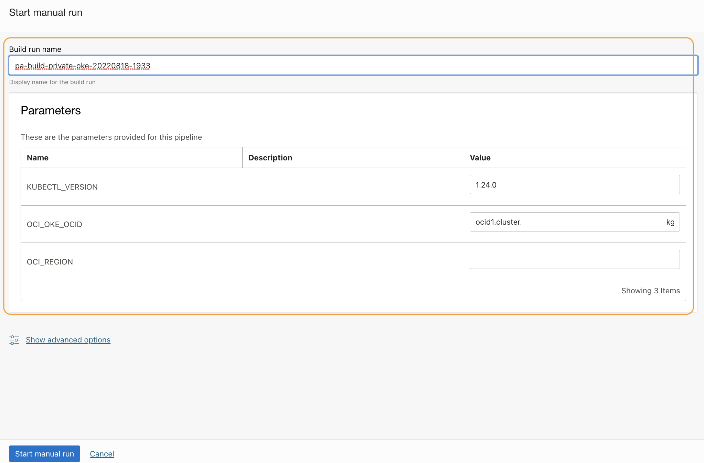

-Wait for all the steps to complete.

- View the build execution logs and validate the access.

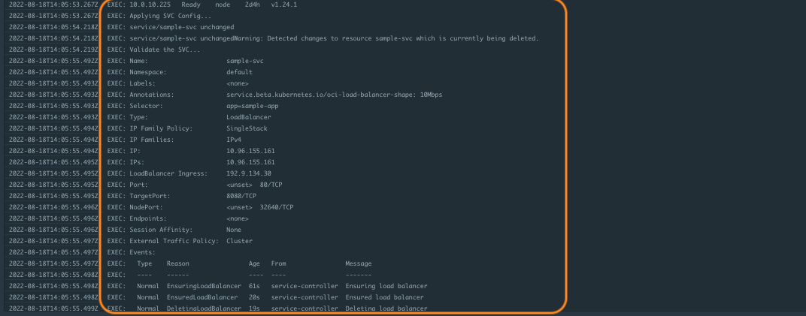

References
==========

- Oracle Cloud Infrastructure DevOps - https://docs.oracle.com/en-us/iaas/Content/devops/using/home.htm


Contributors
===========

- Author: [Rahul M R](https://github.com/RahulMR42).
- Collaborators: NA
- Last release: August 2022

### Back to examples.
----

- 🍿 [Back to OCI DevOps Build sample](./../README.md)
- 🏝️ [Back to OCI DevOps sample](./../../README.md)


