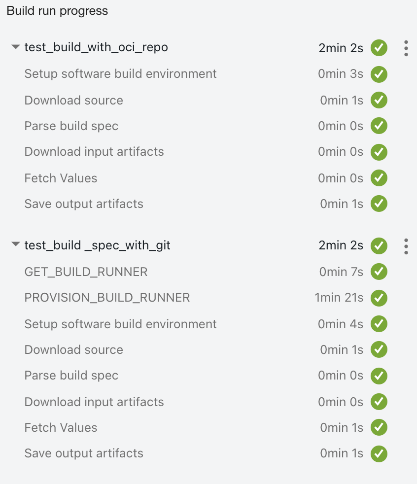
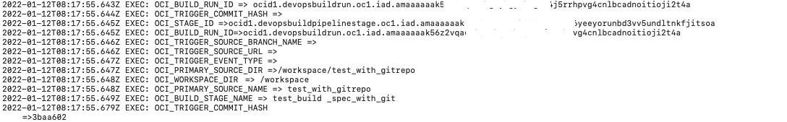
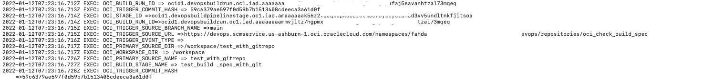
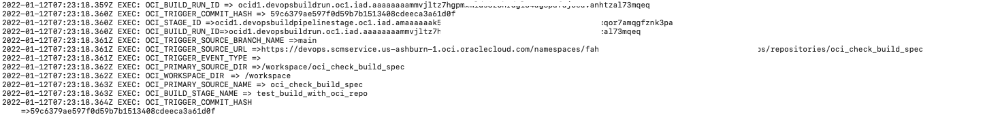

## Sample illustration to user OCI DevOps Build pipeline's predefined system variables.


## Predefined System Variables (of OCI Build pipeline stage)

DevOps provides a set of predefined system variables with default values that you can use like environment variables in the build specification. These values are available within DevOps managed build stages and can expose to other stages via an explicit export of the variables.
You need to export these values with another variable name which is following below patters.

```markdown
Parameter name can only consist of ASCII letter, digit or '_' (underscore) characters and not start with an oci (case-insensitive) prefix
```

System Variables | Description | 
--- | --- | 
OCI_STAGE_ID | The OCID of the current stage. | 
OCI_PIPELINE_ID|The OCID of the current build pipeline.|
OCI_BUILD_RUN_ID|The OCID of the current build run.|
OCI_TRIGGER_COMMIT_HASH|Commit hash of the current trigger.|
OCI_TRIGGER_SOURCE_BRANCH_NAME|Branch that triggers the build.|
OCI_TRIGGER_SOURCE_URL|Repository URL that triggered the build|
OCI_TRIGGER_EVENT_TYPE|Trigger that started the event.|
OCI_PRIMARY_SOURCE_DIR|Default working directory of the build (primary source working directory).|
OCI_WORKSPACE_DIR|Working directory value. Contains /workspace as the default value.|
${OCI_WORKSPACE_DIR}/<source-name>|Build source directory path."source-name" is the name of the build source given by the user while creating the Build stage.|
OCI_BUILD_STAGE_NAME|Build stage name.|
OCI_PRIMARY_SOURCE_NAME|Primary build source name.|
OCI_PRIMARY_SOURCE_COMMIT_HASH|Primary build source commit hash used in the current build run.|
OCI_PRIMARY_SOURCE_SOURCE_URL|Primary build source URL.|
OCI_PRIMARY_SOURCE_SOURCE_BRANCH_NAME| Primary build source branch used in the current build run.|

Reference - https://docs.oracle.com/en-us/iaas/Content/devops/using/build_specs.htm

### Procedure to use the sample.

- Clone the sample illustrations.
 ```
   $ git init oci_build_parameters
   $ cd oci_imagescan_before_deploy
   $ git remote add origin <url to this git repo>
   $ git config core. sparsecheckout true
   $ echo "oci-build-examples/oci_build_parameters/*">>.git/info/sparse-checkout
   $ git pull --depth=1 origin main

   ```
- Create a DevOps project - https://docs.oracle.com/en-us/iaas/Content/devops/using/create_project.htm
- Create an OCI Code repo - https://docs.oracle.com/en-us/iaas/Content/devops/using/create_repo.htm
- Create a build pipeline - https://docs.oracle.com/en-us/iaas/Content/devops/using/create_buildpipeline.htm
- Push these samples to the OCI Code repo.
- Add a `Managed Build stage` to the build pipeline - https://docs.oracle.com/en-us/iaas/Content/devops/using/add_buildstage.htm
- Run the build pipeline and verify the values.
- You may use these values by defining an external repo (Github/Gitlab or Bitbucket) and validate the executions too - https://docs.oracle.com/en-us/iaas/Content/devops/using/create_connection.htm

Sample output

 ----


#### Build Stage View (With a combination of OCI Code repo and Github.com repo)




#### Build logs for manual execution of build stage with OCI Code repo.




#### Build logs for an automated execution with a `Trigger`.

- using Github Repo



- using OCI Code Repo



Contributors
===========

- Author: Rahul M R.
- Collaborators: NA
- Last release: June 2022

### Back to examples.
----

- 🍿 [Back to OCI DevOps Build sample](./../README.md)
- 🏝️ [Back to OCI Devops sample](./../../README.md)

