A sample illustation of integrating [OCI Devops](https://docs.oracle.com/en-us/iaas/Content/devops/using/home.htm) with [Sonarqube](https://www.sonarqube.org/) to assess the code quality and security.

-------


🪄 Objective .
====


-  Build a sample OCI build pipeline.
-  Integrate with Sonarqube.
-  Validate the integration.

🖨️ How to use it .
=======


1. OCI Devops Setup

----

- Create an OCI Devops Project  - https://docs.oracle.com/en-us/iaas/Content/devops/using/devops_projects.htm 

* Create an OCI Build pipeline.

    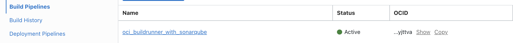

* Create an `OCI Vault`,the same will be used to store the credentials for external code repo connection if any and sonar sensitive attributes.

  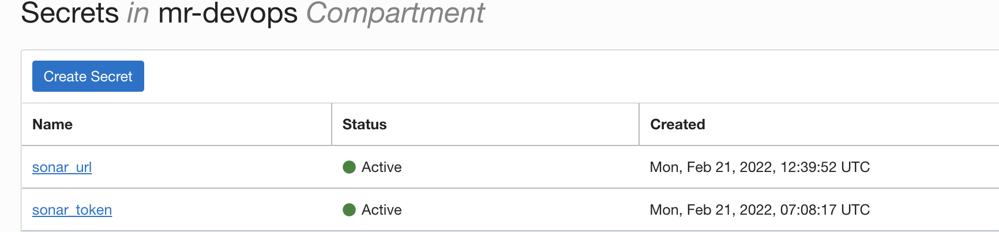

  * At this stage you won’t be seeing any sonar related secrets in your Vault .Follow further steps.

* Clone this repo and push to one of the target code repo .You may use any of the OCI devops supported code repo for the usage (OCI Code repo ,Github,Gitlab etc)

  * Specific instruction to clone only this example.

    ```
    $ git init oci_devops_sonarqube
    $ cd oci_devops_sonarqube
    $ git remote add origin <url to this git repo>
    $ git config core.sparsecheckout true
    $ echo "oci-build-examples/oci_buildrunner_with_sonarqube/*">>.git/info/sparse-checkout
    $ git pull --depth=1 origin main

    ```

* In this example we have used `GITHUB` with an `external connection` method with OCI devops.
  
  * Doc reference -  https://docs.oracle.com/en-us/iaas/Content/devops/using/create_connection.htm  

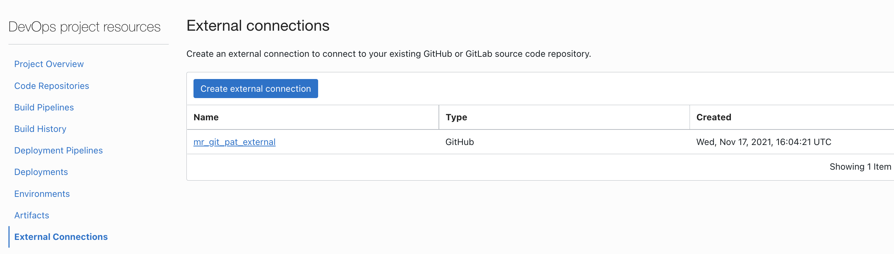

* Use the `OCI Build pipeline` and add a new stage. Use the `+` symbol and add `Managed Build` stage.

  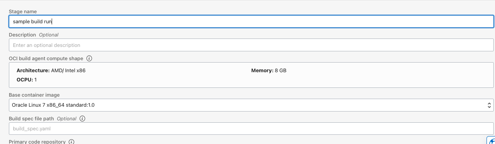

* Add the `primary source` respect to the code repo selected.

  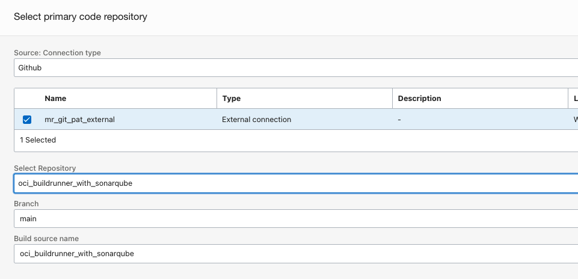

  * Documentation reference -  https://docs.oracle.com/en-us/iaas/Content/devops/using/add_buildstage.htm#add_buildstage

2. Setup the Sonarqube.

----

* You may use any of the official mode of Sonarqube installation method or use an existing one. We have used sonarqube deployment over kubernetes - [documentation](https://docs.sonarqube.org/latest/setup/sonarqube-on-kubernetes/).

* Create a new sonarqube project.

  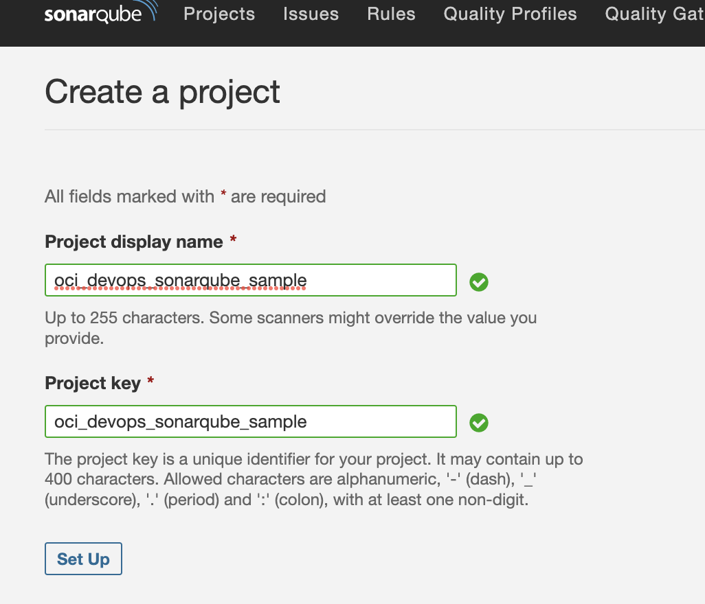

* Use `Other CI` option.

  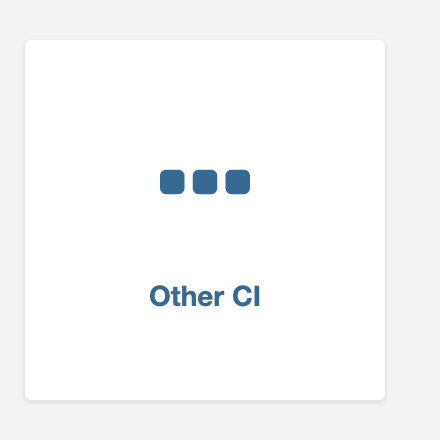

* Generate or reuse a sonar token.

  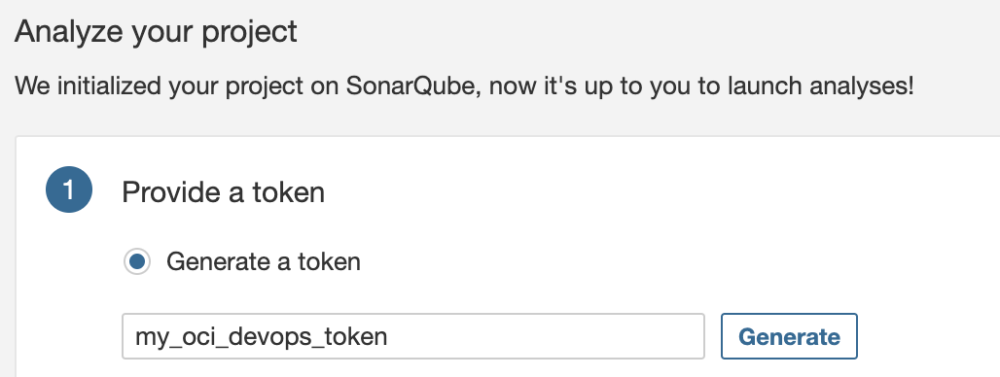

* Keep the `token` safely.

* Select `Others` as source code type and `OS` as `Linux`.

* Copy the `Execute` command lines.

  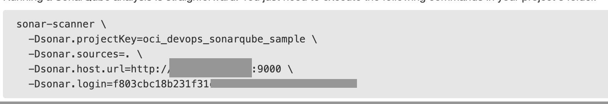

- Use `OCI Vault` and create new secrets as below 

  

  * Ensure to add the absolute URL for sonar_url. `eg:http://sonar.yourdmain.com:9000`.

- Update the file `build_spec.yaml` and push it back to the repo. We need to update the file with sonar properties.

  - variables 

  ```
  graal_vm_version : "21.3.0"
  sonar_cli_version : "Use the latest sonarqube-scanner cli"
  sonar_project: "Sonarqube project name"
  sonar_quality_wait: "true" |Marke as "false" if you wish to skip sonar checks
  ```

  - vaultVariables

  ```
  sonar_token: "OCI of Vault secret - sonar token "
  sonar_url: "OCI of Vault secret - sonar url"
  ```
- Sonarqube scanner CLI reference - https://docs.sonarqube.org/latest/analysis/scan/sonarscanner/ 
- A sample view 
  
  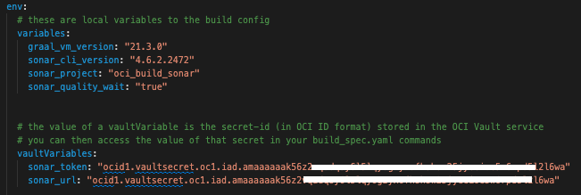

3. Validate the integration.

----

- Use `OCI Console` > `Developer services` >`Project` >`Project name` >`DevOps Resource`>`Build pipeline` >select the build pipeline .

  

- Click on `Start Manual run` and do an execution.

  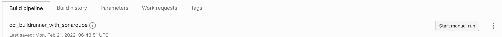

- Wait for the completion ,you may check the logs to see the quality status.

  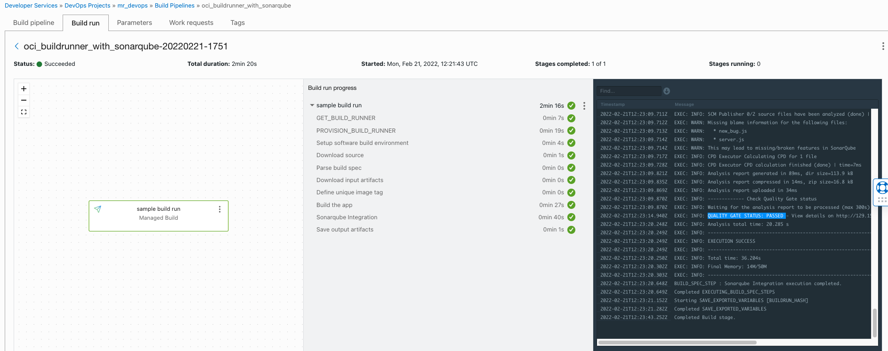

- We are using an option with sonar-scanner to wait till the end of quality check and based on the success /failure the build will proceed.You can verify the status via sonar console as well .

  - Sample build logs.

```
2022-02-21T12:05:35.387Z
EXEC: INFO: ------------- Check Quality Gate status   
2022-02-21T12:05:35.387Z
EXEC: INFO: Waiting for the analysis report to be processed (max 300s)   
2022-02-21T12:05:40.440Z
EXEC: INFO: QUALITY GATE STATUS: PASSED - View details on http://X.Y.Z.A:9000/dashboard?id=oci_build_sonar   
2022-02-21T12:05:45.762Z
EXEC: INFO: Analysis total time: 20.561 s   
2022-02-21T12:05:45.765Z
EXEC: INFO: ------------------------------------------------------------------------   
2022-02-21T12:05:45.766Z
EXEC: INFO: EXECUTION SUCCESS   
2022-02-21T12:05:45.766Z
EXEC: INFO: ------------------------------------------------------------------------   
2022-02-21T12:05:45.766Z
EXEC: INFO: Total time: 36.536s   
2022-02-21T12:05:45.820Z
EXEC: INFO: Final Memory: 14M/50M   
2022-02-21T12:05:45.820Z
EXEC: INFO: ------------------------------------------------------------------------   
2022-02-21T12:05:46.197Z
BUILD_SPEC_STEP : Sonarqube Integration execution completed.   
2022-02-21T12:05:46.198Z
Completed EXECUTING_BUILD_SPEC_STEPS   
```
  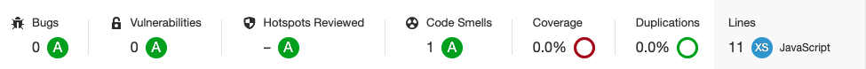

- For a demo purpose let us add a buggy stuff to the reppo .

  - Create a new file `bug.tf` and add below code to them .Its easy to get a buggy code from sonar it self ,use  

    `Sonar Quality Profiles` >`Select one of it` >`Click a Rule `>copy a `Noncomplaint Code example` snippet.Ensure to use the right file extension(Eg:if its terraform it should be .tf etc.)

    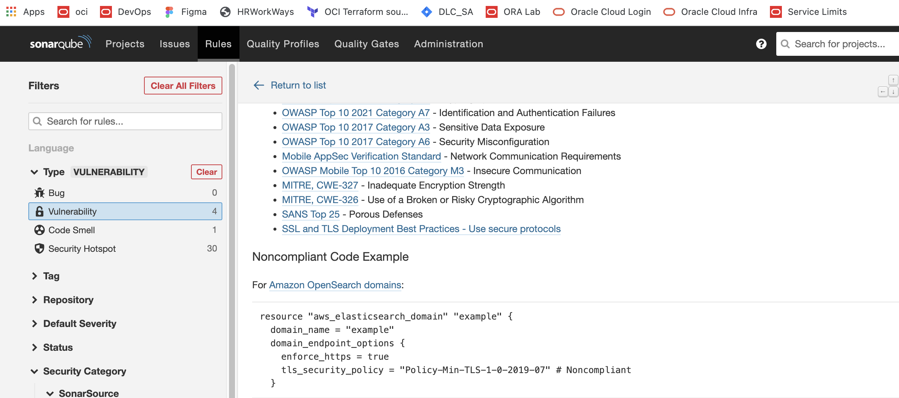

  - Push the code to the code repo and run the `OCI Build` .It will end with a failure ,you can take a view via sonar as well .

    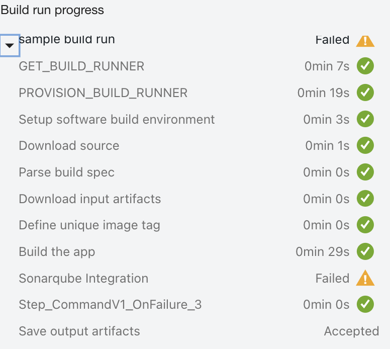

    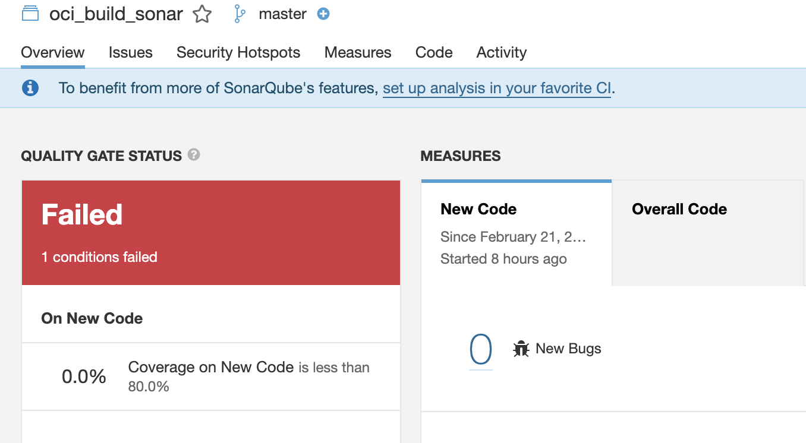 

A specific note 

----

Its a demo and focused only on `OCI Devops Build services` and `Sonarqube` .The whole pipeline can be referred here . - https://github.com/RahulMR42/oci-devops-cicd-with-java-graalvm-example. 

References & Credits for base code
============


  - https://docs.sonarqube.org/latest/ 
  
  - https://www.graalvm.org/docs/getting-started/container-images/

  - https://github.com/graalvm/graalvm-demos 


Contributors 
===========

- Author : Rahul M R.
- Collaborators : NA
- Last release : Feb 2022

### Back to examples.
----

- 🍿 [Back to OCI Devops Build sample](./../README.md)
- 🏝️ [Back to OCI Devops sample](./../../README.md)


