# Using Oracle GraalVM in OCI DevOps to build a Micronaut REST App

This sample shows how to use `Oracle GraalVM` in `OCI DevOps build pipelines` to build a simple Micronaut hello world REST application. You can use this approach to build any high performance Java application with Micronaut, Oracle GraalVM and OCI DevOps.

## What is GraalVM?

- GraalVM is a high performance JDK distribution that can accelerate any Java workload running on the HotSpot JVM.

- GraalVM Native Image ahead-of-time compilation enables you to build lightweight Java applications that are smaller, faster, and use less memory and CPU. At build time, GraalVM Native Image analyzes a Java application and its dependencies to identify just what classes, methods, and fields are necessary and generates optimized machine code for just those elements.

- Oracle GraalVM is available for use on Oracle Cloud Infrastructure (OCI) at no additional cost.

## What is Micronaut

- Micronaut is a modern, JVM-based framework to build modular, easily testable microservice and serverless applications. By avoiding runtime reflection in favour of annotation processing, Micronaut improves the Java-based development experience by detecting errors at compile time instead of runtime and improves Java-based application start time and memory footprint. Micronaut includes a persistence framework called Micronaut Data that precomputes your SQL queries at compilation time making it a great fit for working with databases like Oracle Autonomous Database, MySQL, etc.

- Micronaut uses GraalVM Native Image to build lightweight Java applications that use less memory and CPUs, and are smaller and faster because of an advanced ahead-of-time compilation technology.


## Specific instruction to clone only this example.

   ```
   $ git init oci_devops_graalee_micronaut
   $ cd oci_devops_graalee_micronaut
   $ git remote add origin <url to this git repo>
   $ git config core. sparsecheckout true
   $ echo "oci-build-examples/oci_devops_graalee_micronaut/*">>.git/info/sparse-checkout
   $ git pull --depth=1 origin main

   ```

## Objectives

- Create an OCI build pipeline.
- Make a build using Oracle GraalVM.
- Here the focus will be on the build specification and DevOps build pipeline


## Procedure to use this illustration.

- Create an OCI notification topic - https://docs.oracle.com/en-us/iaas/Content/Notification/Tasks/managingtopicsandsubscriptions.htm#createTopic
- Create a DevOps project - https://docs.oracle.com/en-us/iaas/Content/devops/using/create_project.htm#create_a_project.
  Associate with the notification topic.

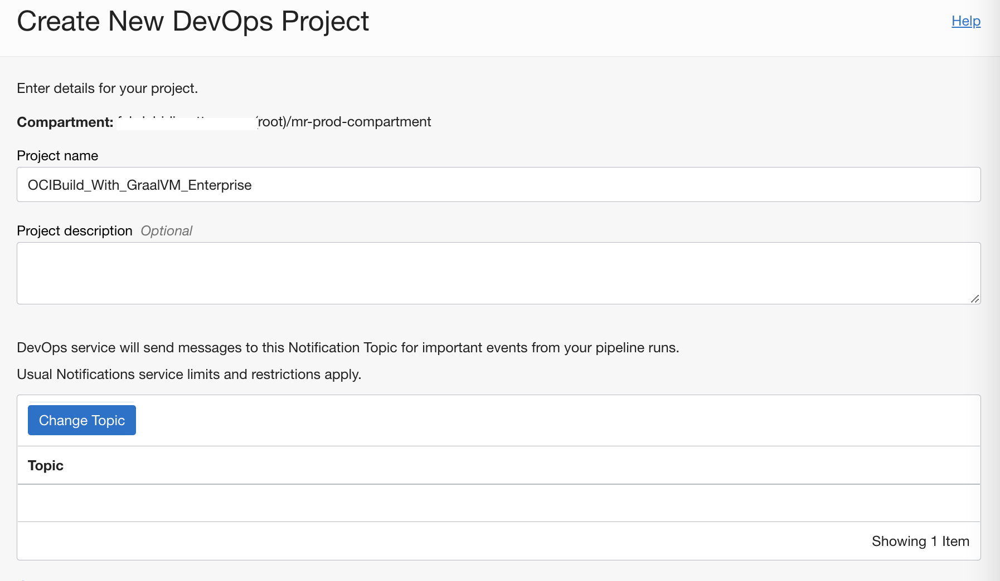

- Enable logging for the DevOps project.


Create an OCI Dynamic group and add the below rules. Replace `<YOUR_COMPARMENT_OCID>` with your compartment OCID. - https://docs.cloud.oracle.com/iaas/Content/Identity/Tasks/managingdynamicgroups.htm

```markdown
ALL {resource.type = 'devopsbuildpipeline', resource.compartment.id = '<YOUR_COMPARMENT_OCID>'}

ALL {resource.type = 'devopsrepository', resource.compartment.id = '<YOUR_COMPARMENT_OCID>'}
```

- Create an OCI policy and add the following policy statements. Replace `<YOUR_DynamicGroup_NAME>` with the name of your dynamic group, and `<YOUR_COMPARTMENT_NAME>` with the name of your compartment. - https://docs.cloud.oracle.com/iaas/Content/Identity/Concepts/policies.htm

```markdown
Allow dynamic-group <YOUR_DynamicGroup_NAME> to manage repos in compartment <YOUR_COMPARTMENT_NAME>
Allow dynamic-group  <YOUR_DynamicGroup_NAME> to use ons-topics in compartment <YOUR_COMPARTMENT_NAME>
```

- Switch back to OCI DevOps Project and create an OCI Code repo - https://docs.oracle.com/en-us/iaas/Content/devops/using/create_repo.htm#create_repo

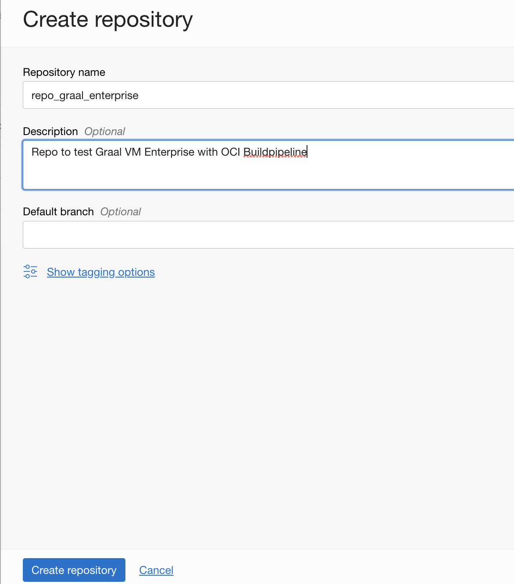

- Push the content to OCI Code repo - https://docs.oracle.com/en-us/iaas/Content/devops/using/clone_repo.htm

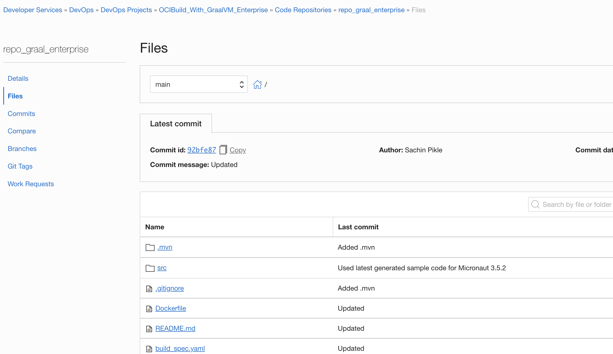

- You may use other supported version control repos as well (like Github.com, Bitbucket.com, Bitbucket Cloud, etc). You may also need to adjust the policies according to the connection and setup external connections accordingly - https://docs.oracle.com/en-us/iaas/Content/devops/using/create_connection.htm

- Create a new build pipeline. - https://docs.oracle.com/en-us/iaas/Content/devops/using/create_buildpipeline.htm


- Use the `Add Stage` option and add a `Managed Build` stage to the build pipeline - https://docs.oracle.com/en-us/iaas/Content/devops/using/add_buildstage.htm

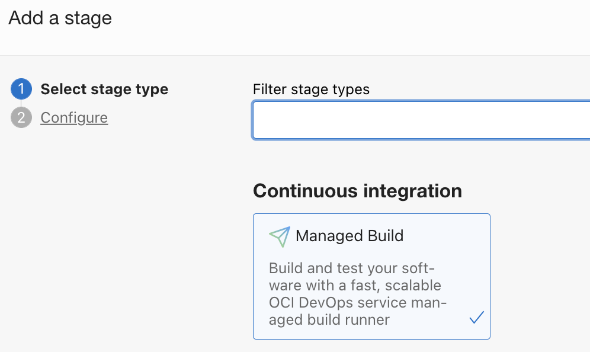

- Click `Next` and provide the details.
- In the `Build spec file path`, enter `build_spec.yaml` to use the [GraalVM Enterprise 22.x Java 17 build spec](build_spec.yaml). Alternatively, you can enter `build_spec_oracle_graalvm_jdk17.yaml` to use the [Oracle GraalVM for JDK 17 build spec](./build_spec_oracle_graalvm_jdk17.yaml) or `build_spec_oracle_graalvm_jdk20.yaml` to use the [Oracle GraalVM for JDK 20 build spec](./build_spec_oracle_graalvm_jdk20.yaml).


- Associate the Primary code repository with the code repo containing the actual code.

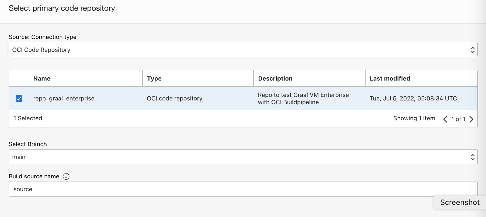

- Click `Add` and add the stage.

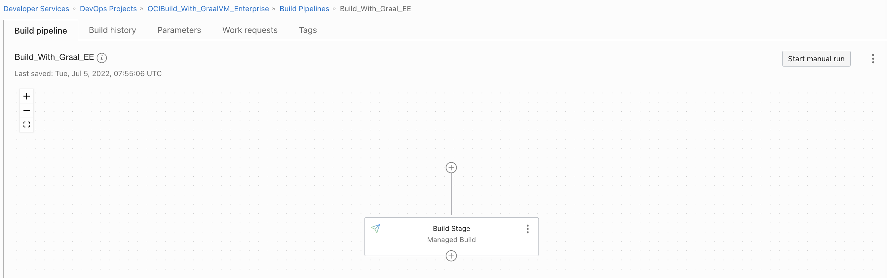


## Take a closer look at the build instructions below

To install and use Oracle GraalVM with Micronaut REST in the DevOps build pipeline, the build specification file is as follows:

1. Add the following command to install the required Oracle GraalVM components. For example, this command installs Native Image along with the Java Development Kit (JDK) and other necessary dependencies.

    ```shell
    steps:
      - type: Command
        name: "Install Oracle GraalVM Enterprise 22.x Native Image for Java17"
        command: |
          yum -y install graalvm22-ee-17-native-image
    ```

2. Set the JAVA_HOME environment variable.

    ```shell
    env:
      variables:
        "JAVA_HOME" : "/usr/lib64/graalvm/graalvm22-ee-java17"
    ```

3. Set the PATH environment variable.

    ```shell
    env:
      variables:
        # PATH is a reserved variable and cannot be defined as a variable.
        # PATH can be changed in a build step and the change is visible in subsequent steps.
    
    steps:
      - type: Command
        name: "Set PATH Variable"
        command: |
          export PATH=$JAVA_HOME/bin:$PATH
    ```

4. Build a native executable for your Micronaut application.

    ```shell
    steps:
      - type: Command
        name: "Build a native executable"
        command: |
          ./mvnw --no-transfer-progress package -Dpackaging=native-image
    ```

5. The native executable file is available under `target/MnHelloRest`.

    ```shell
    outputArtifacts:
      - name: app_native_executable
        type: BINARY
        location: target/MnHelloRest
    ```

6. Package the native executable in a lightweight distroless runtime container image.

    ```shell
    steps:
      - type: Command
        name: "Package the native executable in a runtime container image"
        command: |
          docker build -f ./Dockerfile \
                    --build-arg APP_FILE=${APP_FILE} \
                    -t ${TAG} .
    ```

7. The runtime container image is available as a build output artifact.

    ```shell
    outputArtifacts:
      - name: runtime_image
        type: DOCKER_IMAGE
        location: ${TAG}
    ```
Here's the complete [build specification for GraalVM Enterprise 22.x Java 17](build_spec.yaml) file. Alternatively, you can use the 
[build specification for Oracle GraalVM for JDK 17](./build_spec_oracle_graalvm_jdk17.yaml) or
[build specification for Oracle GraalVM for JDK 20](./build_spec_oracle_graalvm_jdk20.yaml).


## How to export the executable file outside of the build pipeline stage.

The following instructions will help you to export the `executable app file` to OCI Artifactory and which can then be used in the further stage including deployment pipelines.

OR 

You can create an OCI Container registry and push the build container image which can be used to deploy to the supported container-based platform (Example OKE).

- Create an OCI artifact registry. https://docs.oracle.com/en-us/iaas/Content/artifacts/home.htm


- Create a public OCI Container registry repo - https://docs.oracle.com/en-us/iaas/Content/Registry/home.htm

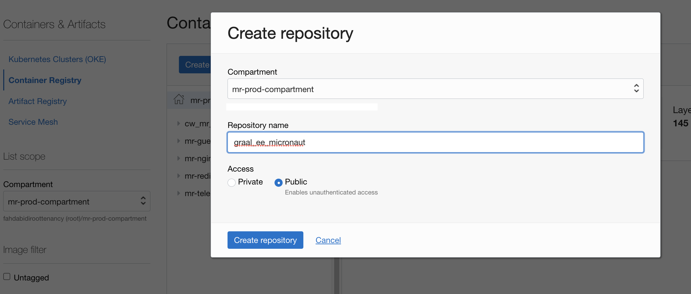


- Switch back to `DevOps Project` and create two `Artifacts`- https://docs.oracle.com/en-us/iaas/Content/devops/using/artifacts.htm

- For the first one, select the type as `General artifact`


- Select the `Artifact source` as the Artifact Registry repository. Use `Select` and associate with the artifact registry created.

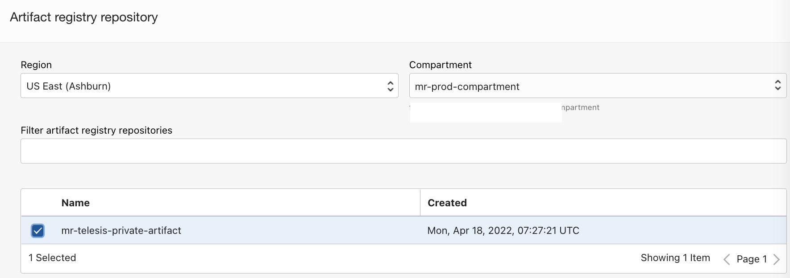


- Use option `Set Custom Location` as Artifact location.
- Provide a path and version as `${BUILDRUN_HASH}`, this is to maintain immutable artifacts.
- The variable `BUILDRUN_HASH` is derived during managed build stage and exported as an exportedVariables.You may use any other name, but ensure to update the file [build_spec.yaml](build_spec.yaml).
- Select `Yes, substitute placeholders` as an option and click `Add`.

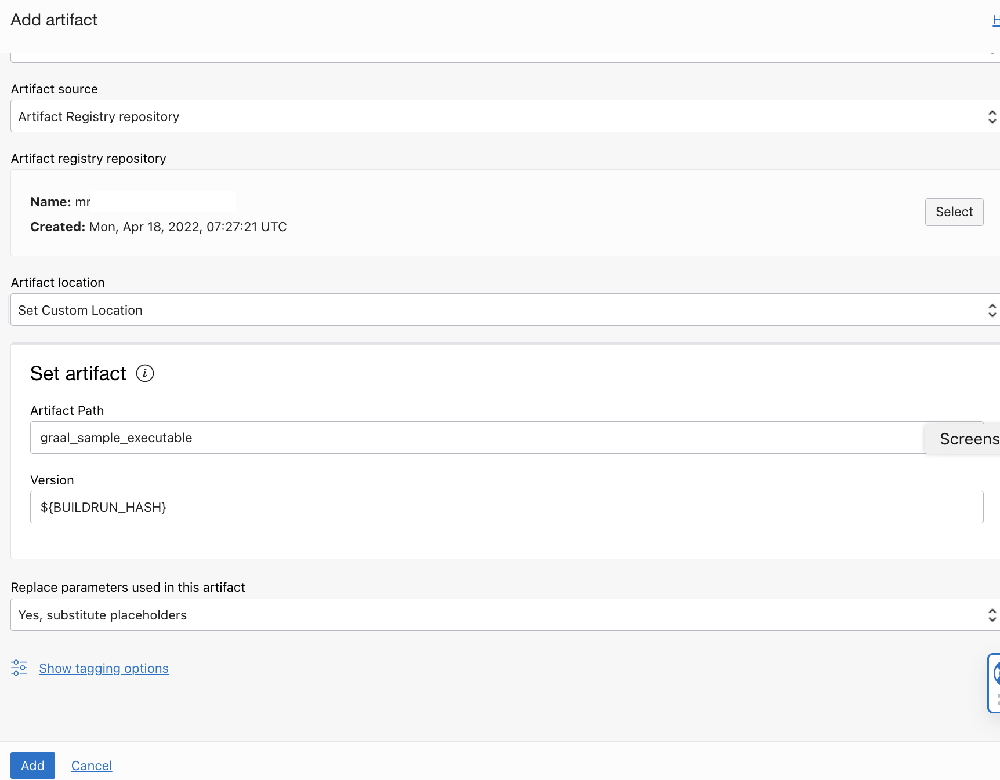

- Create a second `Artifact` with type as `Container image repository`.
- Provide a full qualified path to the image repo

```markdown
"OCI Region Key".ocir.io/"Tenancy Namespace"/"Repo Name":${BUILDRUN_HASH}
```
- Enable `Allow paramterization option`

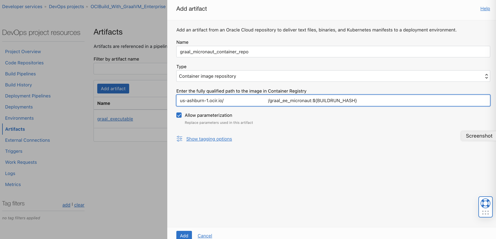

- Under `Build pipeline ` use the `+` icon after the current stage and add a new stage named `Deliver artifacts`

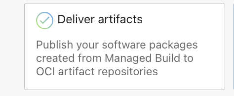

- Associate it with the `DevOps Artifacts` created.

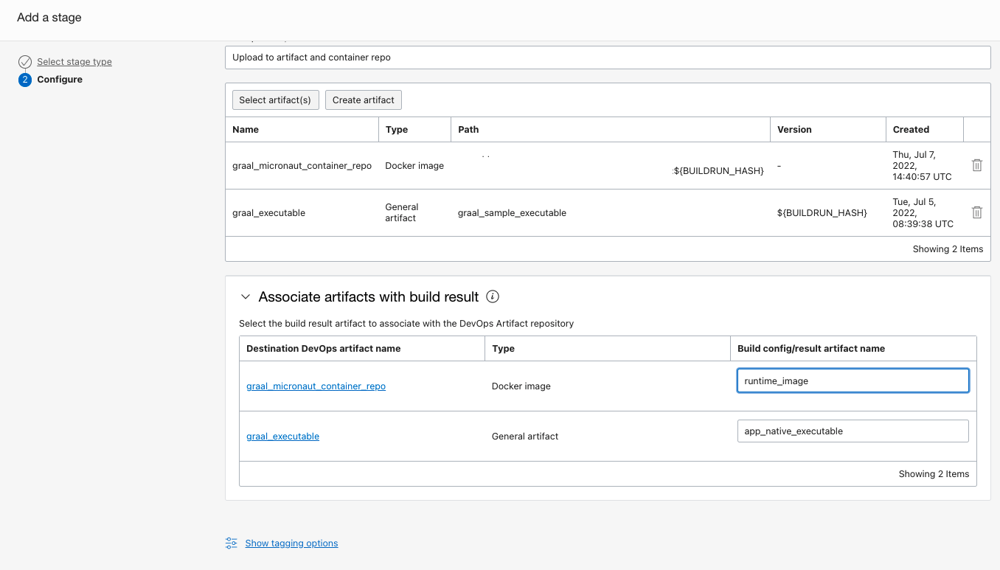

- Use name `app_native_executable` result artifact name for artifact reference for `General artifacts` for executable artifact.
- Use name `runtime_image` result artifact name for artifact reference for `Docker image` for container image artifact.
- The name `app_native_executable` and `runtime_image` are references to the `outputArtifacts` defined under the file [build_spec.yaml](build_spec.yaml).
- Click `Add` and add the stage.

- The build pipeline with two stages would look like the one below.


## Let's test.

- Use `Start manual run` under OCI Buildpipeline and run the pipeline stages.


- Wait for all the stages to complete

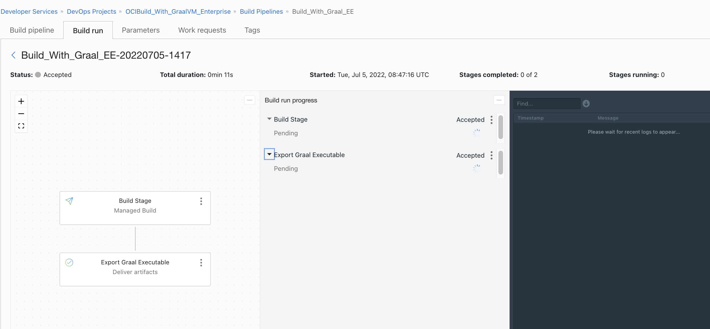

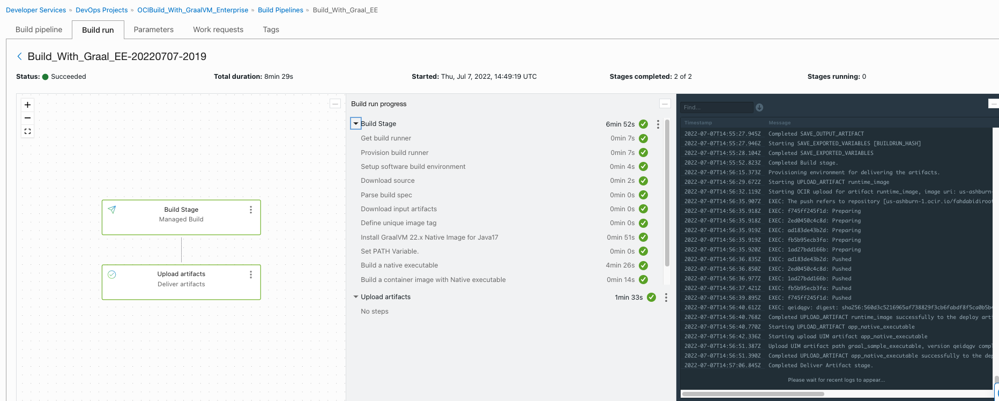

- Validate the outcome - `executable artifact` or `container image`.
- Switch to `OCI Container registry repo` and you should see a container image, which can be used to deploy onto any supported platform (Example: OKE) or can refer to the OCI Deployment pipeline too.

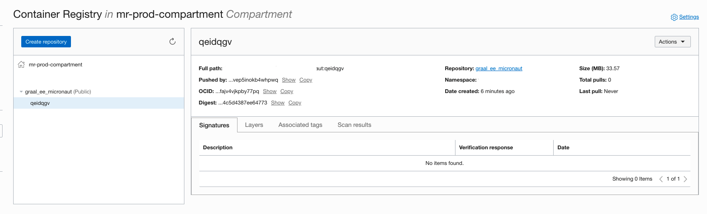

- Switch to `OCI Artifact registry repo` and you should see an executable artifact.

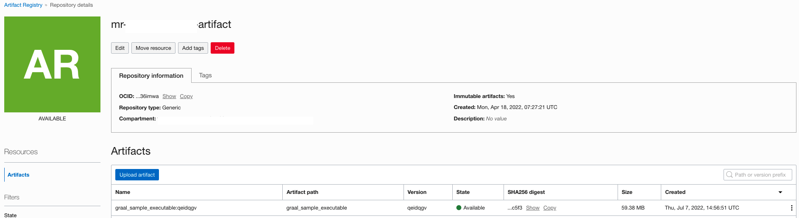

## Optional - Run build with more verbose output.

- An additional build instruction file as [build_spec_verbose.yaml](build_spec_verbose.yaml)
  can be used for more verbose output with the managed build.
- To do so, switch to `OCI DevOps project` > `OCI Build pipeline` > Click `3 dots` on the `Managed Build` stage and click on `View details` and then `Edit Stage`.


- Change  `Build spec file path` as `build_spec_verbose.yaml`  and `Save changes`


- Do another manal run for the build pipeline and you will see more verbose build logs.

## Sample Build Logs

1. The `yum install` build log statements should be similar to:

    ```shell
    ...
    EXEC: Installed:   
    EXEC:   graalvm22-ee-17-native-image.x86_64 0:22.1.0.1-1.el7                             
    EXEC:    
    EXEC: Dependency Installed:   
    EXEC:   glibc-static.x86_64 0:2.17-326.0.1.el7_9                                         
    EXEC:   graalvm22-ee-17-jdk.x86_64 0:22.1.0.1-1.el7                                      
    EXEC:   libstdc++-static.x86_64 0:4.8.5-44.0.3.el7                                       
    EXEC:   zlib-static.x86_64 0:1.2.7-20.el7_9                                              
    EXEC:    
    EXEC: Complete!
    ...
    ```

2. The native executable build log statements should be similar to:

    ```shell
    ...
    EXEC: ==================================================================
    EXEC: GraalVM Native Image: Generating 'MnHelloRest' (static executable)...
    EXEC: ==================================================================
    EXEC: [1/7] Initializing...                         (6.8s @ 0.27GB)   
    EXEC:  Version info: 'GraalVM 22.1.0.1 Java 17 EE'   
    EXEC:  C compiler: gcc (redhat, x86_64, 4.8.5)   
    EXEC:  Garbage collector: Serial GC   
    EXEC:  4 user-provided feature(s)   
    EXEC:   - io.micronaut.buffer.netty.NettyFeature   
    EXEC:   - io.micronaut.core.graal.ServiceLoaderFeature   
    EXEC:   - io.micronaut.http.netty.graal.HttpNettyFeature   
    EXEC:   - io.micronaut.jackson.JacksonDatabindFeature   
    ...
    EXEC: [2/7] Performing analysis...  [**************] (63.9s @ 1.98GB)   
    EXEC:   13,612 (91.86%) of 14,818 classes reachable   
    EXEC:   18,692 (57.10%) of 32,734 fields reachable   
    EXEC:   74,699 (64.21%) of 116,327 methods reachable   
    EXEC:      750 classes,   341 fields, and 2,746 methods registered for reflection   
    EXEC:       62 classes,    68 fields, and    54 methods registered for JNI access   
    EXEC: [3/7] Building universe...                    (5.0s @ 1.94GB)   
    EXEC: [4/7] Parsing methods...      [***]           (5.1s @ 2.60GB)   
    EXEC: [5/7] Inlining methods...     [****]          (8.6s @ 1.77GB)   
    EXEC: [6/7] Compiling methods...    [***********]   (135.4s @ 1.80GB)   
    EXEC: [7/7] Creating image...                       (6.2s @ 2.01GB)   
    EXEC:   34.67MB (51.40%) for code area:   43,533 compilation units   
    EXEC:   24.50MB (36.31%) for image heap:   9,698 classes and 352,409 objects   
    EXEC:    8.29MB (12.29%) for other data   
    EXEC:   67.46MB in total   
    EXEC: ------------------------------------------------------------------
    ...
    EXEC: ------------------------------------------------------------------
    EXEC:  16.5s (6.9% of total time) in 111 GCs | Peak RSS: 4.46GB | CPU load: 3.38   
    EXEC: ------------------------------------------------------------------
    EXEC: Produced artifacts:   
    EXEC:  /workspace/mn-hello/target/MnHelloRest (executable)   
    EXEC:  /workspace/mn-hello/target/MnHelloRest.build_artifacts.txt   
    EXEC: ==================================================================
    EXEC: Finished generating 'MnHelloRest' in 3m 57s.   
    ...
    ```

References
==========

- Using Oracle GraalVM in DevOps Build Pipelines - https://docs.oracle.com/en-us/iaas/Content/devops/using/graalvm.htm
- Oracle Cloud Infrastructure DevOps - https://docs.oracle.com/en-us/iaas/Content/devops/using/home.htm
- Oracle GraalVM - https://www.oracle.com/java/graalvm/

Contributors
===========

- Author: [Rahul M R](https://github.com/RahulMR42).
- Collaborators: [Sachin Pikle](https://github.com/sachin-pikle)
- Last release: July 2022

### Back to examples.
----

- 🍿 [Back to OCI DevOps Build sample](./../README.md)
- 🏝️ [Back to OCI Devops sample](./../../README.md)

 

