A sample illustration of build with a container image vulnerability validation,before the deployment invoke.
------

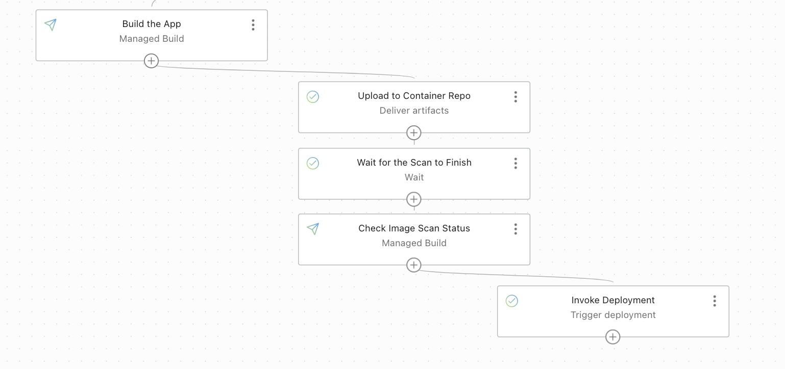

Objective
---

- Create an OCI devops build pipeline to build a container image for OKEdeployment.

- Use an OCI Vulnerability scanner and scan the image.

- If the image is valid proceed for deployment.

* Specific instruction to clone only this example.

   ```
   $ git init oci_imagescan_before_deploy
   $ cd oci_imagescan_before_deploy
   $ git remote add origin <url to this git repo>
   $ git config core.sparsecheckout true
   $ echo "oci-build-examples/oci_imagescan_before_deploy/*">>.git/info/sparse-checkout
   $ git pull --depth=1 origin main

   ```

Procedure to use the illustration

-------

- Create OCI devops project / necessary policies - https://docs.oracle.com/en-us/iaas/Content/devops/using/home.htm.

- Set the policies for Build /Deploy / Connection policies.


- Create an OCI Build pipeline (with no stages for now)

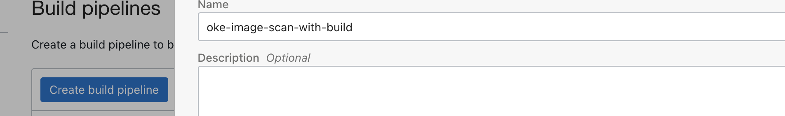

- Create an OCI Artifact repo (For container)

  - https://docs.oracle.com/en-us/iaas/Content/Registry/home.htm


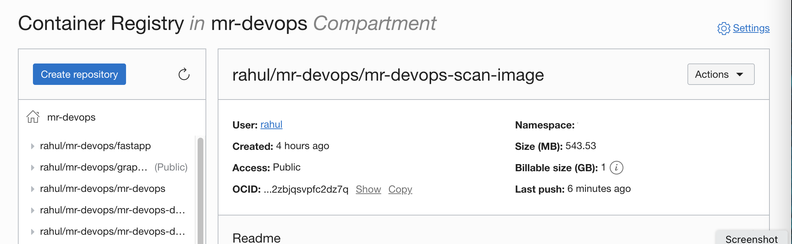

- Create a policy (identity) to enable vulnerable scanning for repo.

  - Refer to below for the policy statement.

```
allow service vulnerability-scanning-service to read repos in compartment  <COMPARTMENT Name>
allow service vulnerability-scanning-service to read compartments in compartment <COMPARTMENT Name>
```

- Create an Artifact with the container repo URL (POSTFIX with a BUILDHASH VARIABLE)


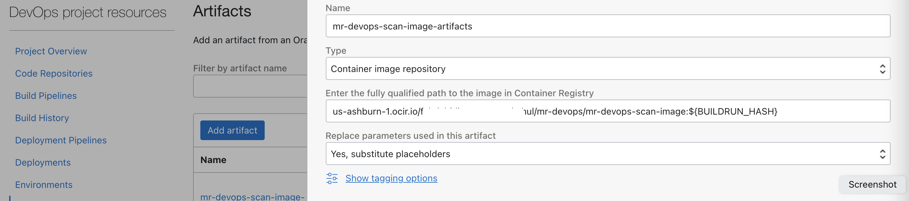

- Add a manage build stage to the build pipeline.

  - https://docs.oracle.com/en-us/iaas/Content/devops/using/managing_build_pipelines.htm


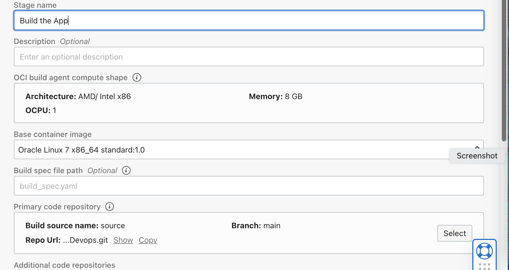

- You may use the GITHUB repo or OCI Code repo to hold the code base (clone this repo and use accordingly).

- Add another upload artifact stage by using the artifact created.

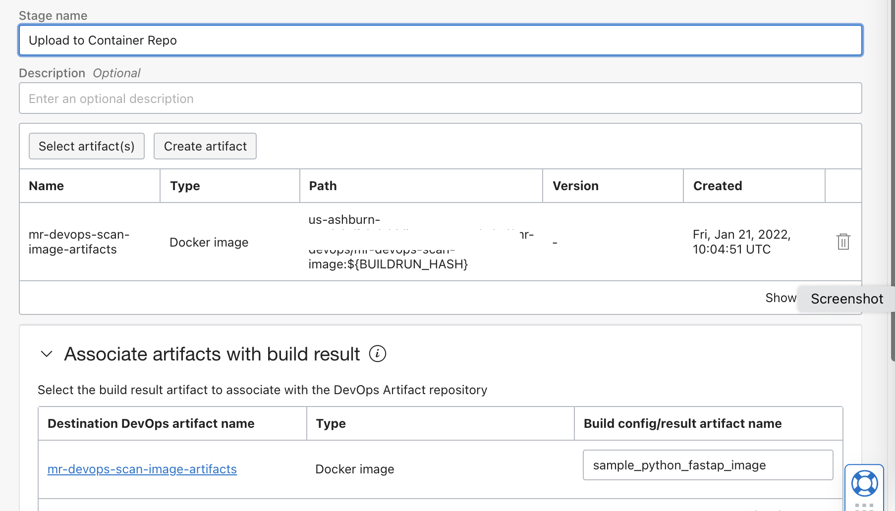

- Add a scanner to the OCI Container repo that we had created.

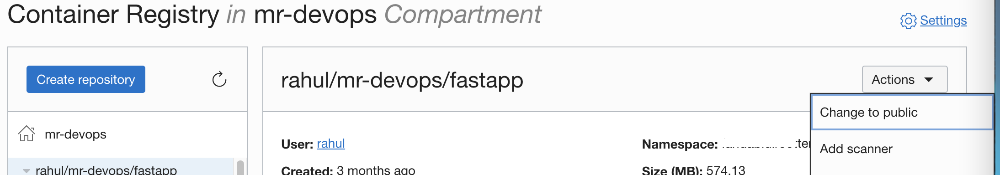

      - https://docs.oracle.com/en-us/iaas/scanning/using/scanning-images.htm#scanning_images 

- The scan may take a while, so add a waiting stage to the build pipeline.

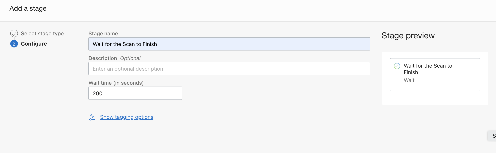

- Add another manage build stage but with a custom yaml path as scan_check.yaml.

- You can use the same repo (Github or OCI code repo) but with the custom yaml file.


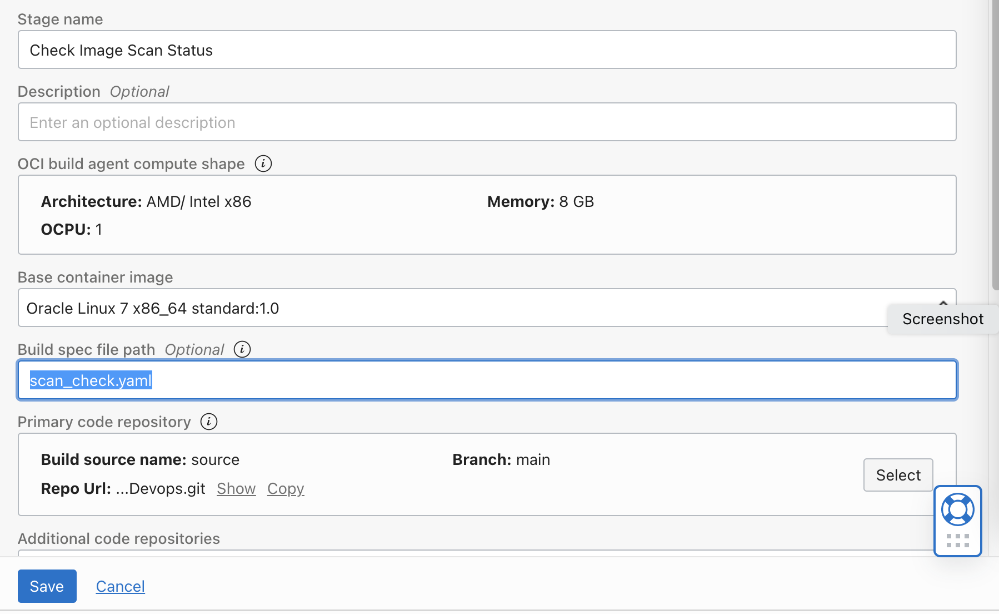

- Set the below values as build params.

```
SCAN_CHECK_BASELINE - None

REPO_NAME - Container Repo name

COMPARTMENT_ID - Compartment OCID

```

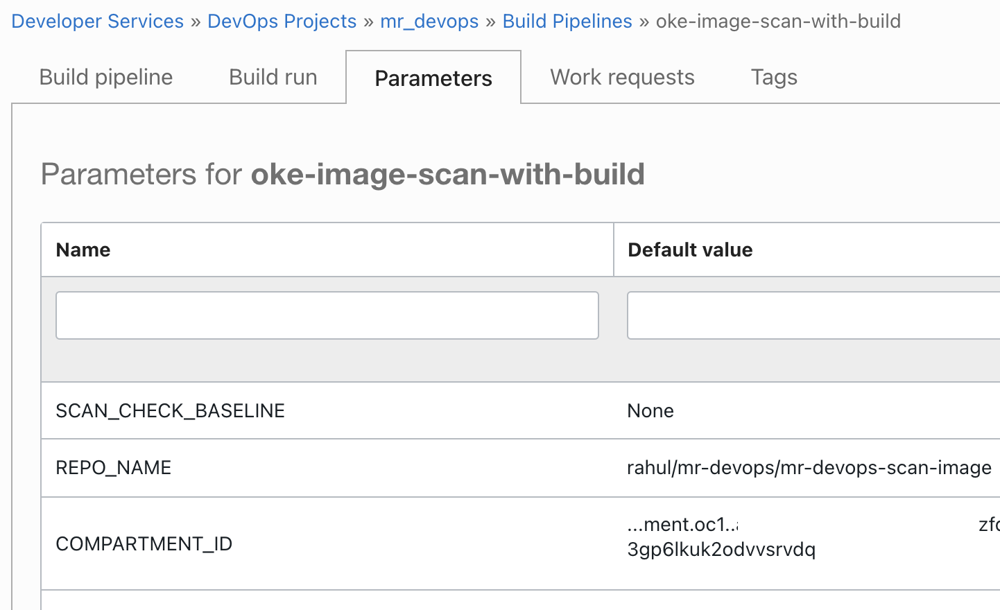


All set for test...

-----

- If your docker images are safe they will follow the build pipeline and invoke the deployment.

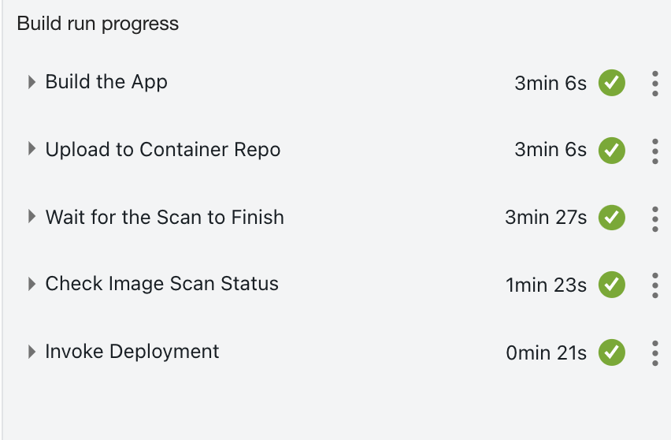


- If not it will fail and won't proceed for deployment.

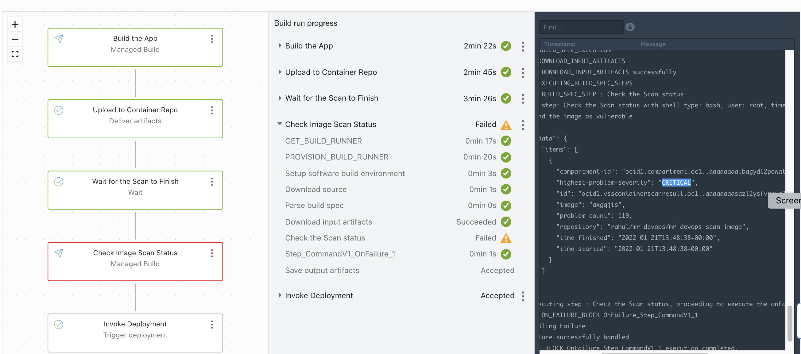

Tail end

-----

- To complete the flow, and create a deployment pipeline, you can use the reference spec file (deployment_spec mentioned here) - https://docs.oracle.com/en-us/iaas/Content/devops/using/deployment_pipelines.htm.You may declare the artifacts and build parameters as variables.

- You may add OCI CLI Steps to delete the image from the repo if found invalid.

Contributors
===========

- Author: Rahul M R.
- Collaborators: NA
- Last release: June 2022

### Back to examples.
----

- 🍿 [Back to OCI Devops Build sample](./../README.md)
- 🏝️ [Back to OCI Devops sample](./../../README.md)

