A sample illustration of [Bitbucket Cloud ](https://bitbucket.org/product?&aceid=&adposition=&adgroup=92542404895&campaign=1407242867&creative=544605032325&device=c&keyword=bitbucket%20cloud&matchtype=e&network=g&placement=&ds_kids=p51241240716&ds_e=GOOGLE&ds_eid=700000001551985&ds_e1=GOOGLE&gclid=EAIaIQobChMIsa_OyLy--AIV8pJmAh079go-EAAYASAAEgLsifD_BwE&gclsrc=aw.ds) code repo integration with OCI DevOps.

--------

#### Objectives

- Create an APP Password on Bitbucket Cloud.
- Create vault, and policies accordingly.
- Create a DevOps connection and integrate it with OCI.
- Test and validate the integrations.

* Specific instruction to clone only this example.

    ```
    $ git init oci-devops-coderepo-with-bitbucketcloud
    $ cd oci-devops-coderepo-with-bitbucketcloud
    $ git remote add origin https://github.com/oracle-devrel/oci-devops-examples
    $ git config core. sparsecheckout true
    $ echo "oci-coderepo-examples/oci-devops-coderepo-with-bitbucketcloud/*">>.git/info/sparse-checkout
    $ git pull --depth=1 origin main

    ```

#### Procedure

- Follow Bitbucket Cloud documentation and do a sign-in. - https://bitbucket.org/product/guides
- Click `profile` on the top right corner and click `Personal Setting`.

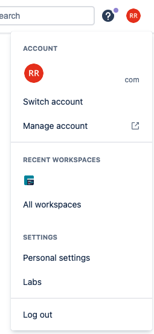

- User `Personal Setting` > make a note of your `user name`.

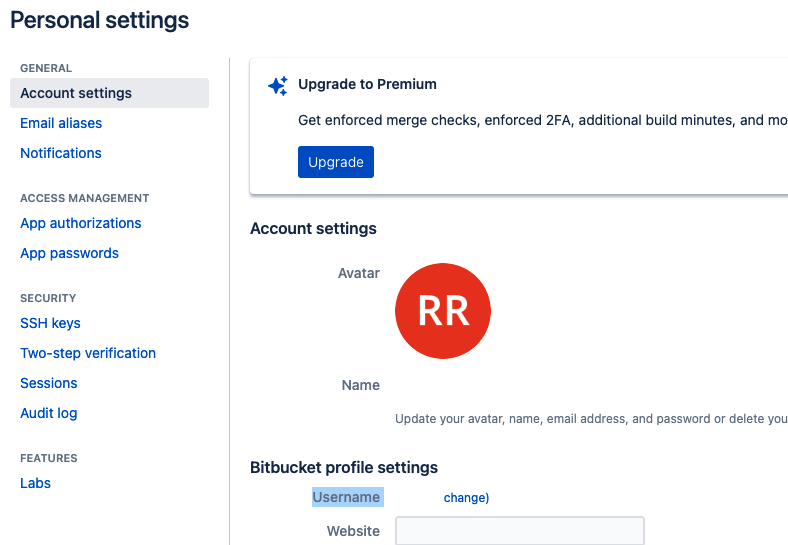

- In the `left-side menu`, click `App passwords` and then click Create app password.
- Enter a `Label (name)` for the password.
- Select the following checkboxes for Permissions:
  - Account: Read
  - Workspace membership: Read
  - Projects: Read
  - Pull requests: Read
  - Webhooks: Read and write

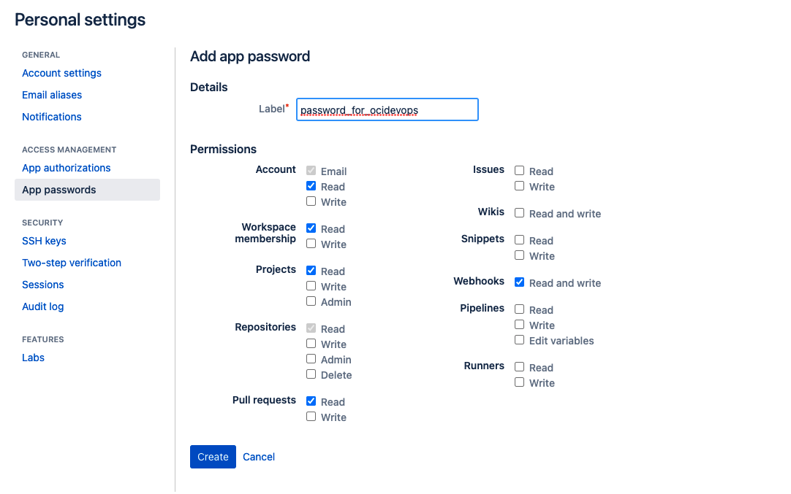
- Click Create.
- Copy the app password immediately to a secure location, because you cannot retrieve it again after you navigate away from the page.

- To securely store and orchestrate Gitlab Personal Access token, we will create a new OCI Vault for now.

- Create a new vault under the concerned compartment. - https://docs.oracle.com/en-us/iaas/Content/KeyManagement/Concepts/keyoverview.htm#Overview_of_Vault

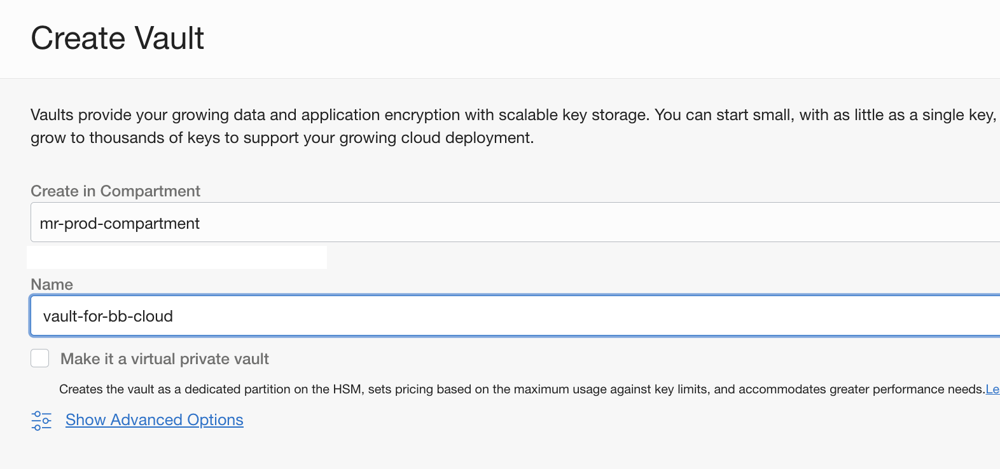

- Create a new `Encryption Key`.

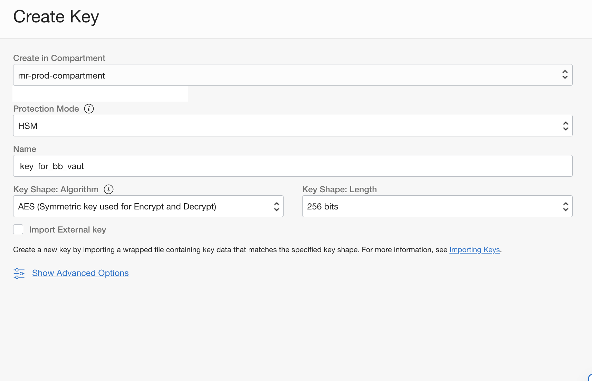

- Create a new secret and store the Bitbucket Cloud App password.


- Create a `Dynamic group` with the below rules.

```
ALL {resource.type = 'devopsconnection', resource.compartment.id = 'COMPARMENT OCID'}
ALL {resource.type = 'devopsrepository', resource.compartment.id = 'COMPARMENT OCID'}
```

- Create a policy (Ensure to create it under the ROOT of tenancy) for the dynamic groups with the below policy statement.

```
Allow dynamic-group mr-devops-policy-checker-dg-connection to read secret-family in compartment <compartment name>
Allow dynamic-group mr-devops-policy-checker-dg-connection to use ons-topics in compartment <compartment name>
```

- Create a notification topic, that will be used for DevOps - https://docs.oracle.com/en-us/iaas/Content/Notification/Tasks/managingtopicsandsubscriptions.htm#createTopic

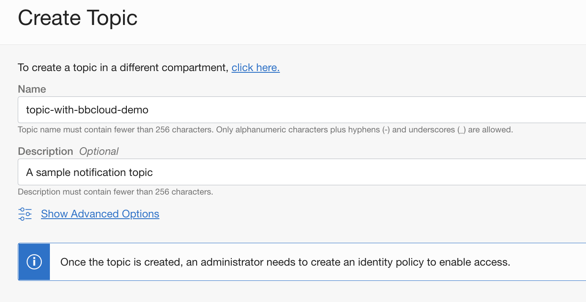


- Create a DevOps project - https://docs.oracle.com/en-us/iaas/Content/devops/using/create_project.htm#create_a_project
- Ensure to associate it with a `notification topic` created.

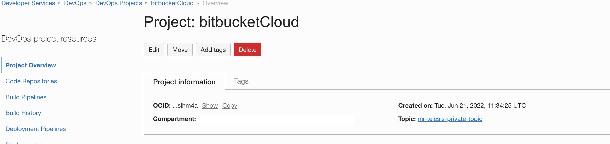

- Under the project click `Enable Logging` and `toggle`  and enable the logs.

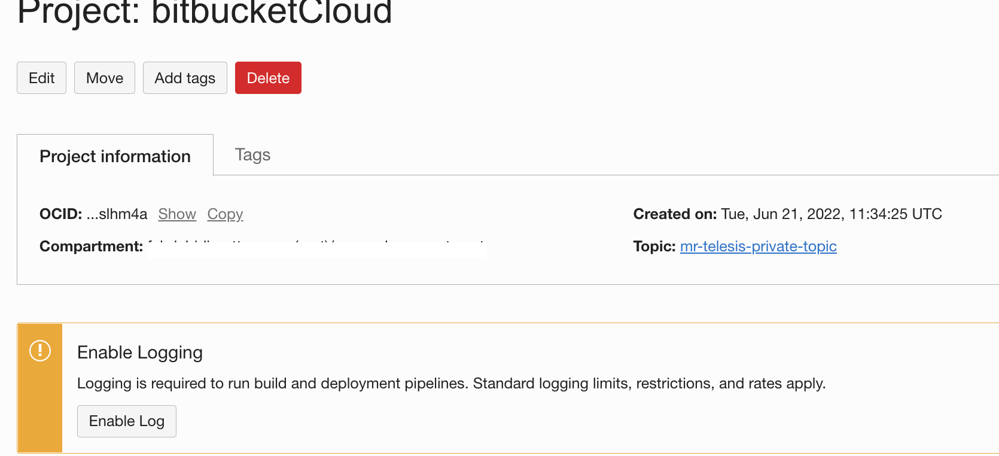

- Select the logging details and enable.

- Create a new  `external connection` - https://docs.oracle.com/en-us/iaas/Content/devops/using/create_connection.htm

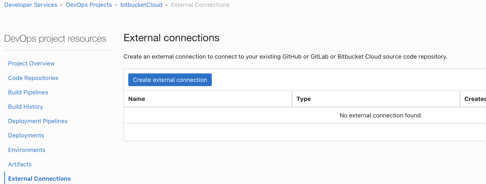

- Select the type as `Bitbucket Cloud`.
- Provide the `Bitbucket username ` as the username.
- Associate with the Vault and the `Secret` created

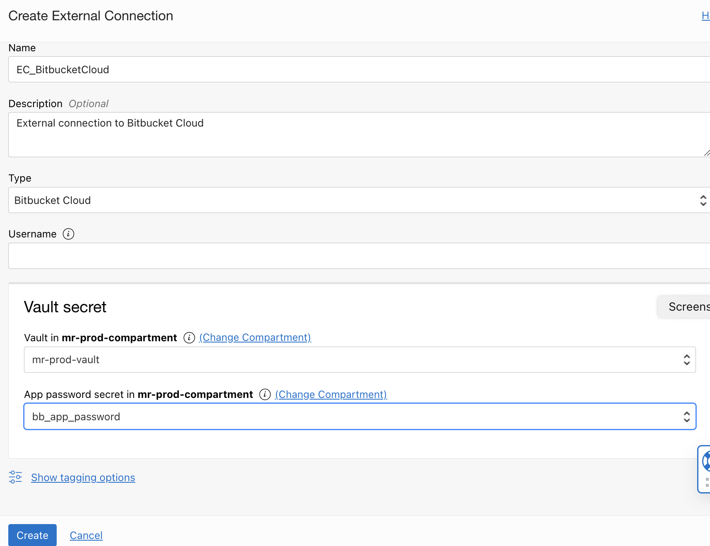

- Use DevOps `Code Repositories` and mirror Bitbucket Cloud to oci DevOps. - https://docs.oracle.com/en-us/iaas/Content/devops/using/mirror_repo.htm

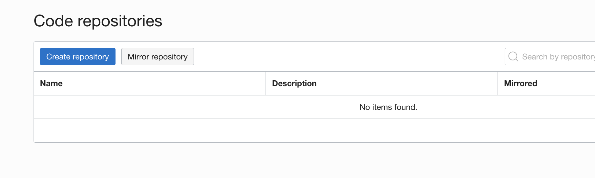


- Select the external connection created and select the Bitbucket Cloud repository. You may mention a custom name (as optional) which will be used when the external repo is cloned to the OCI Code repo.
- You may alter the Scheduling type to a custom value if needed. The default sync is `15 minutes`.

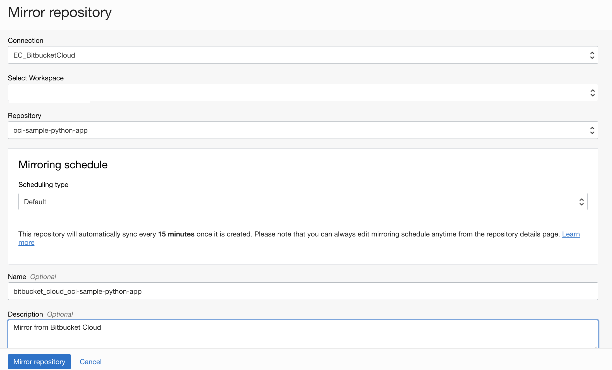

- After a while, the repo will be available via `OCI Code Repo`

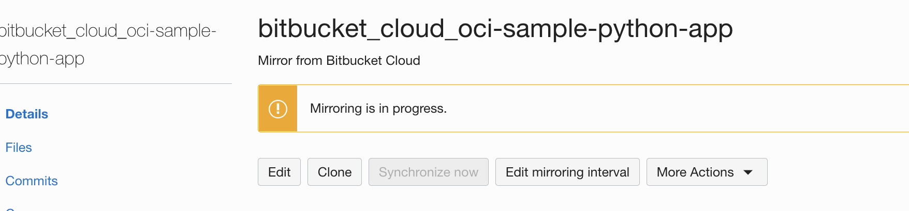

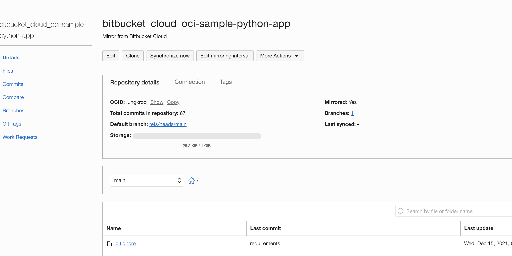

Contributors
===========

- Author: Rahul M R.
- Collaborators: NA
- Last release: June 2022

### Back to examples.
----

- 🍿 [Back to OCI Devops Coderepo sample](./../README.md)
- 🏝️ [Back to OCI Devops sample](./../../README.md)

