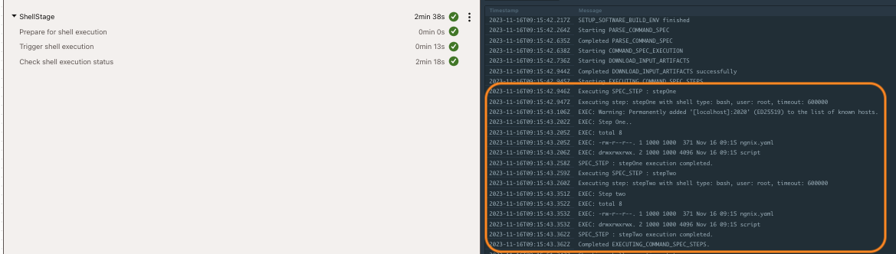
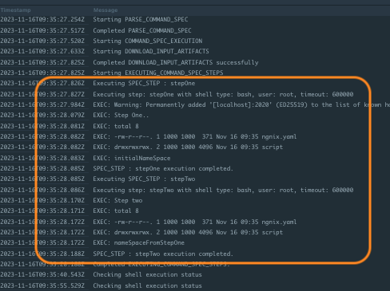
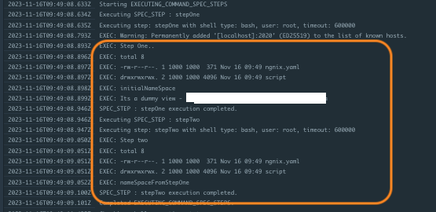
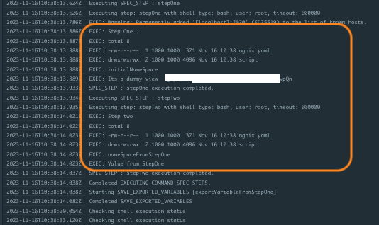
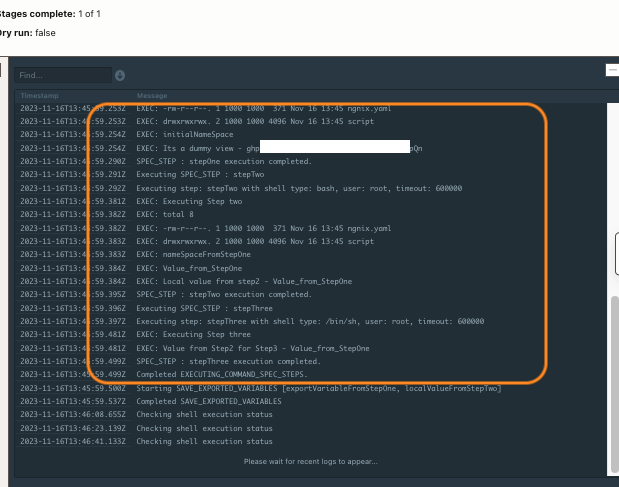

### How to use variables with managed `build stage` (OCI Build pipeline) or using `shell stage` (OCI Deployment pipeline)

------
The procedure demonstrates some of the sample usage of variables within the build or shell stage. The format and usage of variables for the shell stage or managed build stage are similar.

* Specific instruction to clone only this example.

   ```
   $ git init oci-devops-variables-shell-buildpiepline
   $ cd oci-project-cascadedelete
   $ git remote add origin <url to this git repo>
   $ git config core. sparse checkout true
   $ echo "oci-config-examples/oci-devops-variables-shell-buildpiepline/*">>.git/info/sparse-checkout
   $ git pull --depth=1 origin main

   ```

<details>
<summary> Basic Configuration - shell stage - Click to View details. </summary>

```yaml
version: 0.1
component: command
timeoutInSeconds: 10000
shell: bash
failImmediatelyOnError: true

inputArtifacts:
  - name: sample-kube-yaml
    type: URL
    url: https://raw.githubusercontent.com/kubernetes/website/main/content/en/examples/application/deployment.yaml
    location: ${OCI_WORKSPACE_DIR}/ngnix.yaml

steps:
  - type: Command
    timeoutInSeconds: 600
    name: "stepOne"
    command: |
      echo "Step One.."
      ls -ltr 

    onFailure:
      - type: Command
        command: |
          echo "Handled Failure for Step One"
        timeoutInSeconds: 40
        
  - type: Command
    timeoutInSeconds: 600
    name: "stepTwo"
    command: |
      echo "Step two"
      ls -ltr 

    onFailure:
      - type: Command
        command: |
          echo "Handled Failure for Step One"
        timeoutInSeconds: 40
```
- Details of the steps.
  - The above is a basic shell stage usage.
  - Here we are using a URL to download a config file using the option `inputArtifacts`.
  - the files that are downloaded using `inputArtifacts` will be available throughout the stage for all the steps.
- Execution result.
  
</details>
<details>
<summary> Use of env/variables  - Click to View details.</summary>

```yaml
version: 0.1
component: command
timeoutInSeconds: 10000
shell: bash
failImmediatelyOnError: true
env:
  variables:
    NAMESPACE: "initialNameSpace" 
inputArtifacts:
  - name: sample-kube-yaml
    type: URL
    url: https://raw.githubusercontent.com/kubernetes/website/main/content/en/examples/application/deployment.yaml
    location: ${OCI_WORKSPACE_DIR}/ngnix.yaml

steps:
  - type: Command
    timeoutInSeconds: 600
    name: "stepOne"
    command: |
      echo "Step One.."
      ls -ltr 
      echo ${NAMESPACE}
      NAMESPACE="nameSpaceFromStepOne"
### The value of an env variable is changed here and the updated value will be available for further steps.

    onFailure:
      - type: Command
        command: |
          echo "Handled Failure for Step One"
        timeoutInSeconds: 40

  - type: Command
    timeoutInSeconds: 600
    name: "stepTwo"
    command: |
      echo "Step two"
      ls -ltr 
      echo ${NAMESPACE}

    onFailure:
      - type: Command
        command: |
          echo "Handled Failure for Step One"
        timeoutInSeconds: 40
```
- Details of steps.
  - This follows a key-value pair.
  - The key must follow POSIX environment variable compliant.
  - The value can be any string.
  - The scope of this variable is the execution of the build specification file. This means the value is available only within the stage across the steps.
  - If the value of the variable contains a new line(\n) or carriage return(\r) character, then they are replaced with space in the subsequent steps.
  - The change of value with a step is available for further steps as well.
- Execution result.
  
</details>

<details>
<summary>Use of env/vaultVariables  - Click to View details.</summary>

```yaml
version: 0.1
component: command
timeoutInSeconds: 10000
shell: bash
failImmediatelyOnError: true
env:
  variables:
    NAMESPACE: "initialNameSpace"
  vaultVariables:
    MYSECRET: "OCID of Vault Secret"
inputArtifacts:
  - name: sample-kube-yaml
    type: URL
    url: https://raw.githubusercontent.com/kubernetes/website/main/content/en/examples/application/deployment.yaml
    location: ${OCI_WORKSPACE_DIR}/ngnix.yaml

steps:
  - type: Command
    timeoutInSeconds: 600
    name: "stepOne"
    command: |
      echo "Step One.."
      ls -ltr 
      echo ${NAMESPACE}
      NAMESPACE="nameSpaceFromStepOne"
      echo "Its a dummy view - $MYSECRET" a

    onFailure:
      - type: Command
        command: |
          echo "Handled Failure for Step One"
        timeoutInSeconds: 40

  - type: Command
    timeoutInSeconds: 600
    name: "stepTwo"
    command: |
      echo "Step two"
      ls -ltr 
      echo ${NAMESPACE}

    onFailure:
      - type: Command
        command: |
          echo "Handled Failure for Step One"
        timeoutInSeconds: 40
```

- Details of steps.
  - `vaultVariables` are used to read secrets from the build or shell stage with a pipeline.
  - The key must be a string and POSIX environment variable compliant.
  - The value must be an OCID of the secret from the vault.
  - The vault and build pipeline must be of the same tenancy.
  - The tenancy must have an appropriate policy to allow build pipeline resources to access the secret.
  - The scope of this value is available across the stage, for all the steps.
- Execution result.
  
</details>

<details>
<summary>Use of env/exportedVariables  - Click to View details.</summary>

```yaml
version: 0.1
component: command
timeoutInSeconds: 10000
shell: bash
failImmediatelyOnError: true
env:
  variables:
    NAMESPACE: "initialNameSpace"
  vaultVariables:
    MYSECRET: "OCI of the Vault Secret"
  exportedVariables:
    - exportVariableFromStepOne
inputArtifacts:
  - name: sample-kube-yaml
    type: URL
    url: https://raw.githubusercontent.com/kubernetes/website/main/content/en/examples/application/deployment.yaml
    location: ${OCI_WORKSPACE_DIR}/ngnix.yaml

steps:
  - type: Command
    timeoutInSeconds: 600
    name: "stepOne"
    command: |
      echo "Step One.."
      ls -ltr 
      echo ${NAMESPACE}
      NAMESPACE="nameSpaceFromStepOne"
      echo "Its a dummy view - $MYSECRET"
      export exportVariableFromStepOne="Value_from_StepOne"

    onFailure:
      - type: Command
        command: |
          echo "Handled Failure for Step One"
        timeoutInSeconds: 40

  - type: Command
    timeoutInSeconds: 600
    name: "stepTwo"
    command: |
      echo "Step two"
      ls -ltr 
      echo ${NAMESPACE}
      echo "${exportVariableFromStepOne}"

    onFailure:
      - type: Command
        command: |
          echo "Handled Failure for Step One"
        timeoutInSeconds: 40
```
- Details of steps.
  - `exportedVariables` can be used to expose values from a stage to subsequent stages.
  - The name of the variable must be a string and POSIX environment variable compliant.
  - The value can be assigned in any of the steps inside the build specification file.
  - The scope of this variable is the build pipeline.

- Execution result.
  
</details>

<details>
<summary>Parsing a variable value between steps  - Click to View details.</summary>

```yaml
version: 0.1
component: command
timeoutInSeconds: 10000
shell: bash
failImmediatelyOnError: true
env:
  variables:
    NAMESPACE: "initialNameSpace"
  vaultVariables:
    MYSECRET: "OCID of Vault Secret"
  exportedVariables:
    - exportVariableFromStepOne
    - localValueFromStepTwo
inputArtifacts:
  - name: sample-kube-yaml
    type: URL
    url: https://raw.githubusercontent.com/kubernetes/website/main/content/en/examples/application/deployment.yaml
    location: ${OCI_WORKSPACE_DIR}/ngnix.yaml

steps:
  - type: Command
    timeoutInSeconds: 600
    name: "stepOne"
    command: |
      echo "Executing Step One.."
      ls -ltr 
      echo ${NAMESPACE}
      NAMESPACE="nameSpaceFromStepOne"
      echo "It a dummy view - $MYSECRET"
      export exportVariableFromStepOne="Value_from_StepOne"
      

    onFailure:
      - type: Command
        command: |
          echo "Handled Failure for Step One"
        timeoutInSeconds: 40

  - type: Command
    timeoutInSeconds: 600
    shell: bash
    name: "stepTwo"
    command: |
      echo "Executing Step Two"
      ls -ltr 
      echo ${NAMESPACE}
      echo "${exportVariableFromStepOne}"
      export localValueFromStepTwo=${exportVariableFromStepOne}
      echo "Local value from step2 - ${localValueFromStepTwo}"

    onFailure:
      - type: Command
        command: |
          echo "Handled Failure for Step Two"
        timeoutInSeconds: 40

  - type: Command
    timeoutInSeconds: 600
    shell: /bin/sh
    name: "stepThree"
    command: |
      echo "Executing Step three"
      echo "Value from Step2 for Step3 - ${localValueFromStepTwo}"

    onFailure:
      - type: Command
        command: |
          echo "Handled Failure for Step Three"
        timeoutInSeconds: 40
```

- Details of steps
  - In the above, we have created a local variable `localValFromStepTwo` with a value.
  - The same is exported so that the same can be used from further steps.
  - The export work across steps as well as different types of shell types. Here we are using `/bin/sh` and `bash`.
- Execution result
  
</details>
<details>
<summary> Certain consideration - Click to View details.</summary>

- The name of the variable must be a string and POSIX environment variable compliant.
- Users won't be able to use the same key name for `vaultVariables` and `exportedVariables`.
- Read [here](https://docs.oracle.com/en-us/iaas/Content/devops/using/reference.htm) for more details.
</details>

Read more
---

- OCI DevOps service - https://docs.oracle.com/en-us/iaas/Content/devops/using/home.htm

Contributors
===========

- Author: [Rahul M R](https://github.com/RahulMR42).
- Collaborators:
- Last release: November 2023

### Back to examples.
----

- 🏝️ [Back to OCI Devops sample](./../../README.md)

