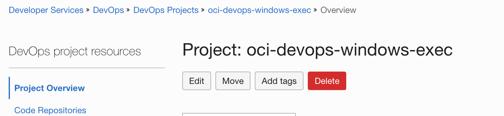
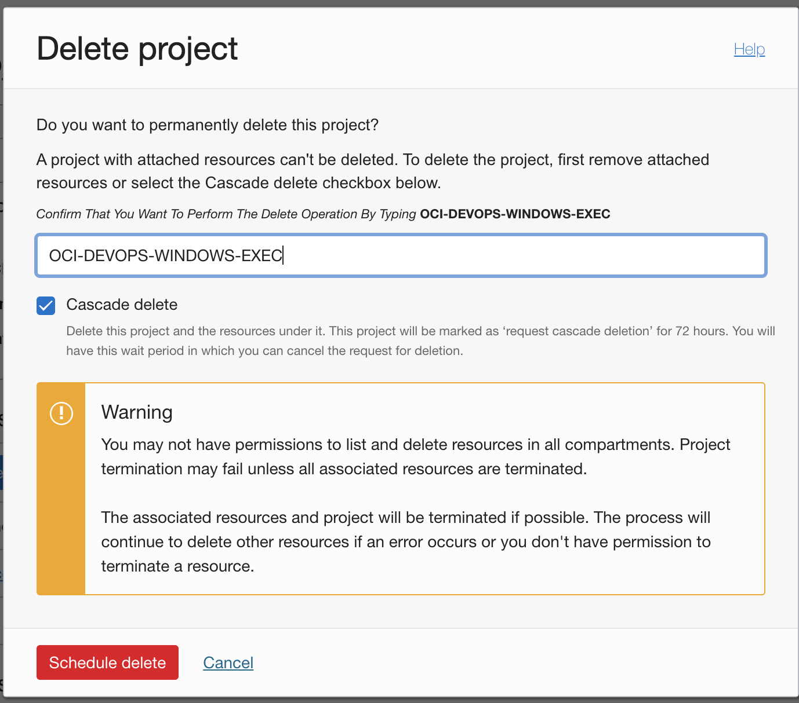
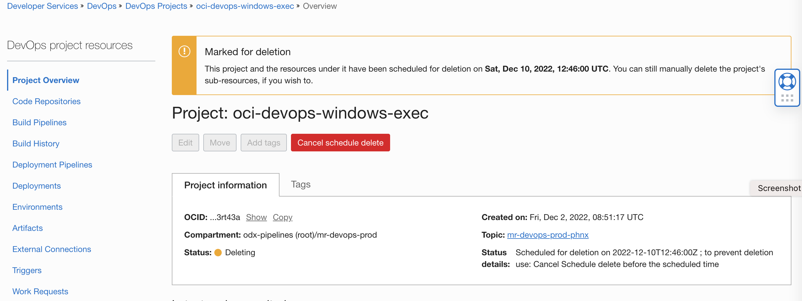
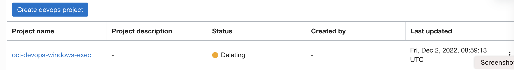

Cascade delete of `DevOps Project`.
------
The procedure illustrates the cascade deletion of OCI DevOps projects.

   ```
   $ git init oci-project-cascade delete
   $ cd oci-project-cascadedelete
   $ git remote add origin <url to this git repo>
   $ git config core. sparse checkout true
   $ echo "oci-config-examples/oci-project-cascadedelete/*">>.git/info/sparse-checkout
   $ git pull --depth=1 origin main

   ```


Procedure to use the illustration
-------

- Use `OCI Console` >`Developer service`>`Devops` and the `Project name



- Click `Delete`. Provide the project name and select the `Cascade delete` option.



- Deletion will be scheduled and it will start after `72` hours.



- All the associated resources within the DevOps project will be in to `deleting` state and won't be able to use further. At any point within the `72` hours, the deletion can be cancelled or individual resources can be deleted.



- Once the 72-hour window elapses and the Project and sub-resources are being hard deleted, the OCI Logging Configuration set up by the Project resource will also be deleted
- For a failed deletion the project status will move to the `Needs Attention` state.
- The act will emit audit events for cascade Delete success & failures for the schedule.

Read more
---

- OCI DevOps service - https://docs.oracle.com/en-us/iaas/Content/devops/using/home.htm
- OCI Compute run command agent - https://docs.oracle.com/en-us/iaas/Content/Compute/Tasks/runningcommands.htm

Contributors
===========

- Author: [Rahul M R](https://github.com/RahulMR42).
- Collaborators:
- Last release: December 2022

### Back to examples.
----

- 🏝️ [Back to OCI Devops sample](./../../README.md)

