Manage OCI policies using a OCI Devops build pipeline and OCI Terraform.
------

### Objectives

- Manage policies and dynamic group and more using OCI Devops and Terraform.
- Demonstrate how to execute terraform scripts from OCI Build runner.
- Manage Terraform state management using object storage.

*Target Audience* : OCI Intermediate and Experienced 

###  Flow 

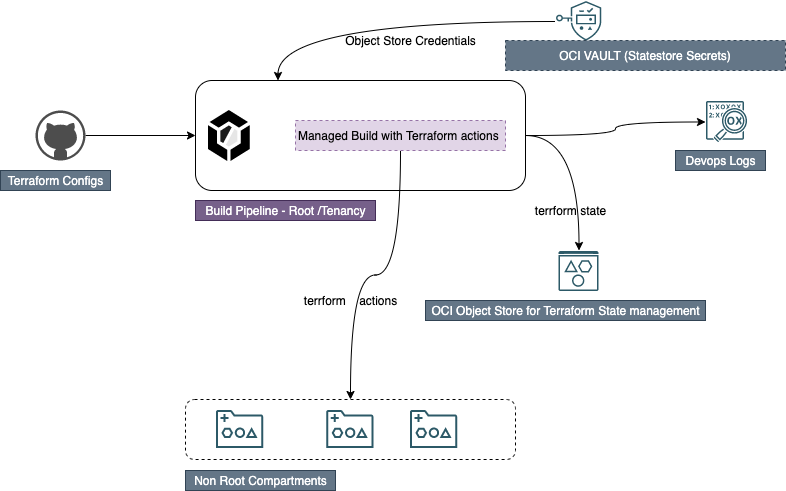

* Specific instruction to clone only this example.

    ```
    $ git init oci_devops_policy_dg_terraform
    $ cd oci_devops_policy_dg_terraform
    $ git remote add origin https://github.com/oracle-devrel/oci-devops-examples
    $ git config core.sparsecheckout true
    $ echo "oci-config-examples/oci_devops_policy_dg_terraform/*">>.git/info/sparse-checkout
    $ git pull --depth=1 origin main

    ```

### Procedure

- Its a specific sample with admin/root privilege ,so ensure that you are an admin to the tenancy or assigned with administrator privileges by the tenancy admin.

- Create an OCI Notification topic - https://docs.oracle.com/en-us/iaas/Content/Notification/home.htm 

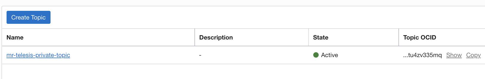

- Create a dynamic group and add below rules.

```
ALL {resource.type = 'devopsbuildpipeline', resource.compartment.id = 'ocid1.compartment.oc1..xxx'} 
ALL {resource.type = 'devopsrepository', resource.compartment.id = 'ocid1.compartment.oc1..xxx'}

```

- Create a policy with below statements.

```
Allow dynamic-group "<DG Name>" to manage repos in compartment "<Compartment Name>"    
Allow dynamic-group "<DG Name>" to read secret-family in compartment "<Compartment Name>"  
Allow dynamic-group "<DG Name>" to manage devops-family in compartment "<Compartment Name>"    
Allow dynamic-group "<DG Name>" to manage generic-artifacts in compartment "<Compartment Name>"    
Allow dynamic-group "<DG Name>" to use ons-topics in compartment "<Compartment Name>"  
Allow dynamic-group "<DG Name>" to read secret-family in compartment "<Compartment Name>"
```

- Create a devops project - https://docs.oracle.com/en-us/iaas/Content/devops/using/create_project.htm#create_a_project 
- Associate it with the notification topic created.

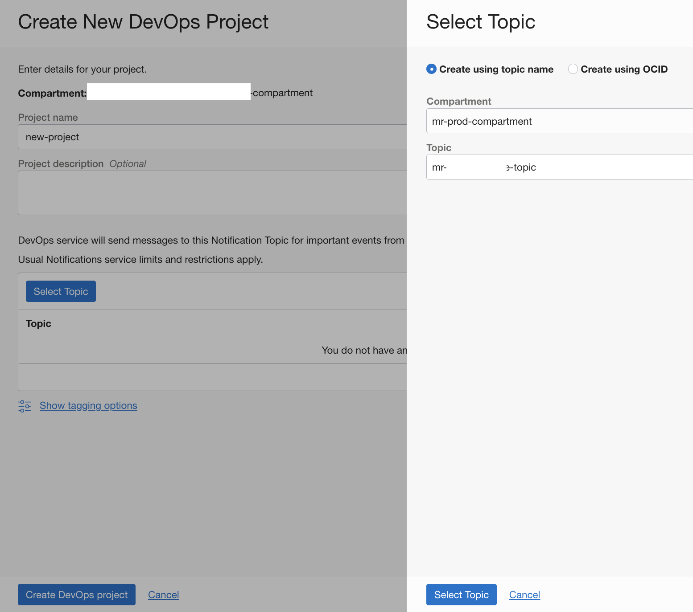

- Enables logs for projects.

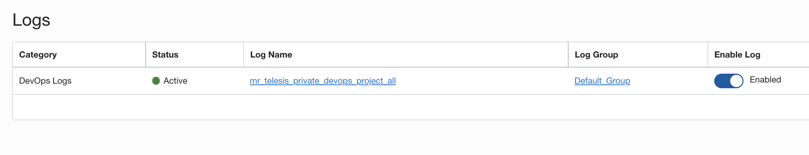

- Created a code repo - https://docs.oracle.com/en-us/iaas/Content/devops/using/create_repo.htm#create_repo

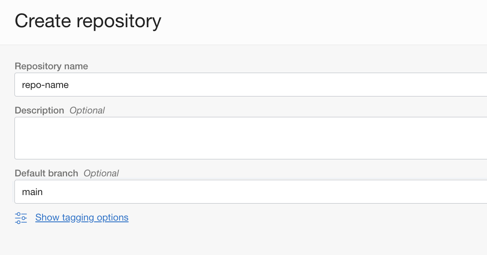

- Create a build pipeline - https://docs.oracle.com/en-us/iaas/Content/devops/using/create_buildpipeline.htm#create_buildpipeline

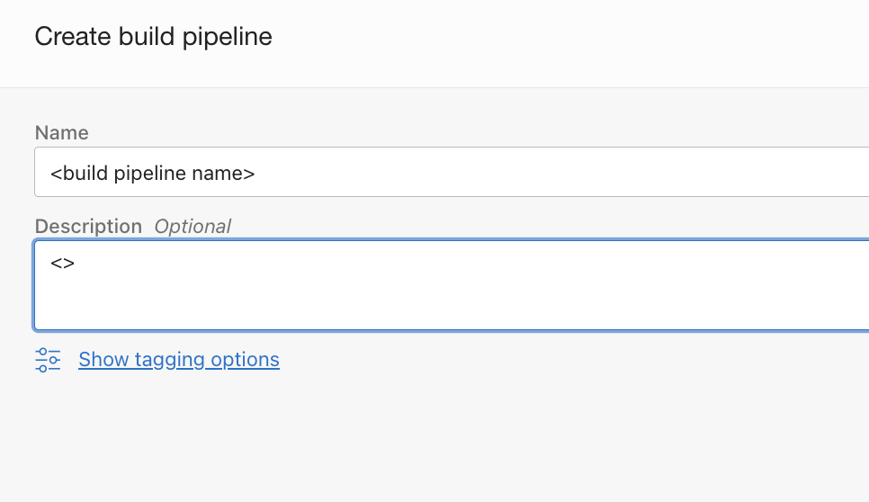

- Add a managed build stage to the build pipeline - https://docs.oracle.com/en-us/iaas/Content/devops/using/add_buildstage.htm

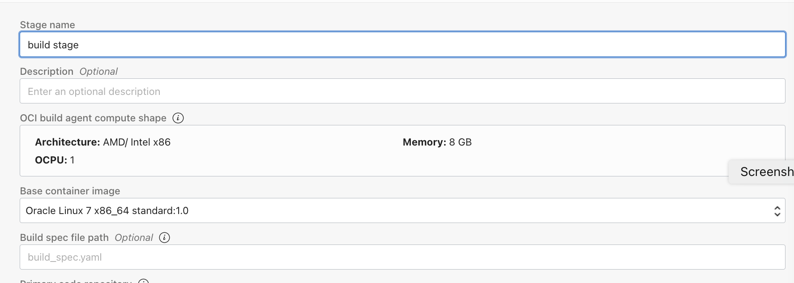

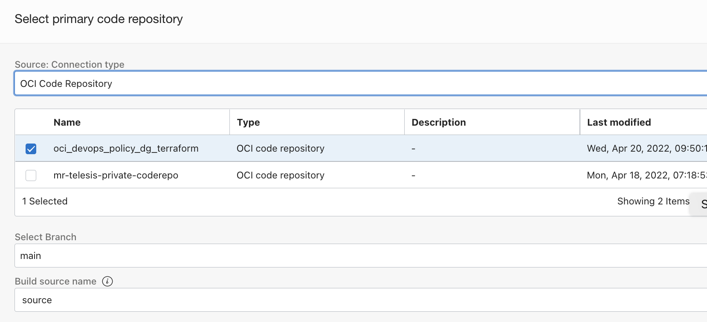

- Create an object storage bucket - https://docs.oracle.com/en-us/iaas/Content/Object/home.htm

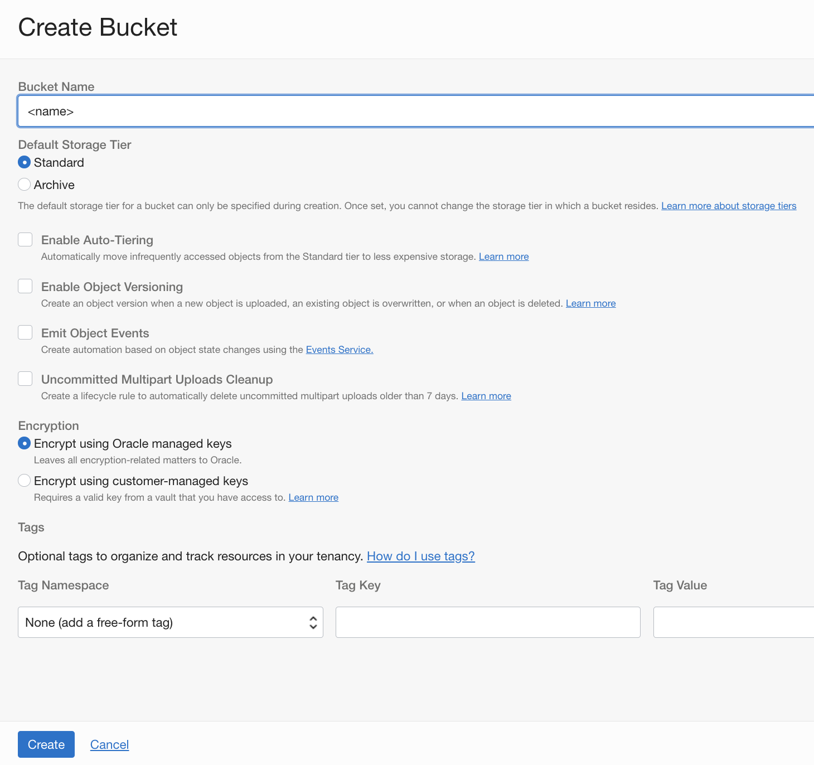

- Create a customer secret keys for the user - https://docs.oracle.com/en-us/iaas/Content/Identity/Tasks/managingcredentials.htm#Working2

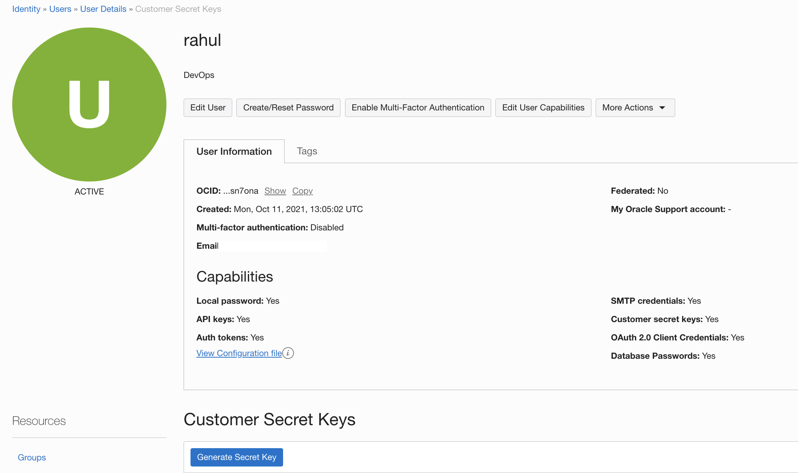

- Make a note of the Access key and Password info.

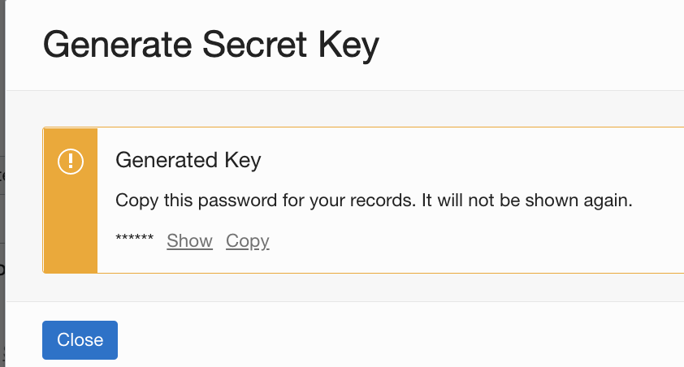

- Create an OCI Vault and create a master key - https://docs.oracle.com/en-us/iaas/Content/KeyManagement/home.htm

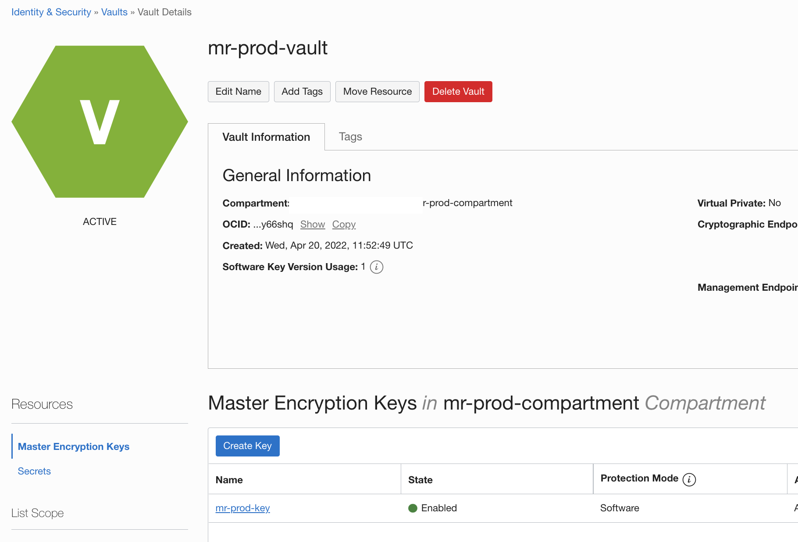

- Create two secretes and store customer secret keys and password.

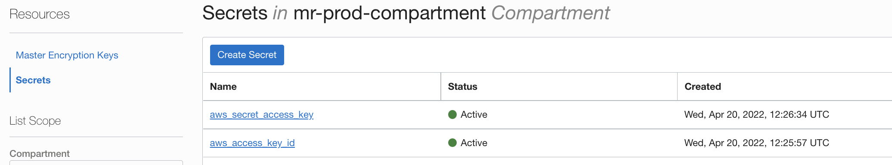

- Now that we have all the infrastructure and services are ready, let us do an implementation  . 
- Clone the repo to local machine or cloud -shell.
- Let us check the folder and file tree.

```
terraform/compartment_scope:  <For all terraform definitions need to implement with in individual compartment.
total 16
-rw-r--r--. 1 rahul oci 566 Apr 21 12:31 policies.tf
-rw-r--r--. 1 rahul oci 102 Apr 21 12:31 provider.tf
-rw-r--r--. 1 rahul oci 471 Apr 21 12:31 remote-backend_template.tf
-rw-r--r--. 1 rahul oci 452 Apr 21 12:31 variables.tf

terraform/tenancy_scope: <For all terraform definitions need to implement under root of the tenancy.
total 20
-rw-r--r--. 1 rahul oci 360 Apr 21 12:31 dgs.tf
-rw-r--r--. 1 rahul oci 102 Apr 21 12:31 provider.tf
-rw-r--r--. 1 rahul oci 476 Apr 21 12:31 remote-backend_template.tf
-rw-r--r--. 1 rahul oci 459 Apr 21 12:31 remote-backend.tf
-rw-r--r--. 1 rahul oci 427 Apr 21 12:31 variables.tf
```

- For sample run we will be adding a dynamic group(under root of the tenancy) and policy per compartment.

- Add the necessary compartment informations under `compartments.config`.
- The format should be "compartment name=compartment ocid" 

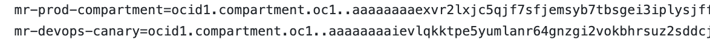

- Update the values for scope compartment.

```
$ cd terraform/compartment_scope
$ Edit variables.tf and update the tenancy_ocid
$ Edit remote-backend_template.tf and update the endpoint.
```
- Endpoint format is "https://NAMESPACEcompat.objectstorage.OCIREGION.oraclecloud.com"

- Update the values for scope tenancy(root).

```
$ cd ../tenancy_scope 
$ Edit variables.tf and update tenancy_ocid and region values.
$ Edit remote-backend_template.tf and update the endpoint.
```

- Push the change back to OCI Code repo using using GIT CLI or UI over https or ssh authorization towards OCI Code repo  - https://docs.oracle.com/en-us/iaas/Content/devops/using/clone_repo.htm 

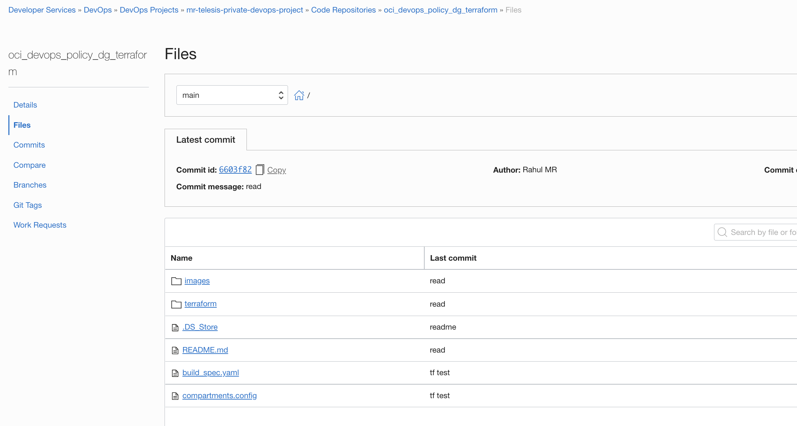

- Let us do a manual build run.

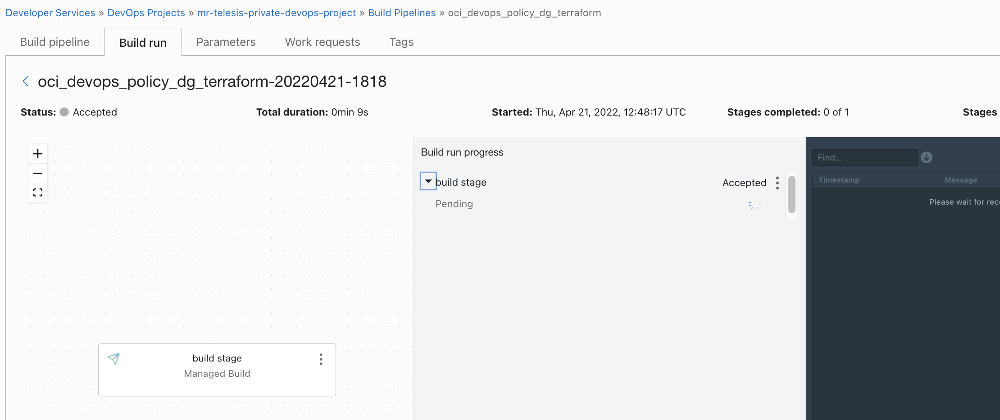

- Wait for the completion of the build run .

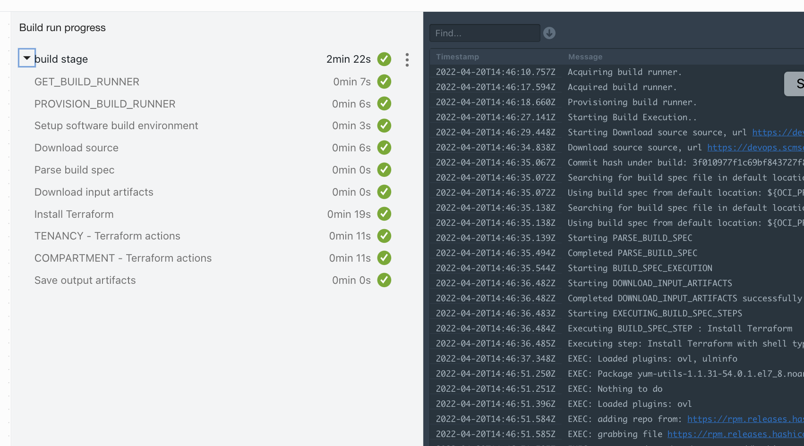

- Re verify the implementation of tenancy level . Switch to dynamic groups and we should see two group with a compartment name post fixed.

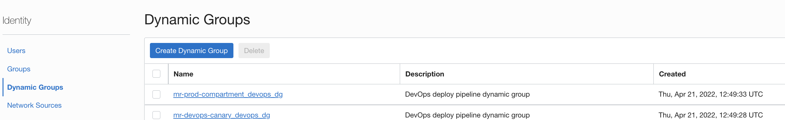

- Switch to policies and switch the different compartment mentioned and validate the policies.We should see one policy per compartment added as per the execution.

- Verify the terraform backend states via object storage files.
- You should see even number  files ,half  with a prefix of `root_` and other with name of the compartment.
- The files with root_ stores the state of resources that are created under tenancy root for a specific compartment

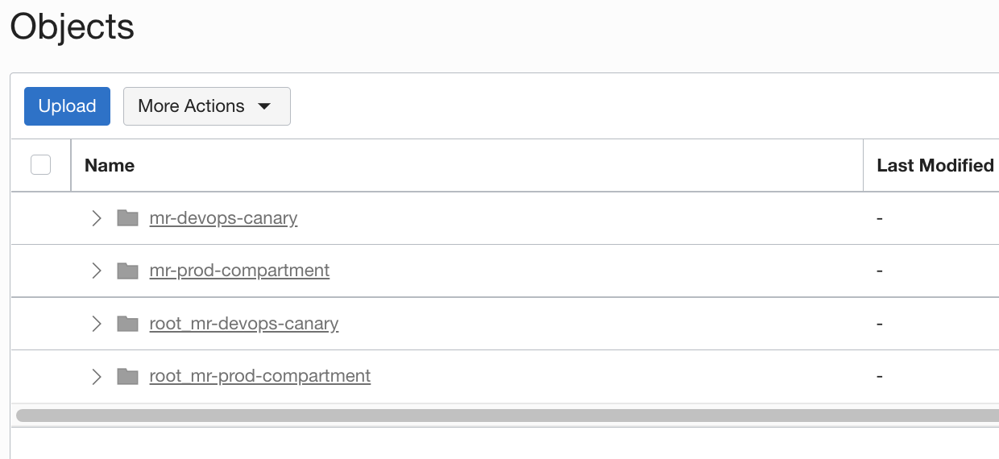


- You may add /update terraform definitions and explore options on state consistency (like a manual deletion or re-run with state and resources intact.)

Read more 
----

- OCI Devops - https://docs.oracle.com/en-us/iaas/Content/devops/using/home.htm.
- OCI Reference architectures  -  https://docs.oracle.com/solutions/
- OCI Devops samples - https://github.com/oracle-devrel/oci-devops-examples 


Contributors 
===========

- Author : Rahul M R.
- Colloboroators : NA
- Last release : April 2022


### Back to examples.
----

- 🍿 [Back to OCI Devops Config sample](./../README.md)
- 🏝️ [Back to OCI Devops sample](./../../README.md)

