Sample illustration of OCI DevOps deployment pipeline with *STAGE LEVEL PARAMETERS*
------------

Objective
---
- Create an OCI Deployment pipeline with a default OKE deployment stage.
- Provide default parameters for the stage.
- Do executions and demonstrate how can the parameters can override using stage-level parameters.

Specific instructions to download only this sample.
---

```
    $ git init oci-deployment-stagelevelparams
    $ cd oci-deployment-stagelevelparams
    $ git remote add origin https://github.com/oracle-devrel/oci-devops-examples
    $ git config core. sparsecheckout true
    $ echo "oci-deployment-examples/oci-deployment-stagelevelparams/*">>.git/info/sparse-checkout
    $ git pull --depth=1 origin main

```

⚠️ Stage level parameter option is now available `ONLY` for `OCI deployment pipeline` and `NOT` available for deployment when invoked from `OCI Buildpipeline` using the `Invoke deployment` stage.

Procedure
---
- The procedure requires an active OKE (Oracle Container Engine for Kubernetes).

- If you do not have an OKE cluster, please create one (It can be private or public hosted nodes /API endpoints) - https://docs.oracle.com/en-us/iaas/Content/ContEng/Tasks/contengcreatingclusterusingoke_topic-Using_the_Console_to_create_a_Quick_Cluster_with_Default_Settings.htm#create-quick-cluster

- Access the OKE Cluster and create two namespaces as `nginx16` and `nginx14`.
- Create an OCI dynamic group with the below rules.

```java
ALL {resource.type = 'devopsdeploypipeline', resource.compartment.id = 'COMPARTMENT OCID'}
```

- Create an OCI policy with the below statements.

```java
Allow dynamic-group <NAME of the DG> to manage ons-topics in compartment <NAME Of the COMPARTMENT>
Allow dynamic-group <NAME of the DG> to manage cluster-family in compartment <NAME Of the COMPARTMENT>
```

- Create an OCI Notification topic - https://docs.oracle.com/en-us/iaas/Content/Notification/Tasks/create-topic.htm#top
- Create a DevOps project and associate it with the notification. - https://docs.oracle.com/en-us/iaas/Content/devops/using/create_project.htm#create_a_project


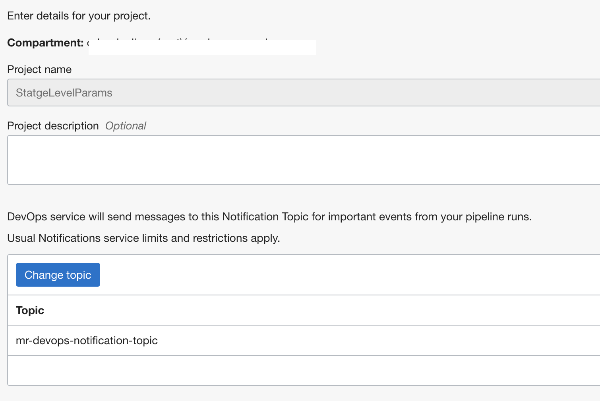

- Ensure enable to logs for the DevOps project.

- Create a DevOps environment of type `Oracle Kubernetes Engine`.

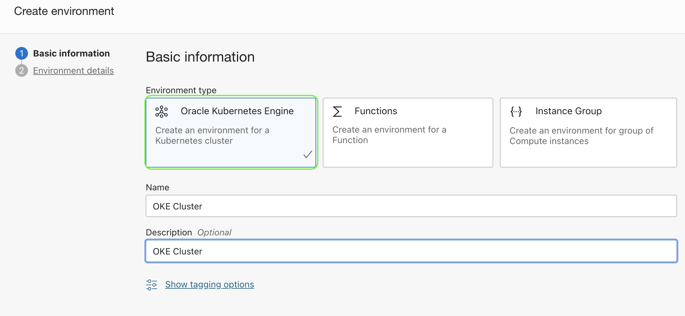

- Select the appropriate OKE Cluster and save.

- Create a deployment artifact of type `Kubernetes manifest`.

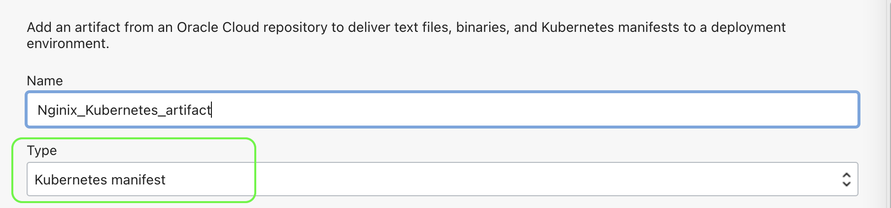

- Select the source type as `inline` and paste the content from [file here.](deployment. yaml)

- Ensure to select the option `Allow parameterization` and add.

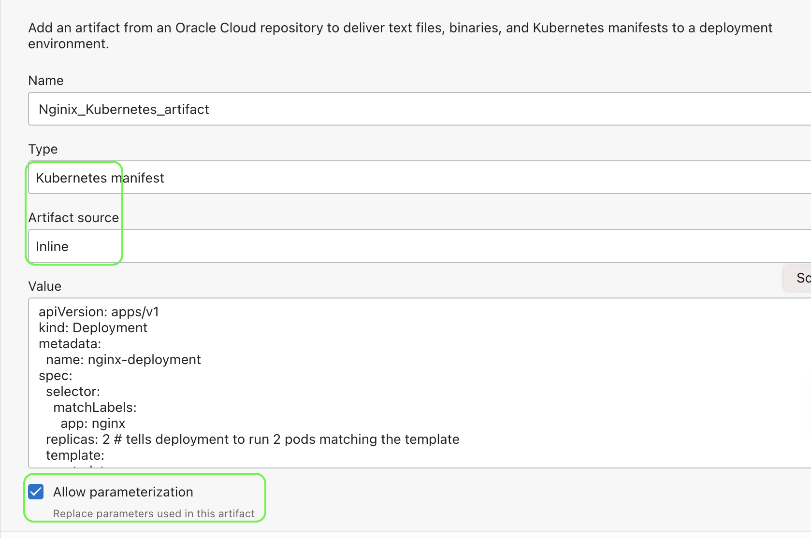

- We are using a sample Nginx deployment file for this procedure.

- Create a `deployment pipeline` - https://docs.oracle.com/en-us/iaas/Content/devops/using/deployment_pipelines.htm

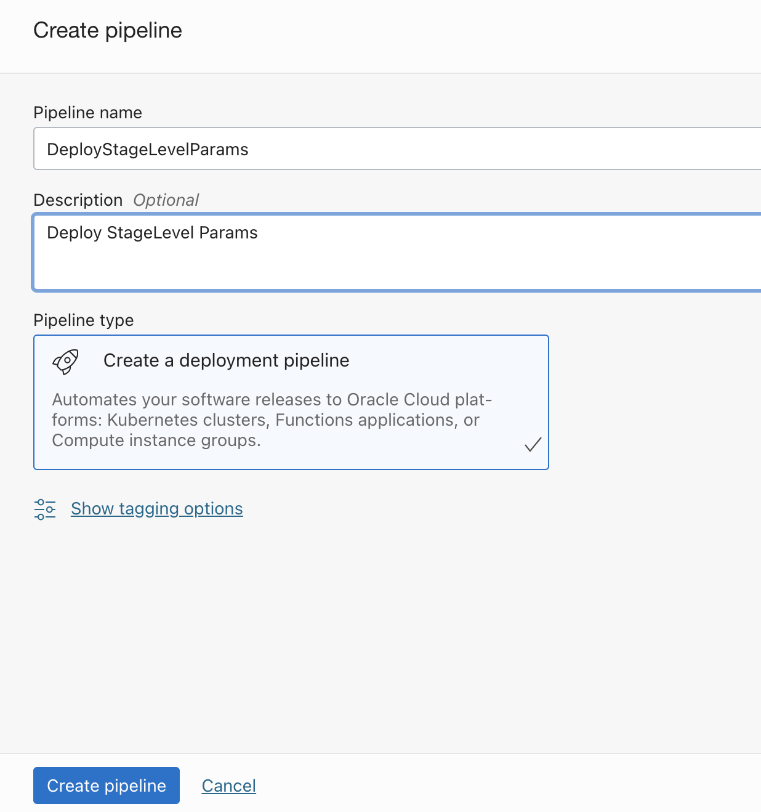

- We will be adding `two OKE deployment stages` within the deployment pipeline to illustrate the procedure.

- Use `+` and add first deployment stage of type `OKE Rolling`.
- Name the stage as `Nginx16` and select the `environment and DevOps artifact created.
- Use namespace as `nginx16` for the deployment.

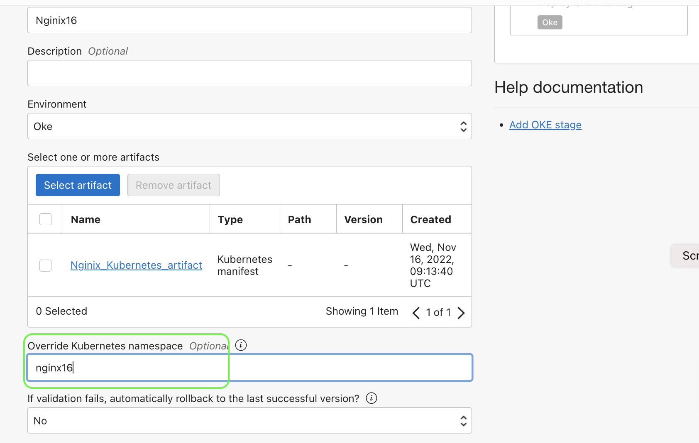


- Use `+` add another stage of type `OKE Rolling`.

- Name the stage  as `Nginx14` and select the `environment and DevOps artifact created

- Use the namespace as `nginx16` for the deployment.

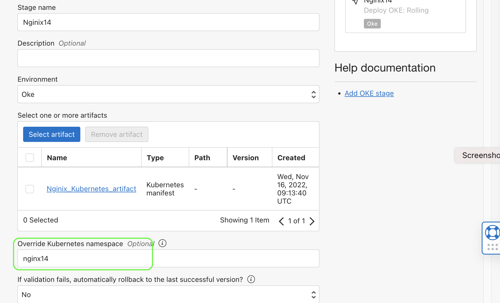

- Set the below parameters for the pipeline (these are global parameters for the pipeline)

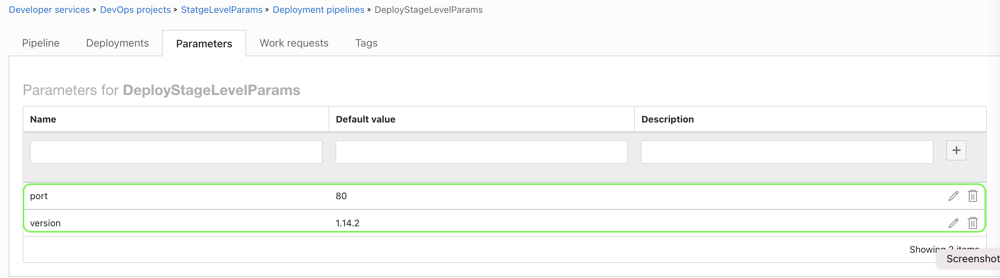

```java
- port: 80
- version: 1.14.2 
```

- Use `Run pipeline` and run the pipeline for both stages.
- Wait for all the stages to complete.

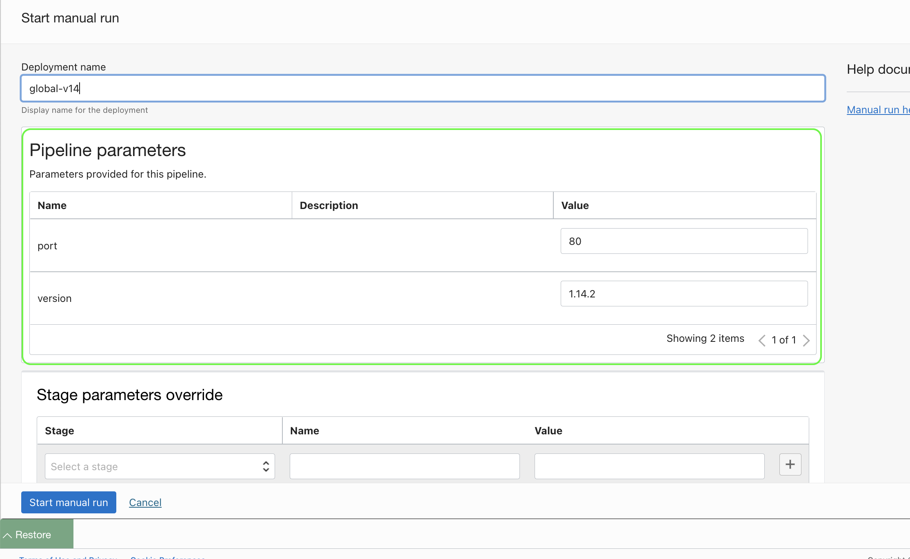

- Once all the steps are completed, connect to the OKE cluster (preferably using cloud shell and kubectl) and run the below commands and validate the version of the image.

```java
kubectl describe deployment.apps/nginx-deployment -n nginx16|grep Image
kubectl describe deployment.apps/nginx-deployment -n nginx14|grep Image
```

- It should show the version as the default version values from `deployment parameters

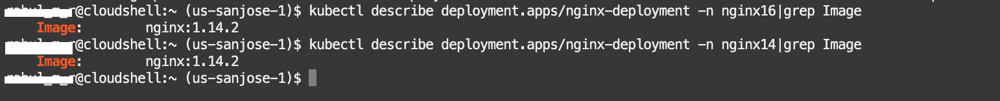

- Let us do a `value override` with another deployment, where we will provide different versions for one of the stages.

- Click on `Run pipeline` > Select `stages` from option `Stage parameters override`
- Select stage `Nginx16` and provide `Name` as `version` and
  `Value` as `1.16.1`.

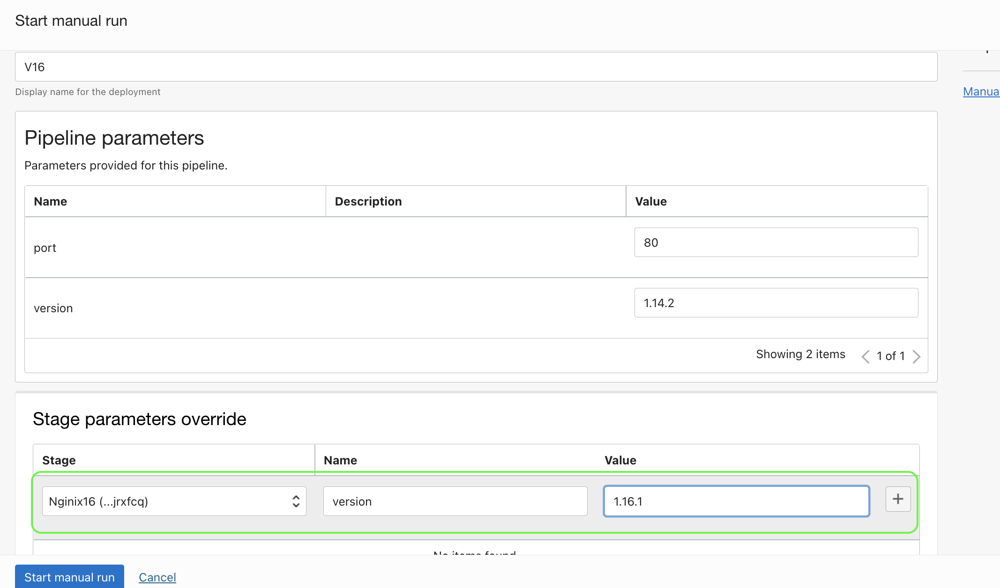

- Re-run the commands using kubectl to validate the changes.

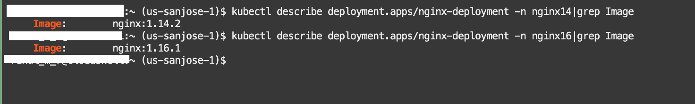


- As you may verify from the above that the override is effective, let us do one last test wherein we will try to parse a param which is not defined in the global pipeline parameters.

- Delete the parameter `port` from the `pipeline parameters`

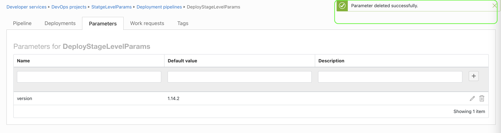

- Re-run the deployment where we will be giving different values for stages as ports.

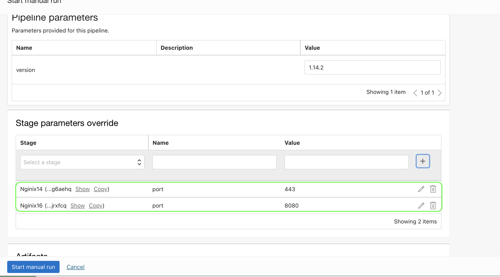

- Wait for all the steps to complete and validate the changes by connecting to the OKE cluster.

```java
kubectl describe deployment.apps/nginx-deployment -n nginx16|grep Port
kubectl describe deployment.apps/nginx-deployment -n nginx14|grep Port
```

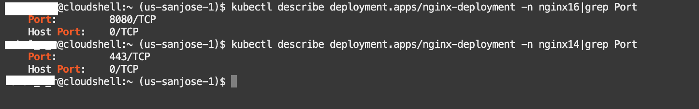

Read more
----

- OCI DevOps - https://docs.oracle.com/en-us/iaas/Content/devops/using/home.htm.
- OCI Reference architectures  -  https://docs.oracle.com/solutions/
- OCI DevOps samples - https://github.com/oracle-devrel/oci-devops-examples

Contributors
===========

- Author: Rahul M R.
- Collaborators  : NA
- Last release: January 2023

### Back to examples.
----
- 🍿 [Back to OCI Devops Deployment sample](./../README.md)
- 🏝️ [Back to OCI Devops sample](./../../README.md)