 Sample illustration of deployment on to *OCI Container instance* using OCI DevOps.
------------

Objective
----

- Using OCI Build pipeline build a container image for a sample python application.
- Use the shell stage within the deployment pipeline to deploy to the container instance.

Specific instructions to download only this sample.
---

```
    $ git init oci-devops-deploy-containerinstance
    $ cd oci-devops-deploy-containerinstance
    $ git remote add origin https://github.com/oracle-devrel/oci-devops-examples
    $ git config core. sparsecheckout true
    $ echo "oci-deployment-examples/oci-devops-deploy-containerinstance/*">>.git/info/sparse-checkout
    $ git pull --depth=1 origin main

```

Procedure
---

### OCI Identity setup.

- Create OCI Dynamic group and add the below rules.

```java
ALL {resource.type = 'devopsbuildpipeline', resource.compartment.id = 'OCID OF YOUR COMPARTMENT'}
ALL {resource.type = 'devopsdeploypipeline', resource.compartment.id = 'OCID OF YOUR COMPARTMENT'}
```

- Create OCI policy and add the below statements.

```java
Allow dynamic-group <NAME OF THE DYNAMIC GROUP> to read secret-family in compartment <NAME OF THE COMPARTMENT>
Allow dynamic-group <NAME OF THE DYNAMIC GROUP> to manage virtual-network-family in compartment <NAME OF THE COMPARTMENT>
Allow dynamic-group <NAME OF THE DYNAMIC GROUP> to manage ons-topics in compartment <NAME OF THE COMPARTMENT>
Allow dynamic-group <NAME OF THE DYNAMIC GROUP> to manage objects in compartment <NAME OF THE COMPARTMENT>
Allow dynamic-group <NAME OF THE DYNAMIC GROUP> to manage all-artifacts in compartment <NAME OF THE COMPARTMENT>
Allow dynamic-group <NAME OF THE DYNAMIC GROUP> to manage repos in compartment <NAME OF THE COMPARTMENT>
Allow dynamic-group <NAME OF THE DYNAMIC GROUP> to manage compute-container-family in compartment <NAME OF THE COMPARTMENT>
```

### OCI Artifact repo setup

- Create an OCI Artifact registry repo - https://docs.oracle.com/en-us/iaas/Content/artifacts/create-repo.htm#create-repo
- Uncheck the immutable option, this is to have a mutable command spec configuration.

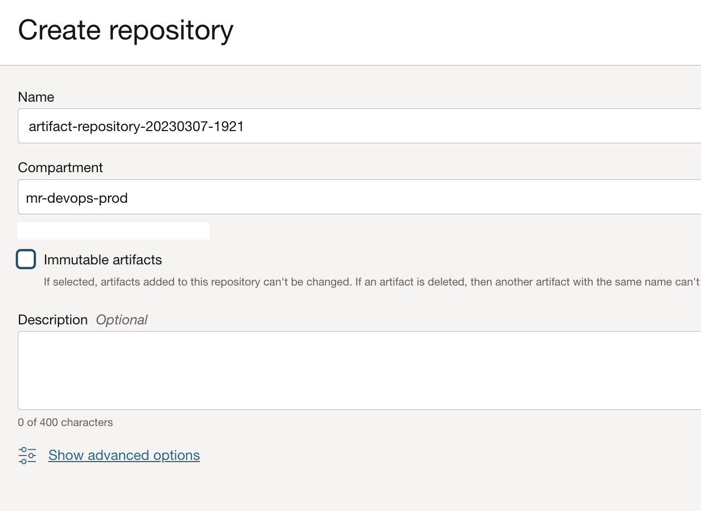

### OCI Container registry setup

- Create an OCI container registry repo - https://docs.oracle.com/en-us/iaas/Content/Registry/Tasks/registrycreatingarepository.htm#Creating_a_Repository

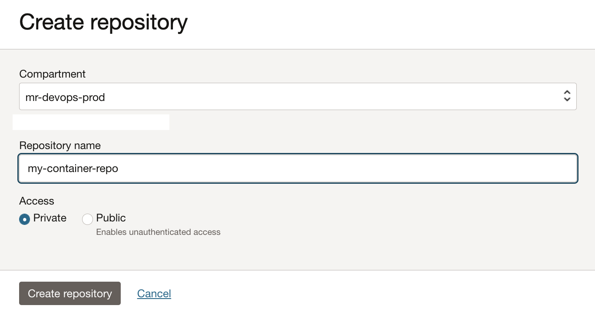

### OCI VCN Setup

- Create a VCN - https://docs.oracle.com/en-us/iaas/Content/Network/Tasks/managingVCNs.htm
- We have created this sample using a `public subnet`, feel free to use a private or public subnet as far as the IP address can connect via HTTP from your workstation.
- With in the subnet ,add  security rules to allow traffic http (port 80) and https (port 443).


### OCI Vault setup

- Create an OCI Vault and master key - https://docs.oracle.com/en-us/iaas/Content/KeyManagement/home.htm
- We will be using an object storage backend to ensure a consistent state across the container instance, to ensure the same IP address for a better user experience. To provide access create a `customer secret key` - https://docs.oracle.com/en-us/iaas/Content/Identity/Tasks/managingcredentials.htm#Working2

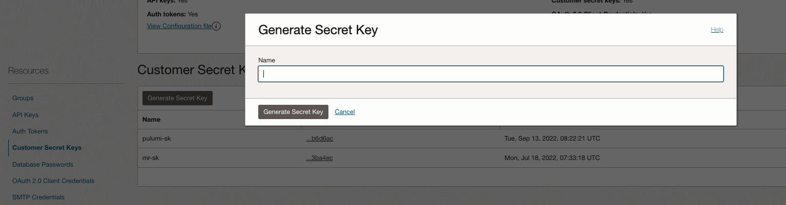

- Add the key id and key as secrets with OCI Vault.

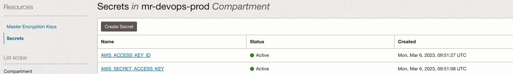

- Make a note of these secrets OCID

### OCI Object storage bucket.

- Create an OCI Object storage bucket, the same will be used to store terraform config and state files.

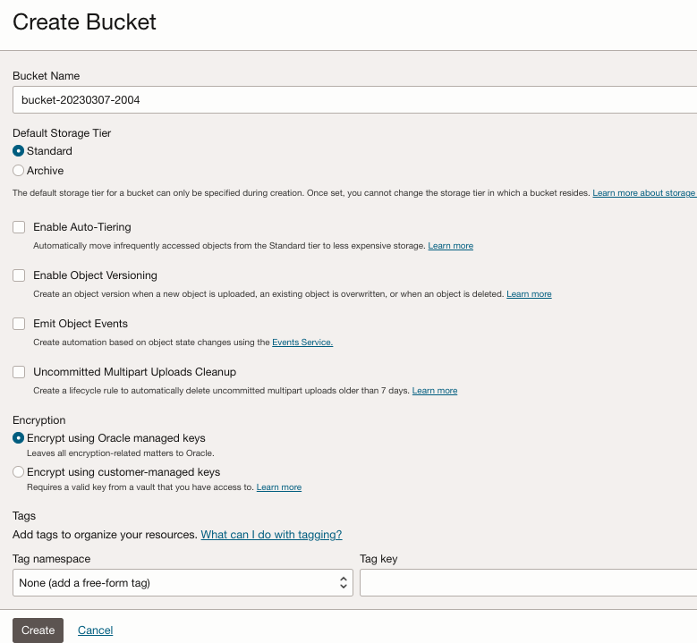


### OCI DevOps setup

- Create an `OCI Notification topic` - https://docs.oracle.com/en-us/iaas/Content/Notification/Tasks/create-topic.htm#top
- Create a DevOps project and associate it with the notification.

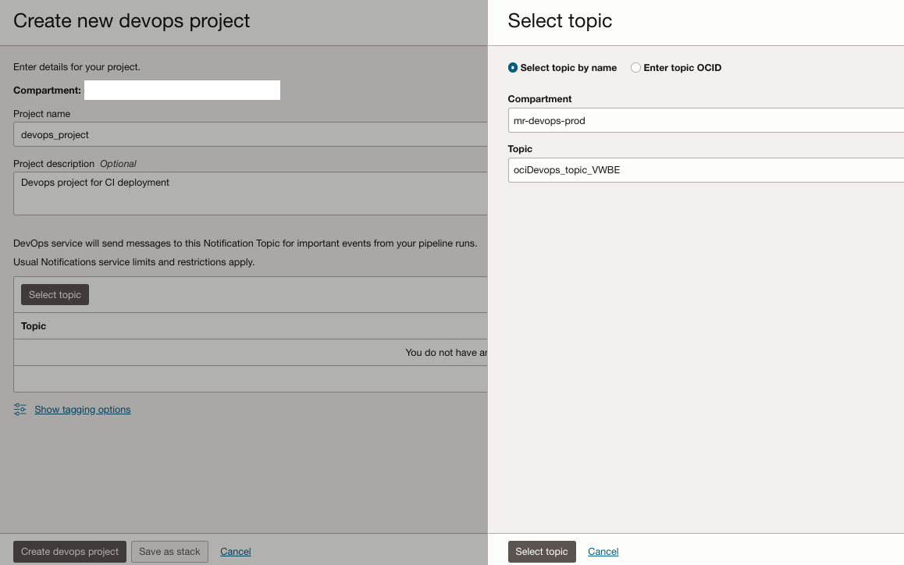

- Enable `logs` for the project.

- Create a code repo. - https://docs.oracle.com/en-us/iaas/Content/devops/using/create_repo.htm#create_repo

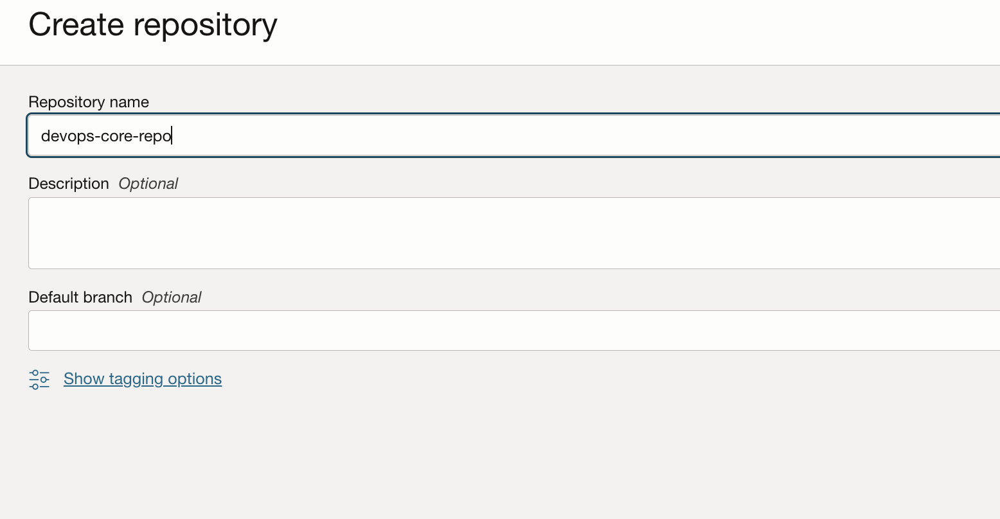

- Push the content to the code repo over HTTPS or ssh protocol.

- Create a DevOps artifact of type `Docker image`, this is for static image reference. Use type as `Container Image repository` and path as `PATH To container repo:${STATIC_IMAGE_TAG}`.Enable `Allow parameterization`.


- Create a DevOps artifact of type `Docker image`, this for dynamic image reference. Use type as `Container Image repository` and path as `PATH To container repo:${BUILDRUN_HAS}`.Enable `Allow parameterization`.

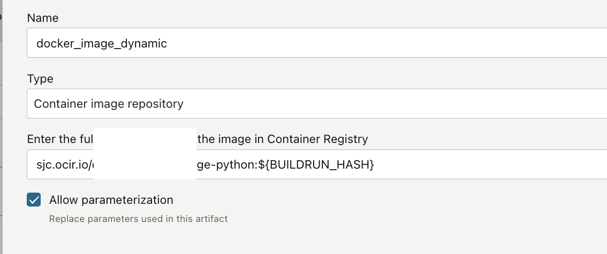

- Create a DevOps artifact of type `General artifact` for the build pipeline to push shell stage instructions to the artifact registry repo. Select the type as `General artifact` and the artifact source as `Artifact registry repository`

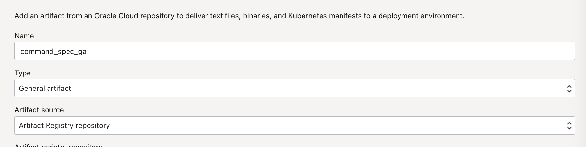

- Use `Select` and associate with the artifact registry repo.

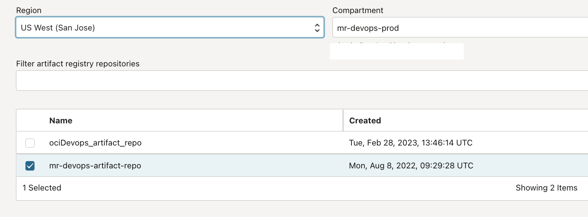

- Use artifact location as `Set custom location` and add the path as `commad_spec.yaml` and version as `0.0`.Enable the `Allow parameterization` option.

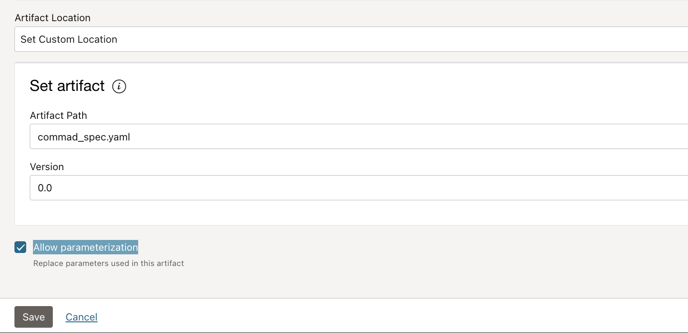


- Create a DevOps artifact of type `Command specification` for the shell stage to use the artifact. We will be using the definitions created in the previous step but with a different artifact type. Select the type as `Command specification` and the artifact source as `Artifact registry repository`

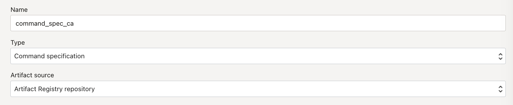

- Use `Select` and associate with the artifact registry repo.

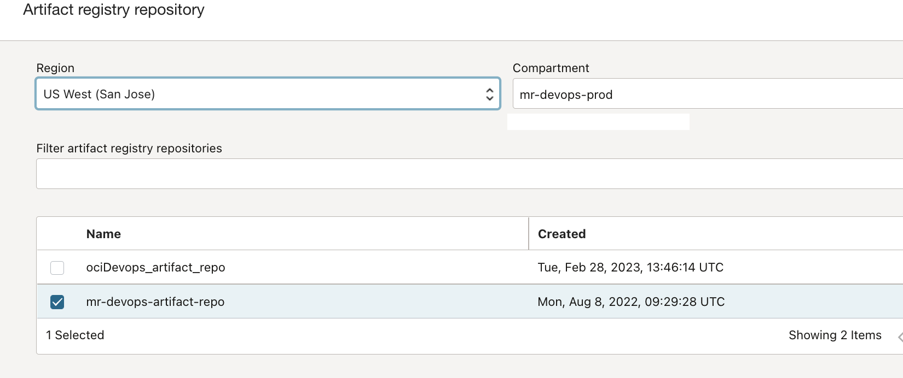


- Use artifact location as `Set custom location` and add the path as `commad_spec.yaml` and version as `0.0`.Enable the `Allow parameterization` option.


- Create a `Build pipeline` - https://docs.oracle.com/en-us/iaas/Content/devops/using/create_buildpipeline.htm#create_buildpipeline

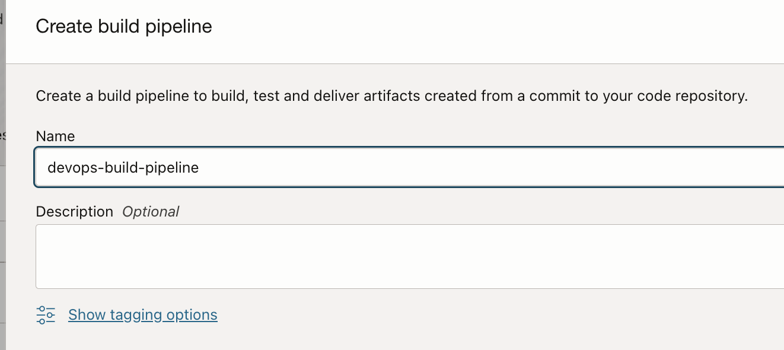

- Add below keys and values for the build pipeline, as parameters.


- BUCKET_NAME = Object storage bucket name
- NAMESPACE_NAME = Object storage namespace
- SUBNET_OCID = OCID of the subnet to use
- IMAGE_STATIC_TAG = a string (Example new), it's a tag we will be using to update the container image.
- CONTAINER_REGISTRY_URL = Absolute path of the container registry repo.
- CONTAINERINSTANCE_DISPLAY_NAME = Display name for the container instance
- AD = Availability domain for the container instance.
- COMPARTMENT_OCID = OCI Compartment OCID
- REGION = OCI Region

- Within the build pipeline add a stage of type `Managed Build`.Associate with the code repo as the `Primary code repository`.

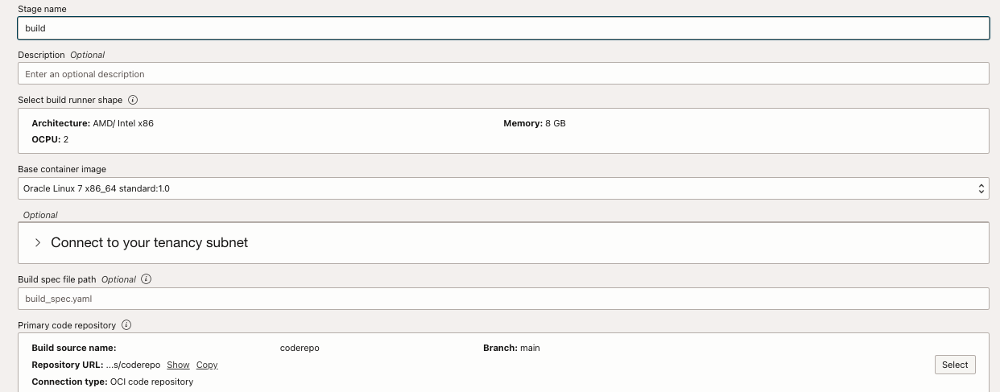

- Add another stage of type `Deliver Artifacts` within the build pipeline. Associate the stage with both the docker image and general artifacts created. Associate both the docker image artifact with the result artifact name as `python_app_dockerimage` and the general artifact with the outputArtifact name `command_spec`. This configuration is based on the [build_spec.yaml](build_spec.yaml) file.

```java
outputArtifacts:
  - name: python_app_dockerimage
    type: DOCKER_IMAGE
    location: python_fast_app:latest

  - name: command_spec
    type: BINARY
    location: ${OCI_PRIMARY_SOURCE_DIR}/command_spec.yaml
```
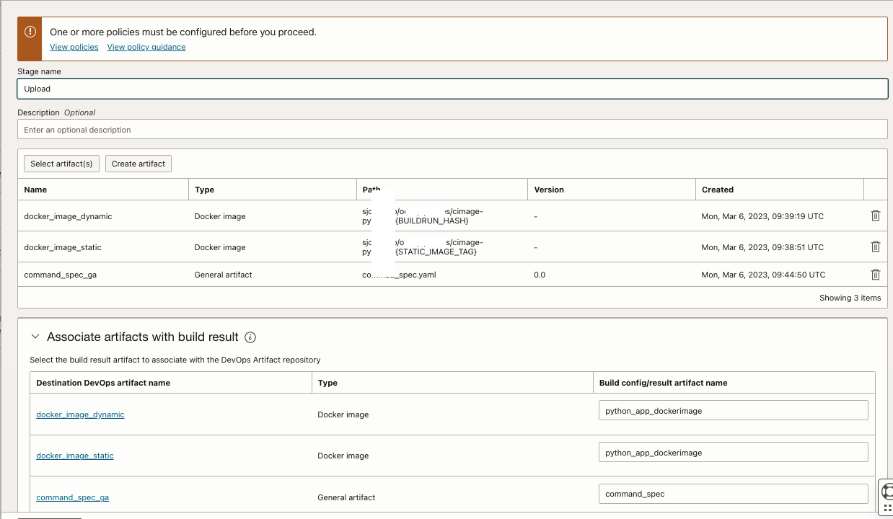

- Create a deployment pipeline - https://docs.oracle.com/en-us/iaas/Content/devops/using/deployment_pipelines.htm


- Within the deployment pipeline add a stage of type `shell.` Associate with the command specification artifacts.

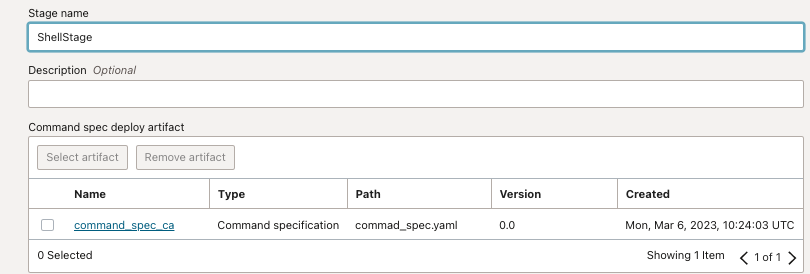

- Select the appropriate container instance configuration.

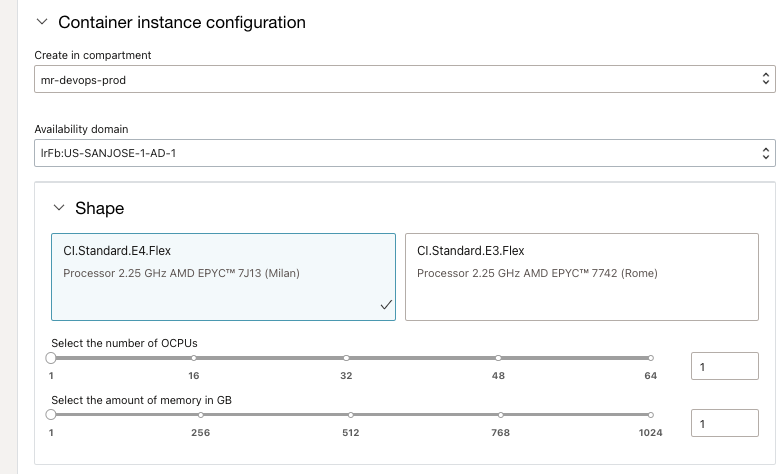

- Select the appropriate virtual cloud network and subnet.

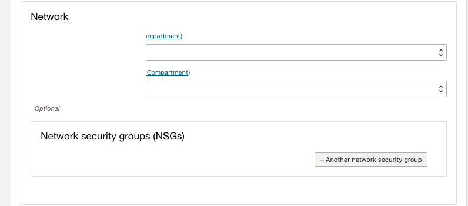

- Switch back to `build a pipeline` and add a stage of type `Trigger deployment`. Associate with the `deployment pipeline`.Ensure to enable the option `Send build pipelines Parameters`.

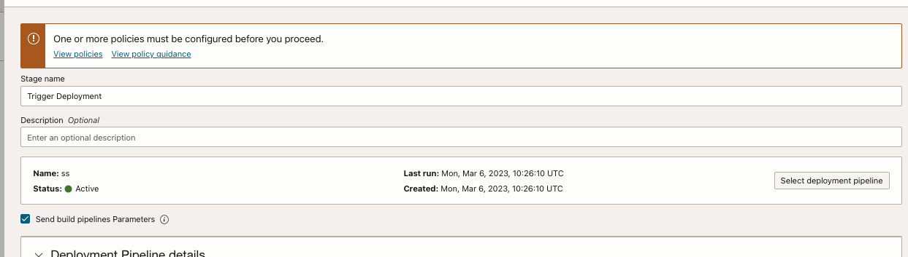

- the complete build pipeline stage will be as below.

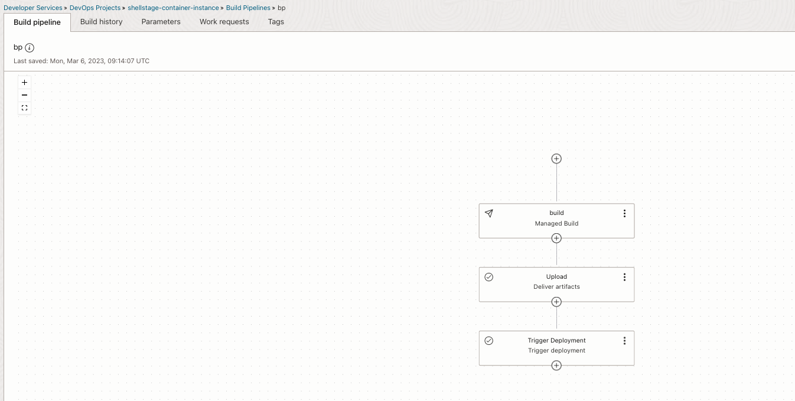

- Create an OCI Trigger and associate the code repo and the build pipeline created - https://docs.oracle.com/en-us/iaas/Content/devops/using/trigger_build.htm

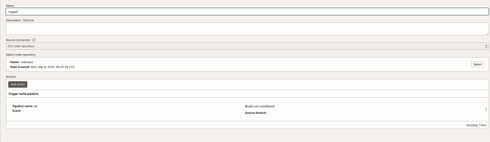

### Test the solution

- Update file [readme.md](README.md) and push back to code repo. Once the repo gets updated, it will trigger a build pipeline.

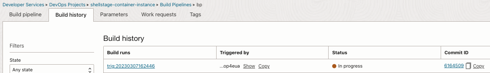

- Wait for all the build stages to complete.

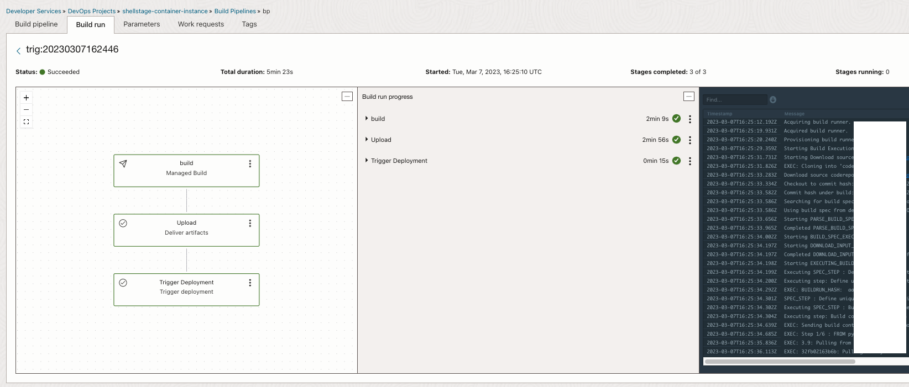

- Follow deployments


- It will take a while for the deployment pipeline to complete. Once done fetch the `IP address` to access the application from the deployment logs.


- We are restarting the container instance on every deployment to
  - Ensure a constant URL for the end user.
  - As there is no native image update for the container, on every restart it will pick the latest image pushed to the container repo.
- Use the application IP and access the container.

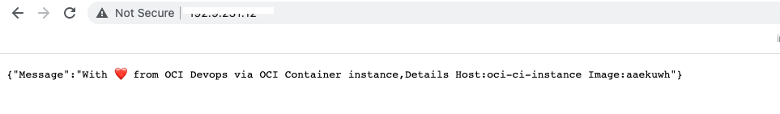

### Tail end

- Refer deployment logs via pipeline or container instances will help to troubleshoot any errors.
- The shell stage intern uses container instances with two containers and it will be auto-deleted once the deployment completes.

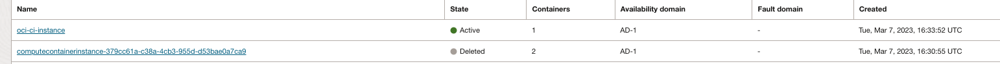

- The terraform state is managed by the object storage, once it's removed or any alteration, the terraform actions will also be changed accordingly.

### Cleanup of the resources.

- Delete OCI devops project using `cascade deletion` option.
- Remove the content and bucket of OCI Object storage.
- Delete the OCI Container instance.
- Remove the artifacts and delete artifact and container registry repos.
- Clean up the devops logs /policies /dynamic group as accordingly.


Read more
----

- OCI DevOps - https://docs.oracle.com/en-us/iaas/Content/devops/using/home.htm.
- OCI Reference architectures  -  https://docs.oracle.com/solutions/
- OCI DevOps samples - https://github.com/oracle-devrel/oci-devops-examples
- OCI DevOps shell stages - https://docs.oracle.com/en-us/iaas/Content/devops/using/shell_stage.htm
  
Contributors
===========

- Author: Rahul M R.
- Collaborators  : NA
- Last release: March 2023

### Back to examples.
----
- 🍿 [Back to OCI Devops Deployment sample](./../README.md)
- 🏝️ [Back to OCI Devops sample](./../../README.md)**

