# Invoke OCI DevOps deployment pipeline on a container image upload.

------------

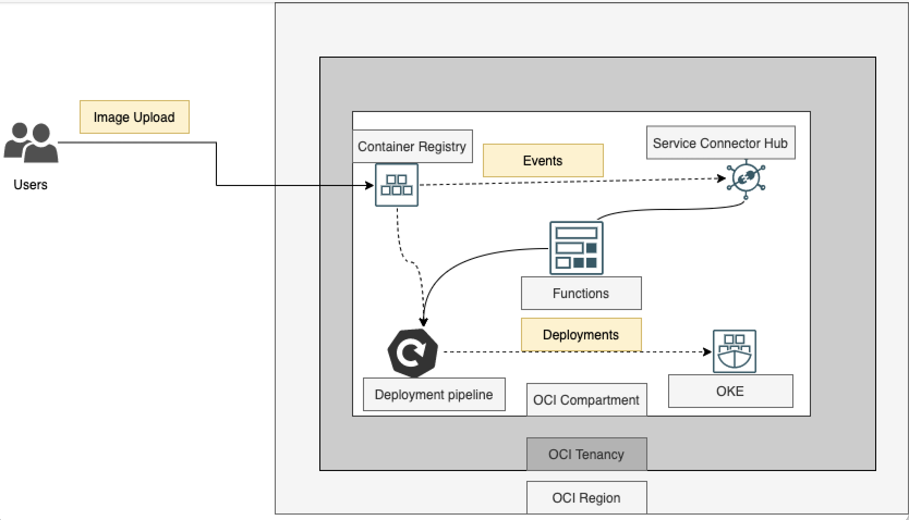

## Objective

- Invoke a deployment pipeline when a user uploads a new container image.
- We will be using the OCI Service Connector hub to connect between the image upload and deployment pipeline invoke.

### Category: Intermediate or expert on OCI services.

Specific instructions to download only this sample.
---

```
    $ git init oci-devops-deploy-on-imageupload
    $ cd oci-devops-deploy-on-imageupload
    $ git remote add origin https://github.com/oracle-devrel/oci-devops-examples
    $ git config core.sparsecheckout true
    $ echo "oci-deployment-examples/oci-devops-deploy-on-imageupload/*">>.git/info/sparse-checkout
    $ git pull --depth=1 origin main

```

## OCI DevOps

- The Oracle Cloud Infrastructure (OCI) DevOps service is an end-to-end, continuous integration and continuous delivery (CI/CD) platform for developers.

- Use this service to easily build, test, and deploy software and applications on Oracle Cloud. The DevOps build and deployment pipelines reduce change-driven errors and decrease the time customers spend on building and deploying releases. The service also provides private Git repositories to store your code and supports connections to external code repositories.

- Read more [here](https://docs.oracle.com/en-us/iaas/Content/devops/using/devops_overview.htm)

## OCI Service connector hub

- Service Connector Hub is a cloud message bus platform that offers a single pane of glass for describing, executing, and monitoring the movement of data between services in Oracle Cloud Infrastructure.
- Data is moved using service connectors. A service connector specifies the source service that contains the data to be moved, optional tasks, and the target service for delivery of data when tasks are complete. An optional task might be a function task to process data from the source or a log filter task to filter log data from the source.
- Read more [here](https://docs.oracle.com/en-us/iaas/Content/service-connector-hub/overview.htm)

## OCI Functions

- Oracle Functions is a fully managed, multi-tenant, highly scalable, on-demand, Functions-as-a-Service platform. It is built on enterprise-grade Oracle Cloud Infrastructure and powered by the Fn Project open-source engine. Use Oracle Functions (sometimes abbreviated to just Functions) when you want to focus on writing code to meet business needs.

- Read more [here](https://docs.oracle.com/en-us/iaas/Content/Functions/Concepts/functionsoverview.htm)


## Procedure to use this illustration.

- Create an OCI notification topic - https://docs.oracle.com/en-us/iaas/Content/Notification/Tasks/managingtopicsandsubscriptions.htm#createTopic

- Create an OCI Dynamic group and add the below rules. Replace <YOUR_COMPARMENT_OCID> with your compartment OCID. - https://docs.cloud.oracle.com/iaas/Content/Identity/Tasks/managingdynamicgroups.htm

```markdown
ALL {resource.type = 'devopsdeploypipeline', resource.compartment.id = '<YOUR_COMPARMENT_OCID>'}
ALL {resource.type = 'fnfunc', resource.compartment.id = '<YOUR_COMPARMENT_OCID>'}
```
- Create an OCI policy and add the following policy statements. Replace <YOUR_DynamicGroup_NAME> with the name of your dynamic group, and <YOUR_COMPARTMENT_NAME> with the name of your compartment. - https://docs.cloud.oracle.com/iaas/Content/Identity/Concepts/policies.htm

```markdown
Allow dynamic-group <YOUR_DynamicGroup_NAME>  to manage devops-family in compartment <YOUR_COMPARTMENT_NAME>
Allow dynamic-group <YOUR_DynamicGroup_NAME>  to manage generic-artifacts in compartment <YOUR_COMPARTMENT_NAME>   Allow dynamic-group <YOUR_DynamicGroup_NAME>  to manage generic-artifacts in compartment <YOUR_COMPARTMENT_NAME>
Allow dynamic-group <YOUR_DynamicGroup_NAME>  to use ons-topics in compartment <YOUR_COMPARTMENT_NAME>
Allow group <YOUR_DynamicGroup_NAME>  to manage cluster-family in compartment <YOUR_COMPARTMENT_NAME>
```
- Create an OKE with public nodes and a public API server -  https://docs.oracle.com/en-us/iaas/Content/ContEng/home.htm


- Create a public OCI Container registry repo - https://docs.oracle.com/en-us/iaas/Content/Registry/Tasks/registrycreatingarepository.htm#Creating_a_Repository

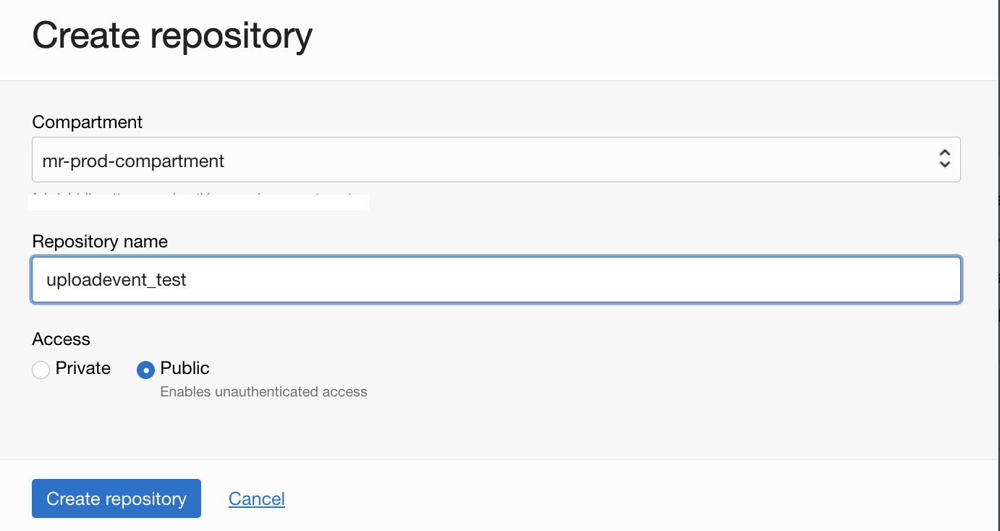

- Create a DevOps project - https://docs.oracle.com/en-us/iaas/Content/devops/using/create_project.htm#create_a_project. Associate with the notification topic.

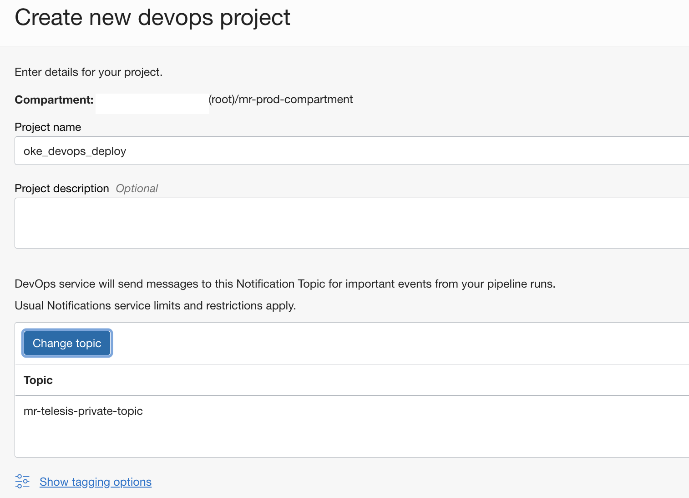

- Enable logging for the DevOps project.

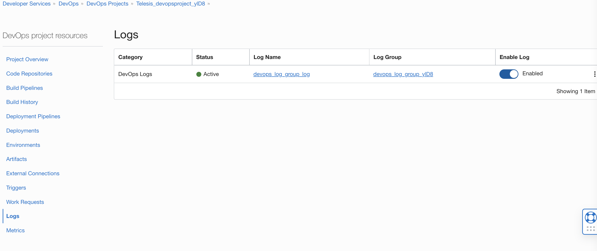

- Create a DevOps artifact - https://docs.oracle.com/en-us/iaas/Content/devops/using/artifacts.htm
- Use type as `Kubernetes manifest` and source as `Inline`.
- Use the content of the file [deploy. yaml](deploy. YAML), with correct reference to the container image path.

- Enable parameterization.

```markdown
image: <OCI Region>.ocir.io/<Namespace>/<Name of the Repo>:${BUILDRUN_HASH}
```
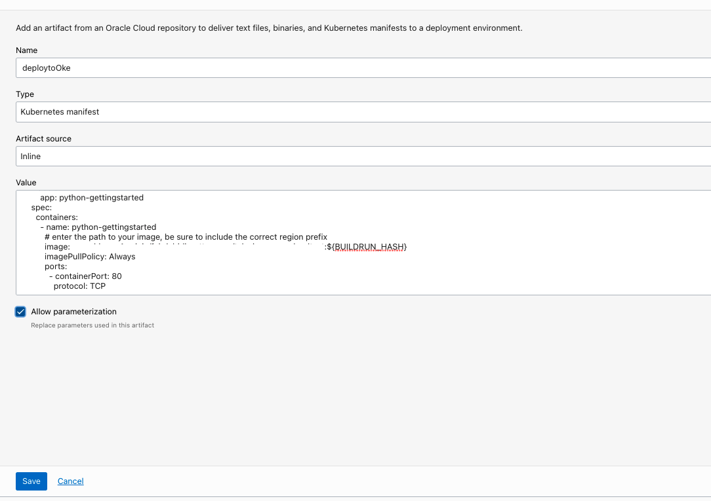

- Create a DevOps `Kubernetes Cluster Environment` - https://docs.oracle.com/en-us/iaas/Content/devops/using/create_oke_environment.htm

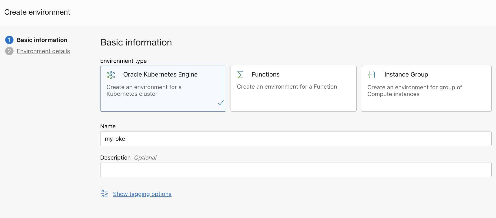

- Create a new DevOps `deployment pipeline` - https://docs.oracle.com/en-us/iaas/Content/devops/using/deployment_pipelines.htm
- Add below as `Deployment parameters

```markdown
Name : BUILDRUN_HASH / Default value : 0.0 
Name : namespace / Default value : ns-deploy
```
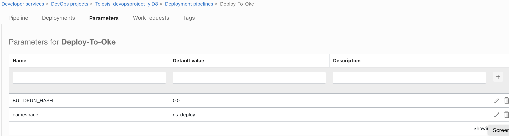

- Under the pipeline add a stage, type as `Apply manifest to your Kubernetes cluster`

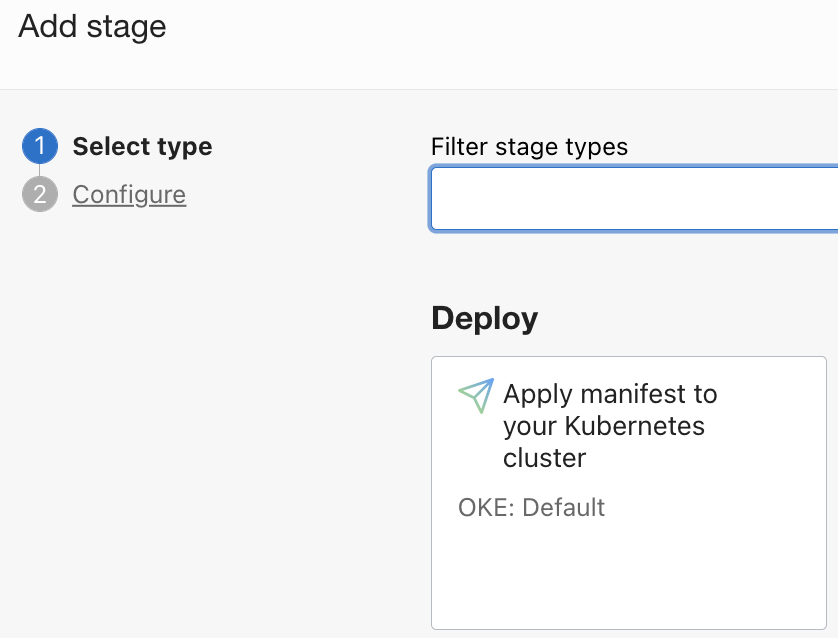

- Select the `Environment` and `Artifact` created and save the stage.

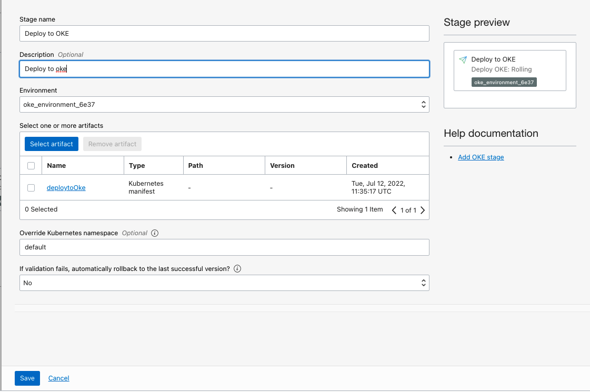

- Use `OCI Cloud shell` and clone the repo.

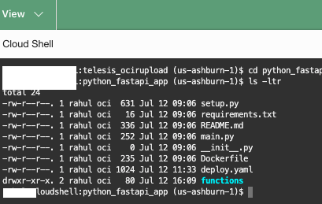

- Create an OCI Function application - https://docs.oracle.com/en-us/iaas/Content/Functions/Tasks/functionscreatingapps.htm#Creating_Applications
- You may use the same VCN that was created as part of OKE.

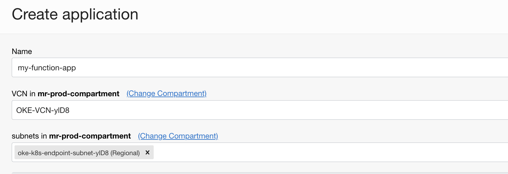

- Follow `Getting started` under the Application and set up the Cloud shell (Follow until step 7).

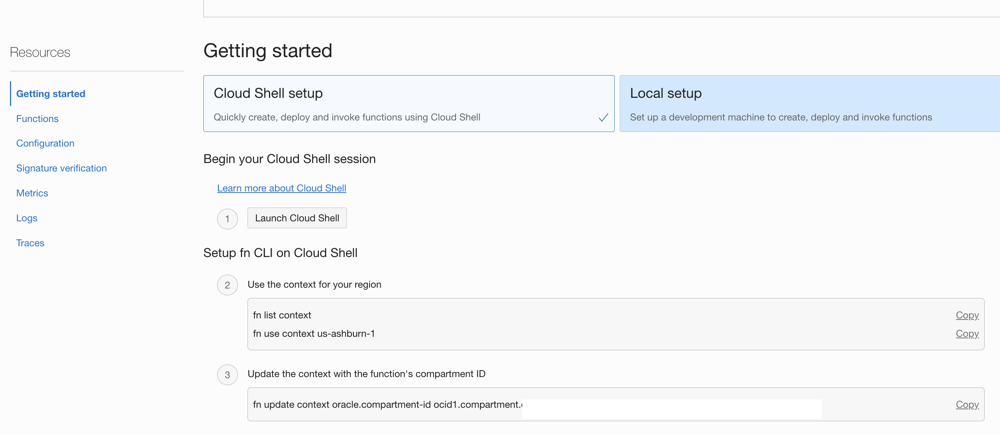

- Validate the `Application` via cloud shell.

```markdown
fn list apps
```
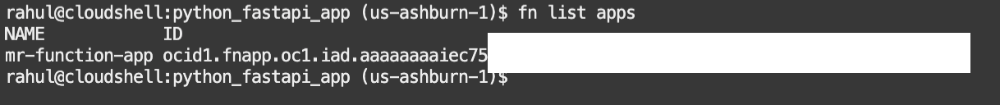

- Update the function configuration.

```markdown
$ cd oci-devops-deploy-on-imageupload/functions
$ Edit func.yaml 
```
- Provide the values for `oci_region` with OCI Region and `oci_deployment_pipeline_id` and the OCI of the deployment pipeline.

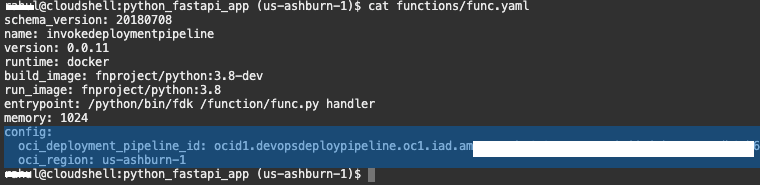


- Deploy the application
```markdown
$ fn deploy --app <Name of Your FN Application> -v
```
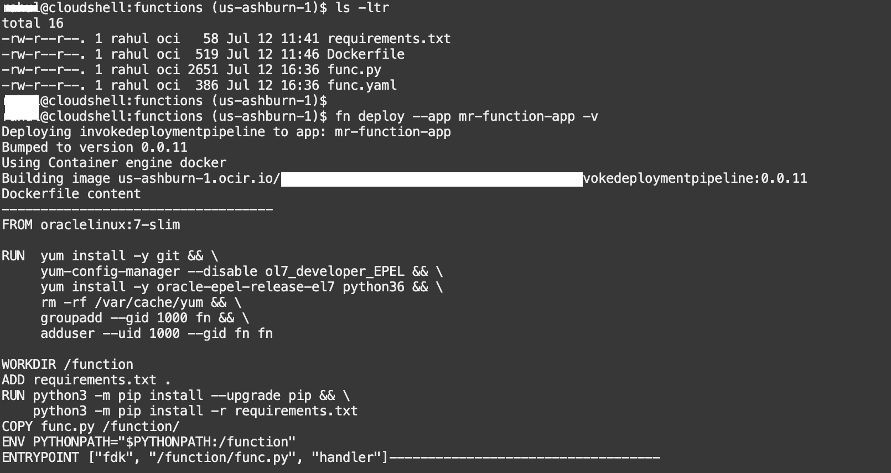
- Validate the function via the `Application` view.
  

-Enable the `logs` for application.

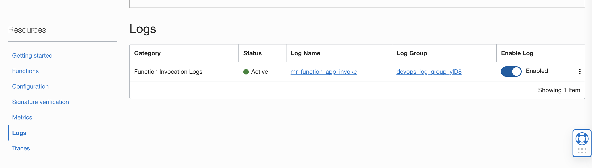

- Create an oci service connector under the root of the tenancy  - https://docs.oracle.com/en-us/iaas/Content/service-connector-hub/managingconnectors.htm#create

- Select source as `Logging` and target as `Functions`

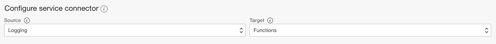

⛺

- At this stage, you may switch to `Advanced mode to configure` service connector, or follow the below steps under `basic mode`

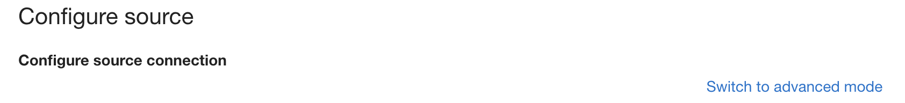

#### Basic mode of the configuration of service connector.

- Under configured source, select `Root of the tenancy` as compartment name.
- Select log group as `_Audit` ,also `Include _Audit in subcompartments` option.

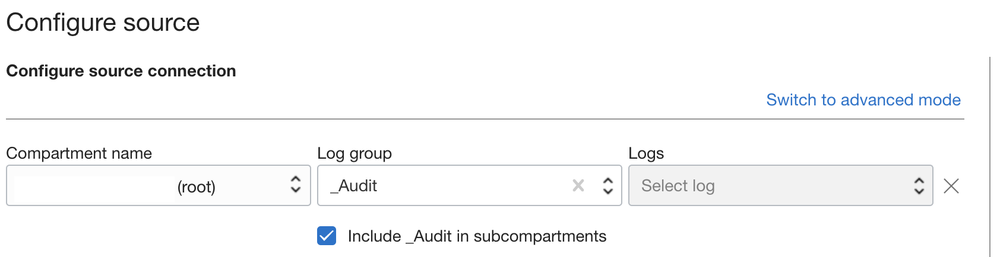

- Select Filter type as `event type` service name as `Registry` and Event type as `Container Image - Upload`

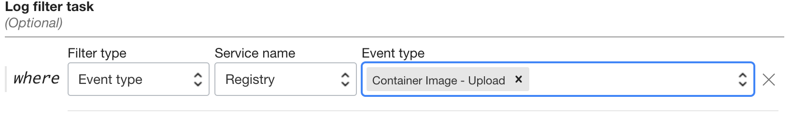

- Click on `+ Another filter`
- Select Filter type as `Attribute`, Attribute name as `source` and Attribute values as the name of the container registry repo.
- Name of the container registry repo must be without the namespace name.

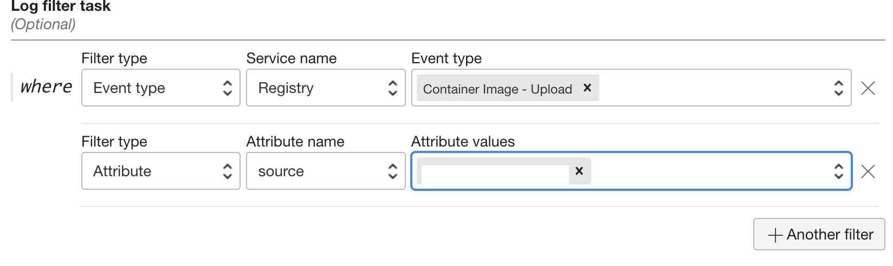


### Advanced mode of the configuration of service connector.

- Copy below to the `Query code editor` and replace it with the correct values

```markdown
search "<OCID of your Tenancy ROOT >/_Audit_Include_Subcompartment" | (type='com.oraclecloud.artifacts.uploaddockerimage') and (source='<NAME of the Container registry repo >')

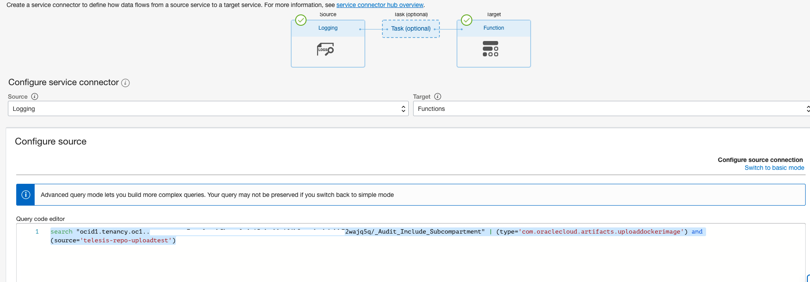


### With Basic or Advanced mode of the configuration of service connector.

```
- Skip the `Configure task` option and under `Configure target` select the function application and name of the function.

- Accept the `prompt` for policy creation.


- Create the service connector.

## Let's test

- Switch back to `OCI Cloud shell`
- Create a docker image.

```markdown
$ docker build -t <OCI Region>.ocir.io/<Namespace>/<Name of the Repo>:0.0 .
```

- Upload the docker image.

```markdown
$ docker push <OCI Region>.ocir.io/<Namespace>/<Name of the Repo>:0.0
```

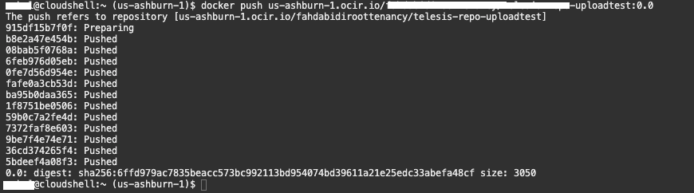

- After a while (about 10 seconds ), switch to the OCI Deployment pipeline - check for `deployments`.

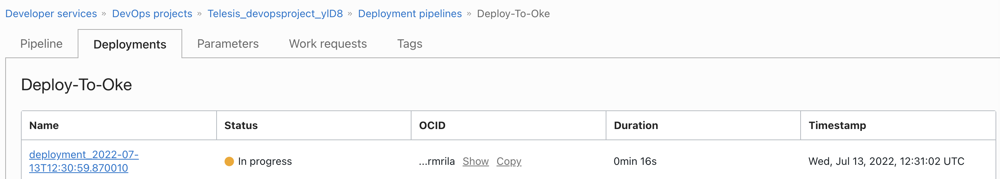

- Click on the same and wait until the completion.

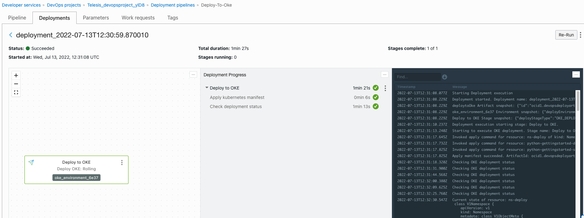

- Switch to `OKE` click on `Access Cluster` follow `Cloud Shell Access`.

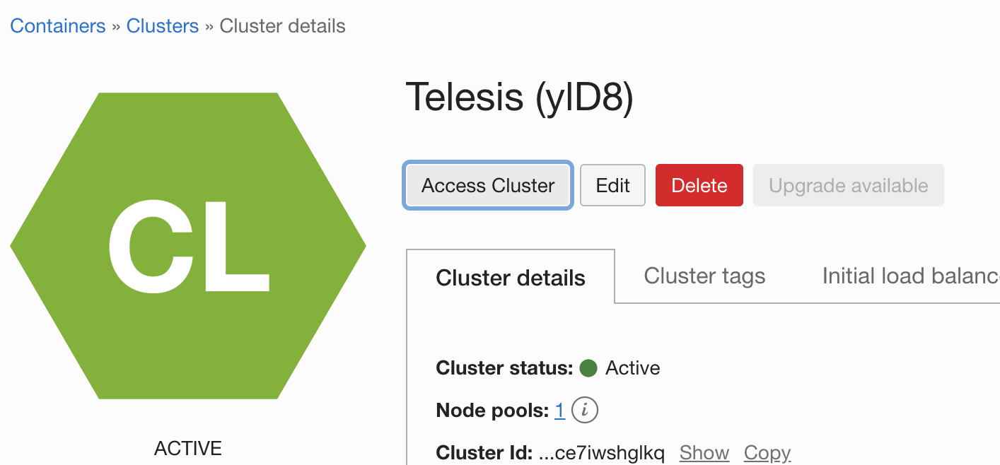

- Once it's done, use kubectl commands and get the application details.

```markdown
kubectl get all -n ns-deploy
```

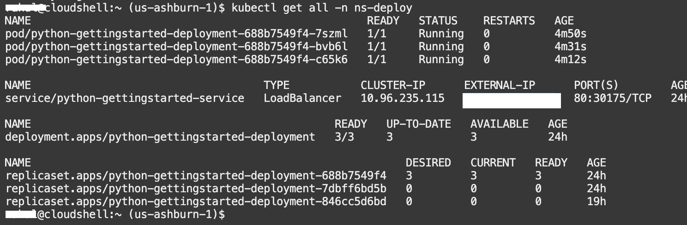

- Fetch the `EXTERNAL-IP` and access the application via browser (http://<EXTERNAL-IP>) or curl.

```markdown
curl http://<EXTERNAL-IP>
```


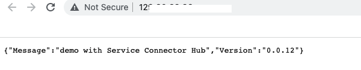

- Switch to `Application`, Logs and click on `Log name` and you can refer to the logs about the execution.

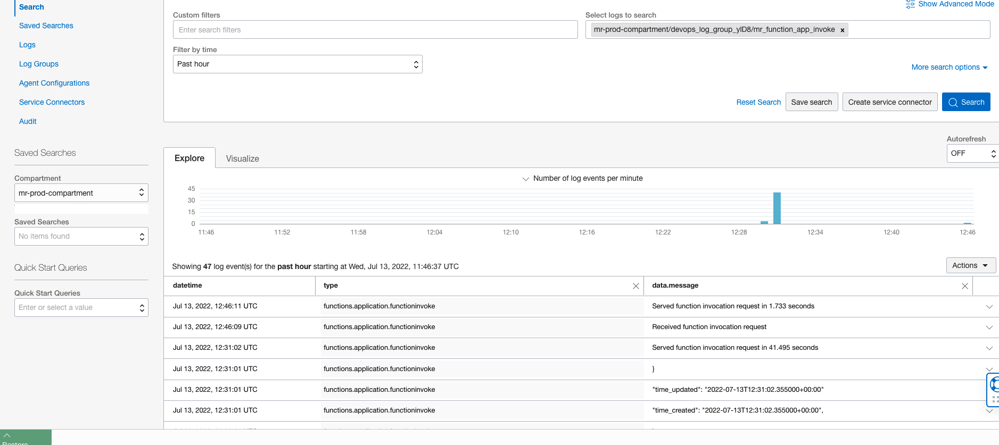


- In case of failure of the service connector, you may refer to the documentation and also you can verify the logs view under the service connector, using the edit option, it should show at least one log (after the first docker push), if not adjust the filter and validate

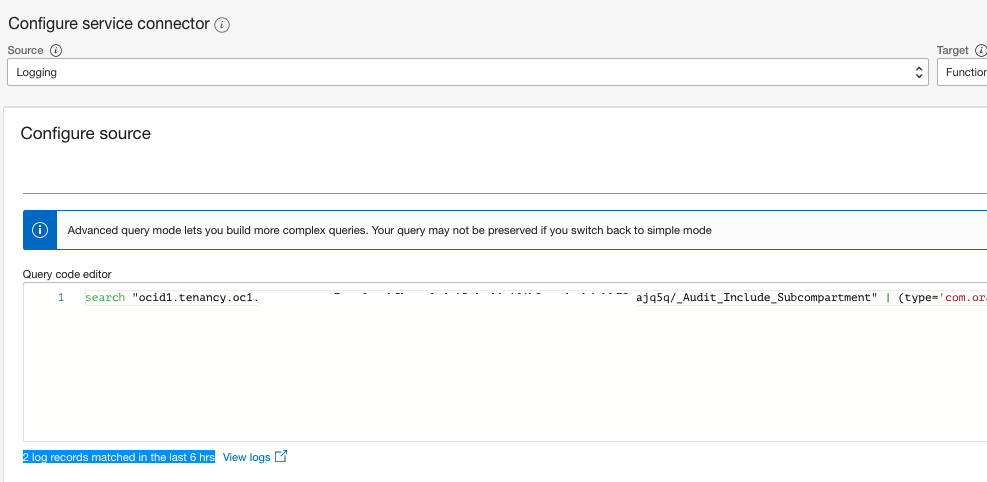

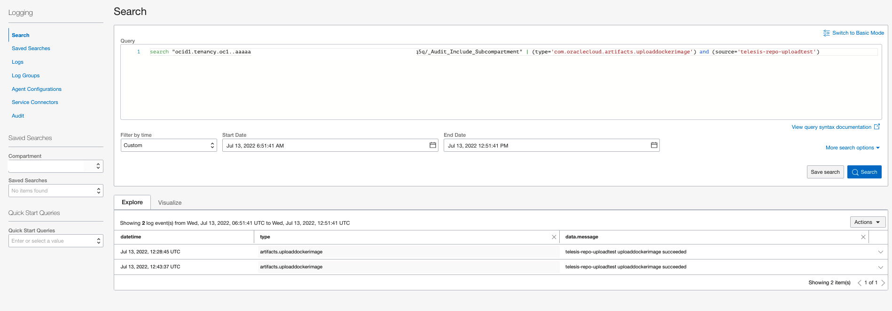


Contributors
===========

- Author: [Rahul M R](https://github.com/RahulMR42).
- Last release: July 2022

### Back to examples.
----

- 🍿 [Back to OCI Devops Deployment sample](./../README.md)
- 🏝️ [Back to OCI Devops sample](./../../README.md)


