Sample illustration of OCI Devops deployment pipeline with *CANARY* deployment strategies using Oracle Container Engine for Kubernetes (OKE).

------------

Objective 
---

- Create OCI Devops build pipeline.
- Build a sample python application.
- Push the artifact to OCI Container and OCI Artifact repo.
- Use OCI Deployment pipeline with CANARY Deployment strategies.
- Validate deployment and manual role back.


Specific instructions to download only this sample.
---

```
    $ git init oci-devops-deploy-with-canary-model-oke
    $ cd oci-devops-deploy-with-canary-model-oke
    $ git remote add origin https://github.com/oracle-devrel/oci-devops-examples
    $ git config core.sparsecheckout true
    $ echo "oci-deployment-examples/oci-devops-deploy-with-canary-model-oke/*">>.git/info/sparse-checkout
    $ git pull --depth=1 origin main

```

Procedure
---

- Create an OCI container registry . https://docs.oracle.com/en-us/iaas/Content/Registry/home.htm 

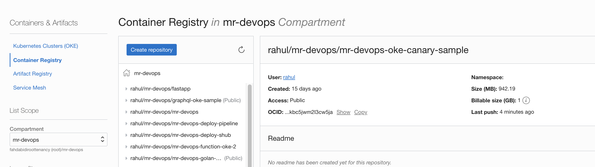

- Create an OCI artifact registry . https://docs.oracle.com/en-us/iaas/Content/artifacts/home.htm 

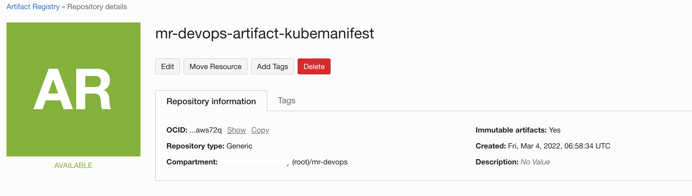

- Set policies & create a devops project - https://docs.oracle.com/en-us/iaas/Content/devops/using/home.htm.

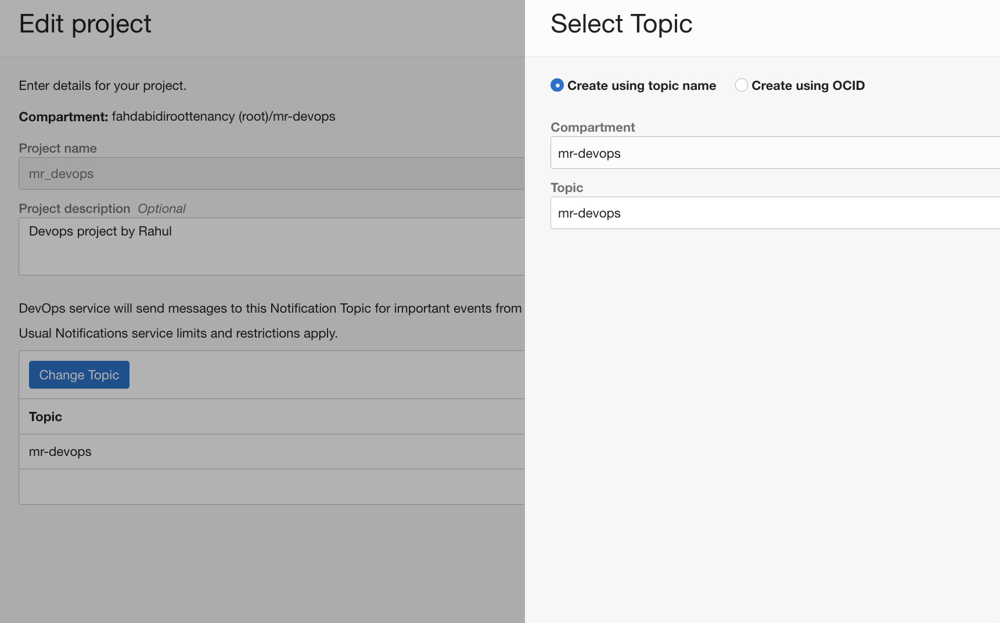

- You may refer here for devops policies sample. - https://github.com/RahulMR42/oci-devops-policies-groups

- Create devops artifacts. - https://docs.oracle.com/en-us/iaas/Content/devops/using/artifacts.htm 

- Create an artifact with type `Docker image` for build to push the artifact. Ensure use your `container repo` url, with `${BUILDRUN_HASH}` at the end of the URL. This is to make the docker image version as dynamic.

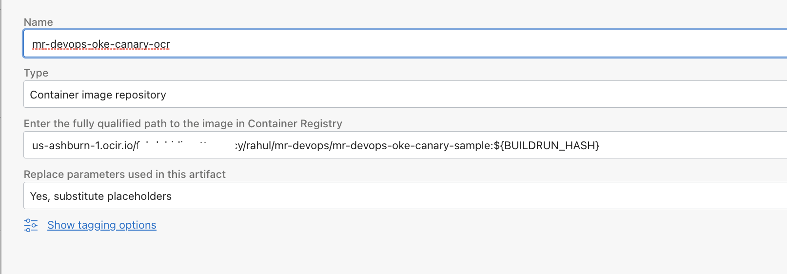

   
- Create an artifact as type `Kubernetes manifest`.Ensure to add your `artifact repo` path and version as `${BUILDRUN_HASH}` .

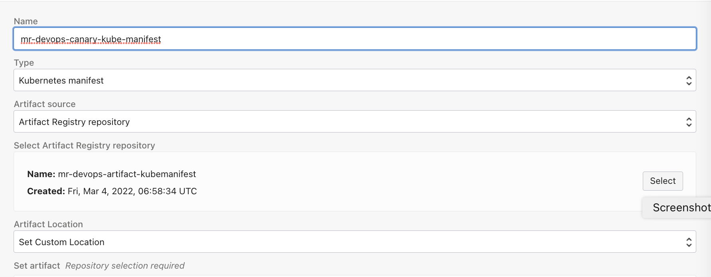

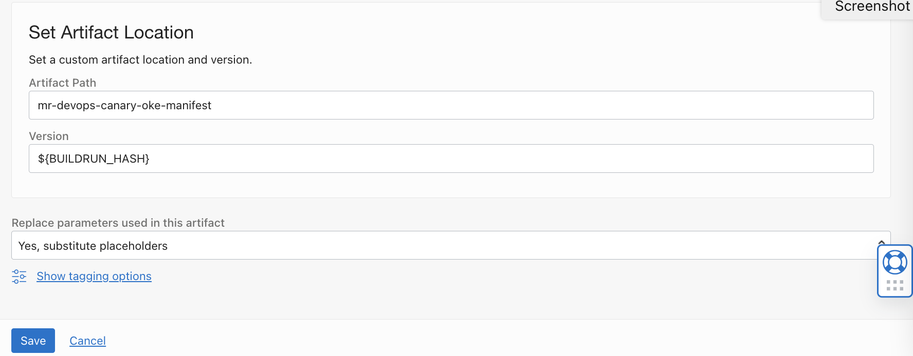


- You can clone this repo and push to an OCI Code repo .Or create GitHub repo by using `import` option to this repo to your GitHub profile.

    - Managing code repo for OCI Devops - https://docs.oracle.com/en-us/iaas/Content/devops/using/managing_coderepo.htm 

- Create an OCI devops build pipeline. https://docs.oracle.com/en-us/iaas/Content/devops/using/create_buildpipeline.htm 


- Add a `manage build` stage to the build pipe line . https://docs.oracle.com/en-us/iaas/Content/devops/using/add_buildstage.htm 

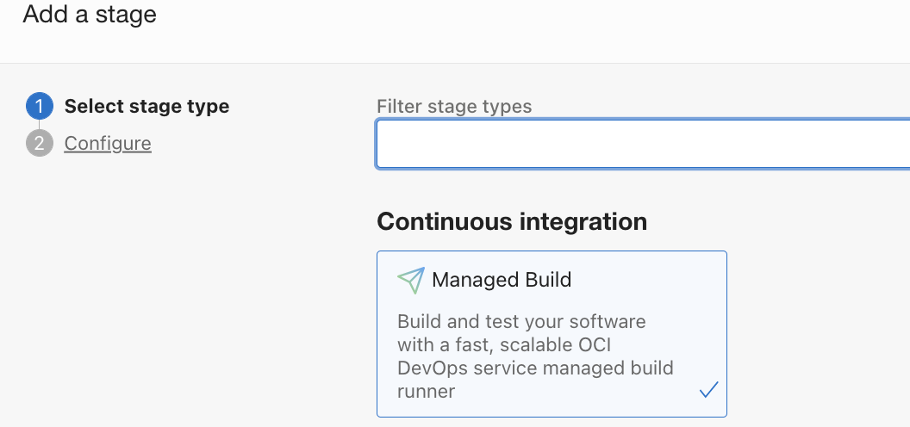
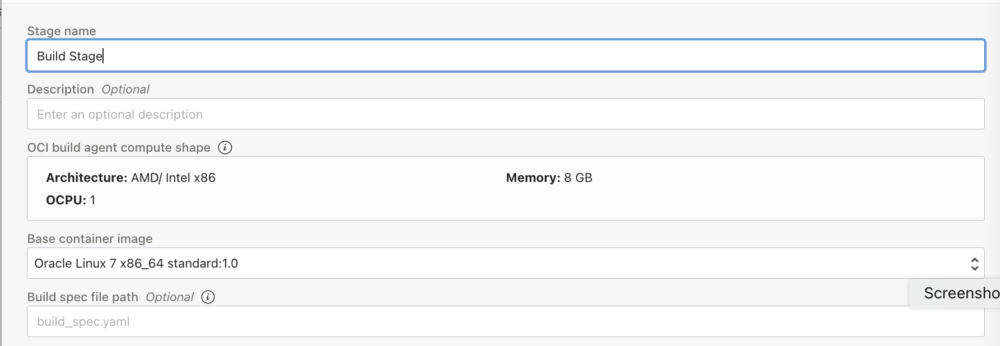

- Accordingly select the `code repo /connection type /repo name`.

If you are using a code repo other than `OCI code repo` ,ensure to set an external connection - https://docs.oracle.com/en-us/iaas/Content/devops/using/create_connection.htm 

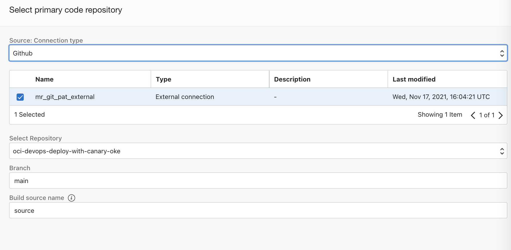

- Add an `Deliver artifact` stage to the build pipeline.


- Select the two `artifacts` created.

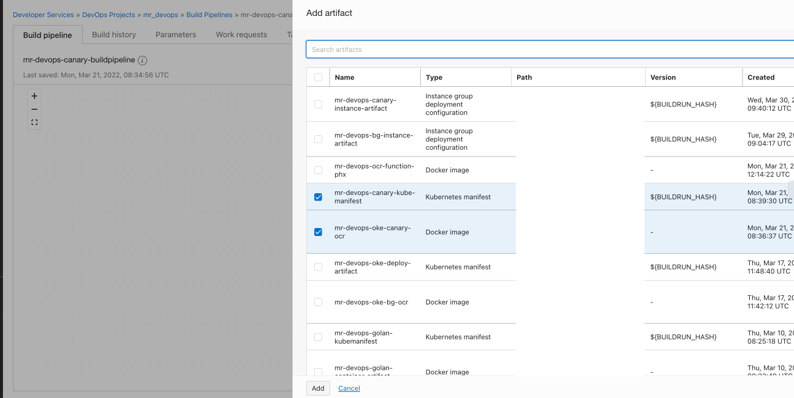

- Associate the build stage `output artifact` names .

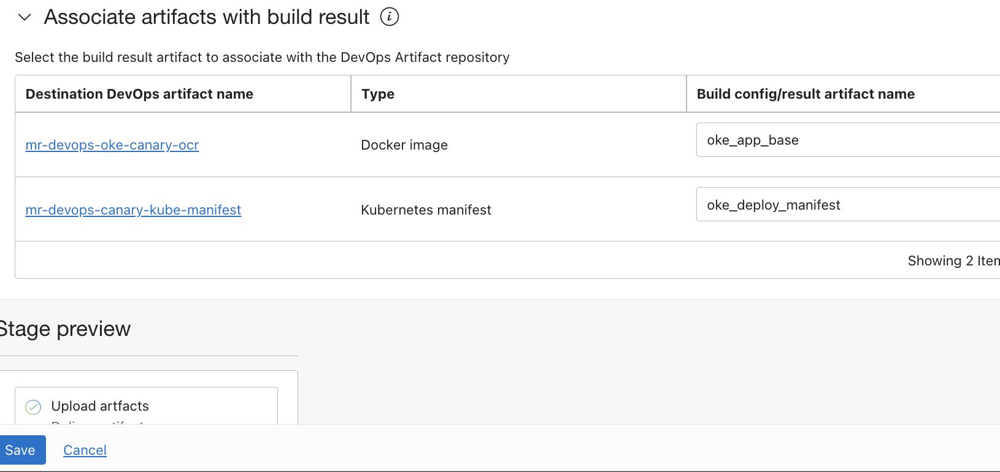

- Snippet from [build_spec.yaml.](build_spec.yaml) with output artifacts.

```
outputArtifacts:
  - name: oke_app_base
    type: DOCKER_IMAGE
    # this location tag doesn't effect the tag used to deliver the container image
    # to the Container Registry
    location: oke_app_base:latest

  - name: oke_deploy_manifest
    type: BINARY
    # this location tag doesn't effect the tag used to deliver the container image
    # to the Container Registry
    location: ${OCI_PRIMARY_SOURCE_DIR}/oci-oke-deployment.yaml
```

- Create a new OKE (With public endpoint and public or private workers) - https://docs.oracle.com/en-us/iaas/Content/ContEng/home.htm .You may reuse an existing one accordingly . Use `Access cluster` option to set your access to `OKE`.

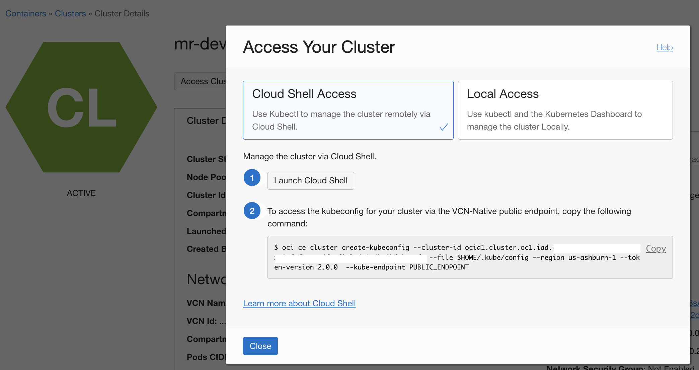

- Create a new devops environment as type `Kubernete Cluster`.-https://docs.oracle.com/en-us/iaas/Content/devops/using/create_oke_environment.htm  

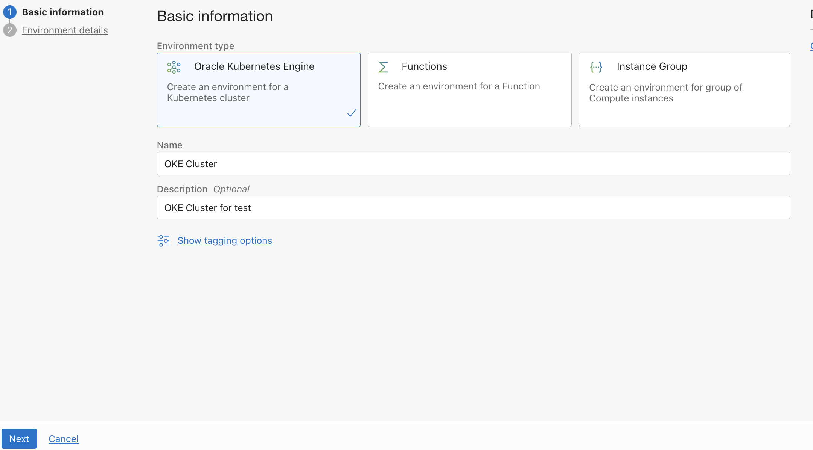
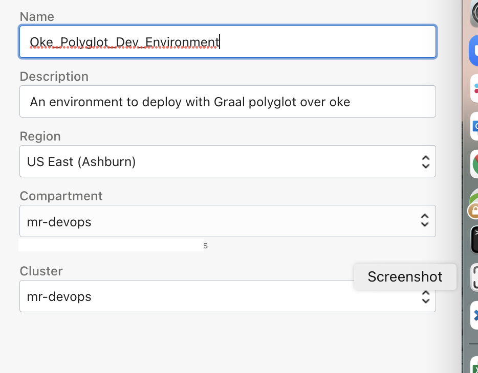

- Create a new devops deployment pipeline. - https://docs.oracle.com/en-us/iaas/Content/devops/using/deployment_pipelines.htm 

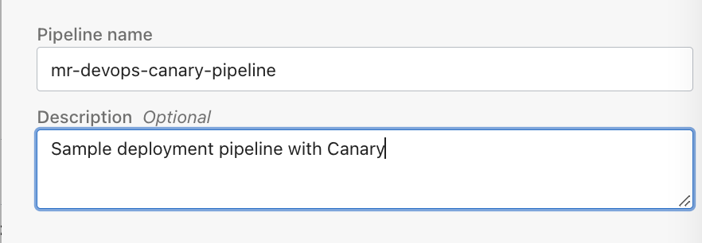

- Add a stage as `Canary Strategy`.

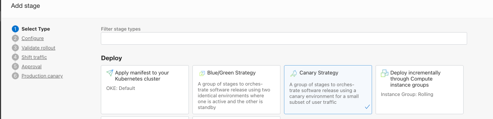

- Select the `Deployment type` as `OKE` and select the `environment` created.

- Associate the `oke environment` created.

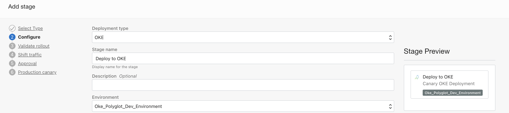

- Select Namespace `nscanarystage` as Canary namespace and select the artifacts.

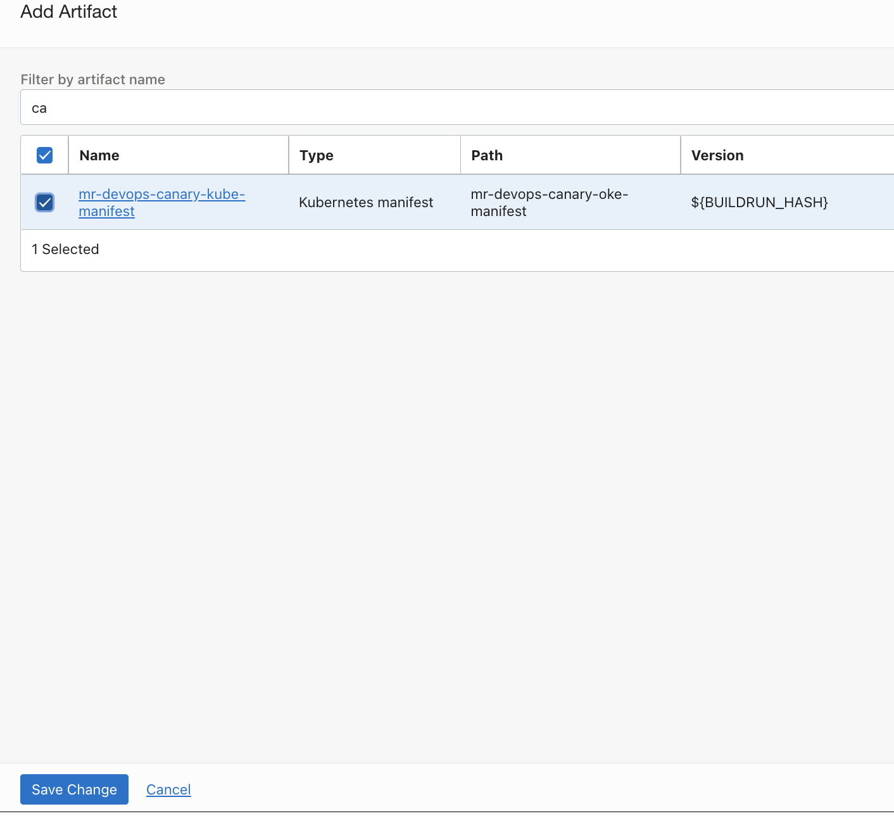

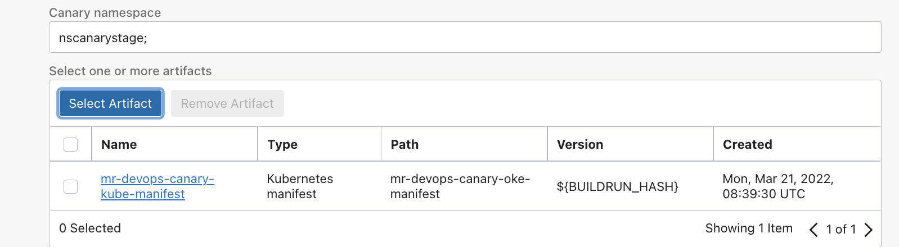

- Fill the ingress name as `sample-oke-canary-app-ing` and click `Next`.

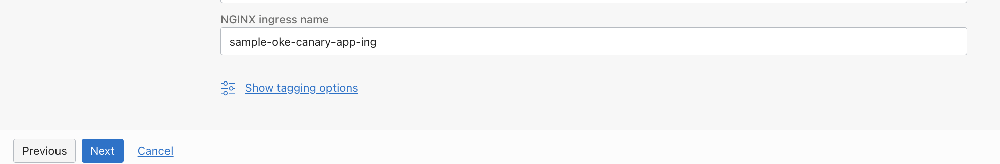

- As its a demo keep the `Validation controls` as `None`or you may connect with a function to validate the deployment and click `Next`.

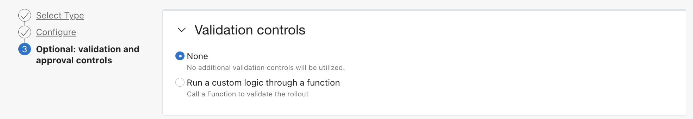

- Keep the `Canary % of shift` as `25` to allow 25 % of traffic to be delivered via canary namespace and click `Next`.

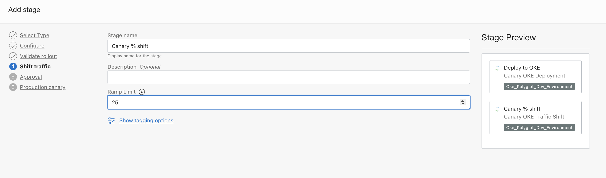 

- Enable the `Approval controls` and add `1` as the number of approvers.


- For the final stage select the namespace as `nscanaryprd` and select `Auto rollback` 

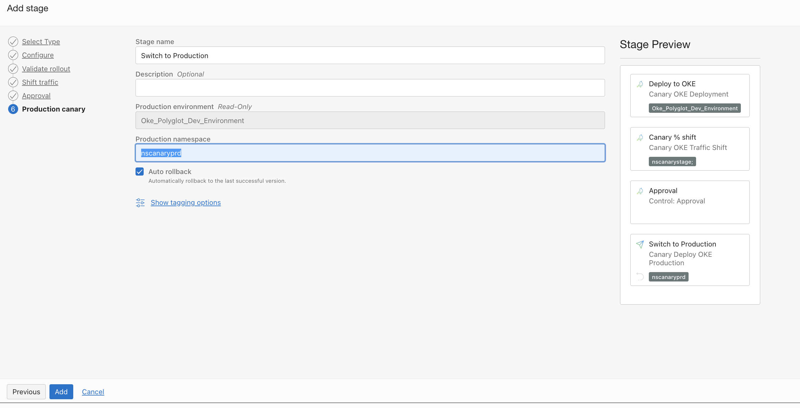

- Click add to add the stages.

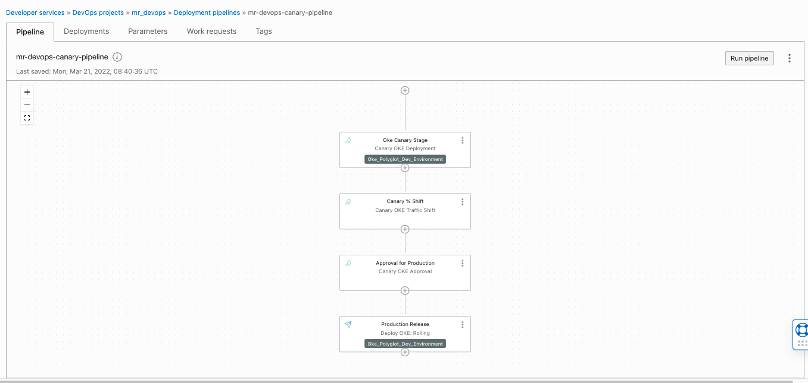

 - Switch back to `Build pipeline` and add a `Trigger Deployment` stage. Select the deployment pipeline and associate. Ensure to `check` the Send build pipelines Parameters option.

 

- In order to run the canary deployments we should install `Nginx Ingress Controller` to our `OKE` cluster.
- Launch `OCI Cloud shell` to enable the OKE access.
- Follow the instruction via `Access Cluster` tab for the OKE cluster.


- Validate the kubernetes access using `kubectl get nodes` & `kubectl config view`.

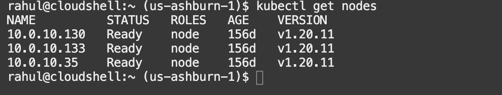

- We will be following the procedure to install and setup `Ingress Controller` - https://docs.oracle.com/en-us/iaas/Content/ContEng/Tasks/contengsettingupingresscontroller.htm 

- Create a `clusterrolebinding` with user `ocid`.

```
kubectl create clusterrolebinding oke_cluster_role_<username> --clusterrole=cluster-admin --user=ocid1.user.oc1..xxx
```

- Install the Ingress controller,always use the latest version. - https://github.com/kubernetes/ingress-nginx#changelog 

```
kubectl apply -f https://raw.githubusercontent.com/kubernetes/ingress-nginx/controller-v1.1.2/deploy/static/provider/cloud/deploy.yaml
```

- Create and save the file cloud-generic.yaml containing the following code to define the ingress-nginx ingress controller service as a load balancer service.

```
kind: Service
apiVersion: v1
metadata:
  name: ingress-nginx
  namespace: ingress-nginx
  labels:
    app.kubernetes.io/name: ingress-nginx
    app.kubernetes.io/part-of: ingress-nginx
spec:
  type: LoadBalancer
  selector:
    app.kubernetes.io/name: ingress-nginx
    app.kubernetes.io/part-of: ingress-nginx
  ports:
    - name: http
      port: 80
      targetPort: http
    - name: https
      port: 443
      targetPort: https

```

- Using the file you just saved, create the ingress-nginx ingress controller service by running the following command.

```
kubectl apply -f cloud-generic.yaml
```

- You may follow the procedure to create a TLS certificate for nginx.

```
openssl req -x509 -nodes -days 365 -newkey rsa:2048 -keyout tls.key -out tls.crt -subj "/CN=nginxsvc/O=nginxsvc"
kubectl create secret tls tls-secret --key tls.key --cert tls.crt
```

- You may skip the sample application example in the procedure.

- Validate the installation.

```
kubectl get svc -n ingress-nginx
```
- The EXTERNAL-IP for the ingress-nginx ingress controller service is shown as `pending` until the load balancer has been fully created in Oracle Cloud Infrastructure. Repeat the kubectl get svc command until an EXTERNAL-IP is shown for the ingress-nginx ingress controller service.

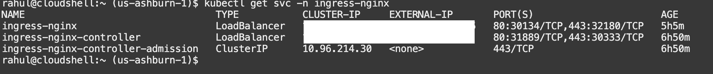

- Create two new namespaces for the deployment.

```
kubectl create ns nscanaryprd;kubectl create ns  nscanarystage;
```

- Go back to build pipeline and do click `Start manual run`.

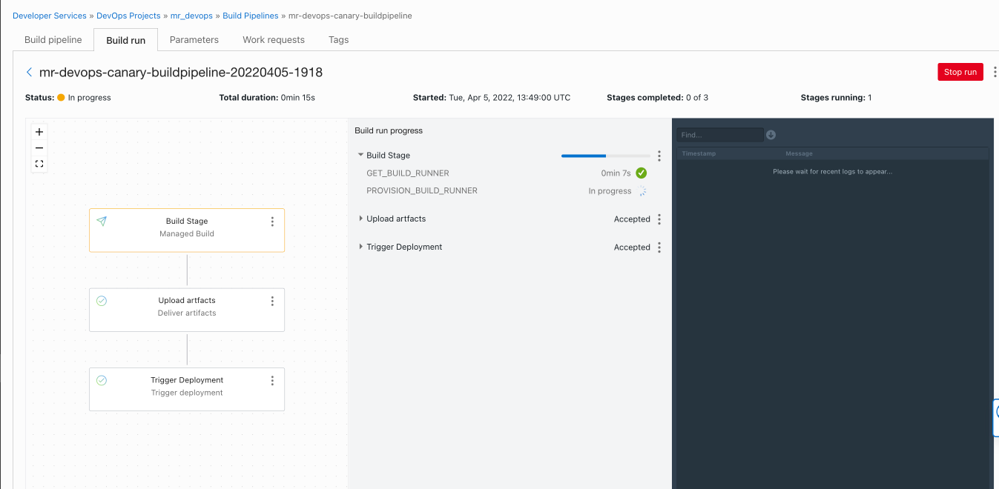

- Wait untill all the  `build stages` completed.

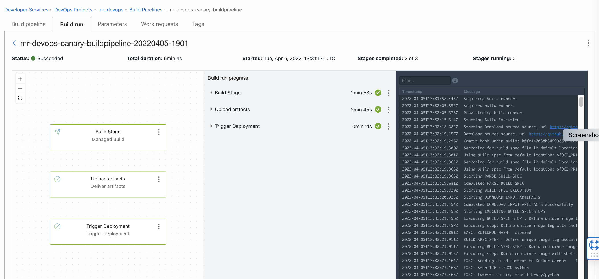

- Switch to the `deployment pipeline` and click on the deployment which is in `progress`.

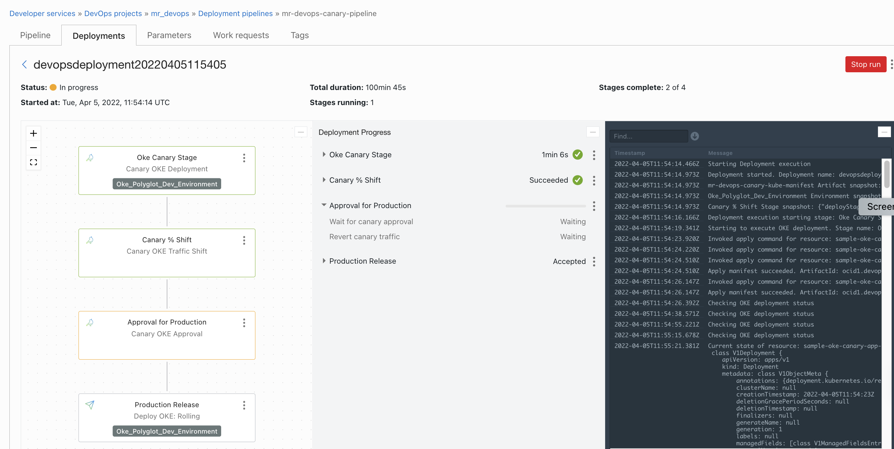

- The pipeline will be pending for `Approval` stage.

- Click on the `3 dots` and validate the `Control:Approval` stage.

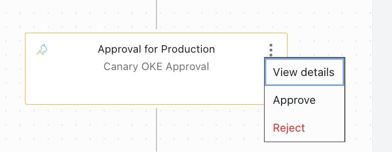
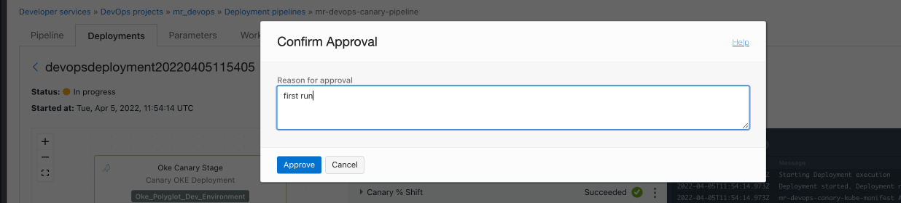

- Wait for all the steps to complete.

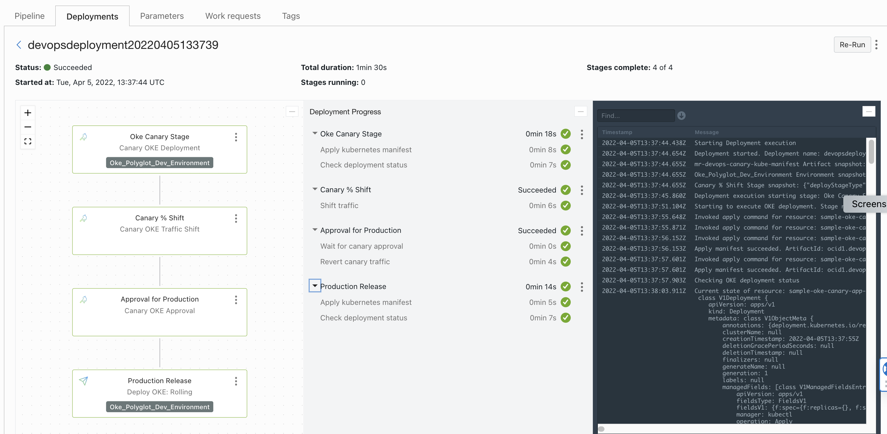

- In order to validate the application , we would need the ingress IP address .To fetch the same ,switch to OCI Cloud Shell and run below commands and make a note of ingress ip address.

```
for i in nscanaryprd nscanarystage; do echo " ....... NS $i ..........."; kubectl get po,ing -n $i; done
```

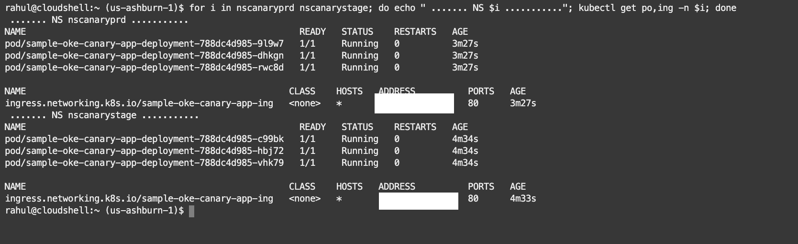

- Validate the deployment using the `Ingress Address` via curl or browser.

```
curl -k http://<Ingress Address>
```


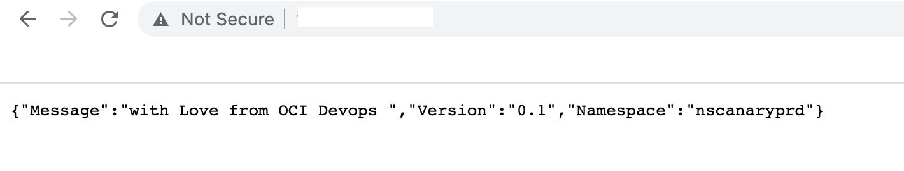

- To simulate a new release scenario , edit the source code - `main.py` and change the version to `1.0` and run the build pipeline again to test a new deployment scenario.

```
from typing import Optional

from fastapi import FastAPI

import os

app = FastAPI()

@app.get("/")
def read_root():
    version="1.0"
    namespace = os.getenv('POD_NAMESPACE', default = 'ns-red')
    return {"Message": "with Love from OCI Devops ","Version":version,"Namespace":namespace}
```

- Update the changed code/files back to the respective repo.

- Go back to build pipeline and do click `Start manual run`.


- Wait until all the  `build stages` completed.


- Switch to the `deployment pipeline` and click on the deployment which is in `progress`.


- Wait until the completion of `% Canary Shift` stage (Just before the approval).

- Launch the application via `Curl` or `Browser` and you can now see `25 %` of traffic is now served via `Canary Namespace` with new version .

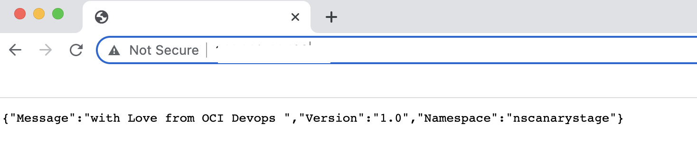

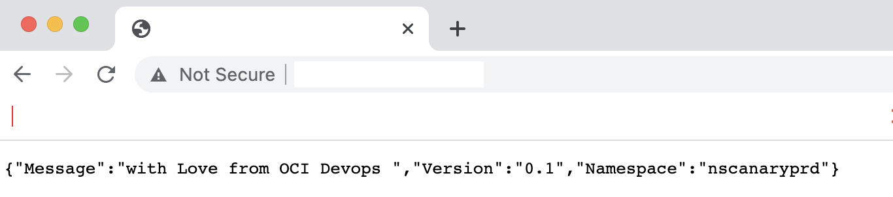

- You may run below via `OCI Cloud Shell` and can validate the details via curl.

```
for i in $(seq 1 100); do curl -Ls -H "redirect-to-canary" --resolve -k  http://<Ingress IP> | grep "Version"; done
```


- To continue the deployment of new version to `Production` ,proceed with the further stages by giving `Approval` and wait for the completion.

- Once all the stages are completed ,the newer version will be available via the production namespace.

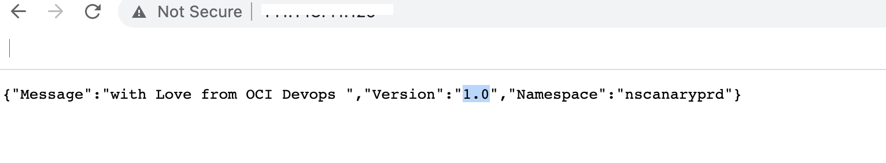

- Let us test a roll back now. Click on `3 dots` at the `Last stage` and select `manual roll back`.

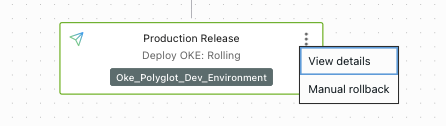

-  Validate the current deployment values.

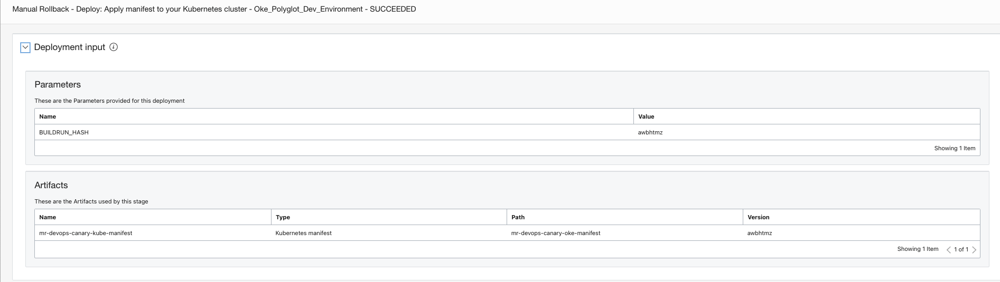

- Select a desired deployment and initiate the rollback.

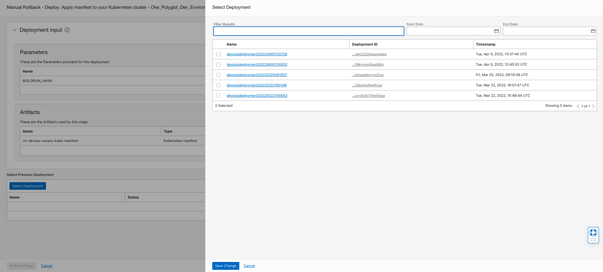

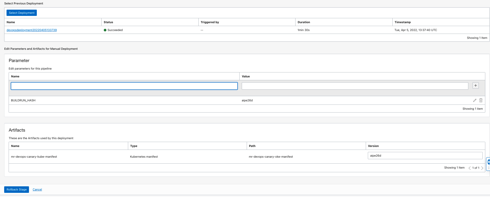

- Wait for the rollback to complete and validate the deployed application.

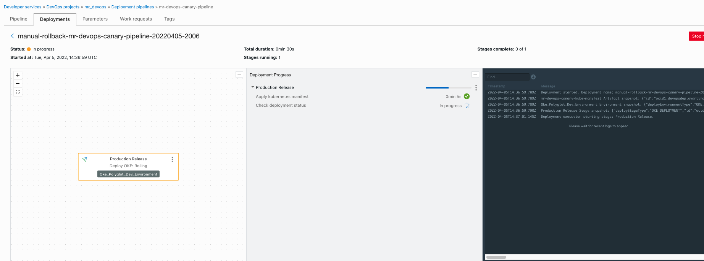

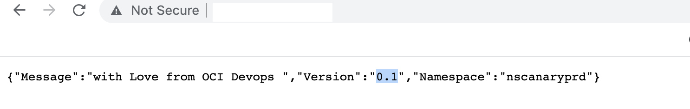

Read more 
----

- OCI Devops - https://docs.oracle.com/en-us/iaas/Content/devops/using/home.htm.
- OCI Reference architectures  -  https://docs.oracle.com/solutions/
- OCI Devops samples - https://github.com/oracle-devrel/oci-devops-examples 


Contributors 
===========

- Author : Rahul M R.
- Collaborators : NA
- Last release : March 2022


### Back to examples.
----

- 🍿 [Back to OCI Devops Deployment sample](./../README.md)
- 🏝️ [Back to OCI Devops sample](./../../README.md)


