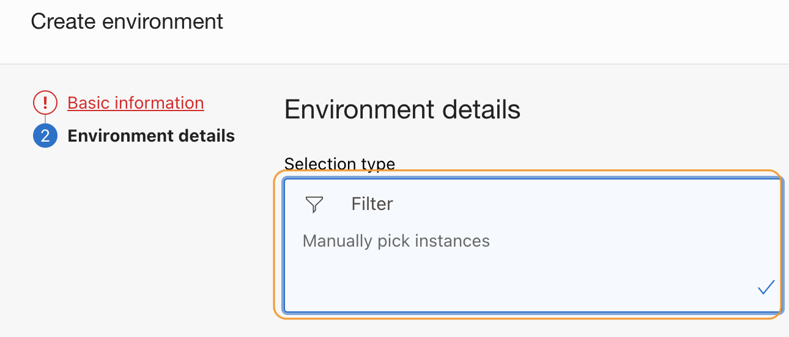
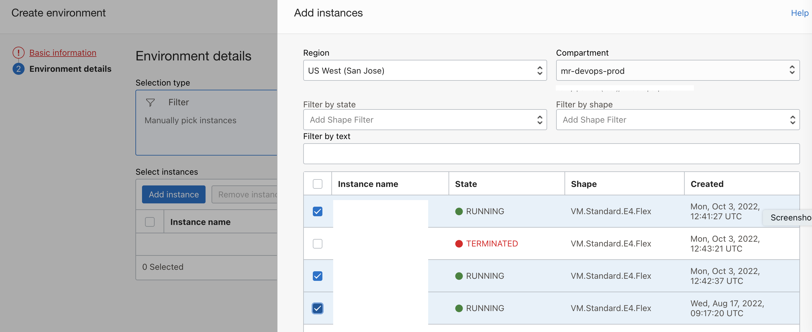
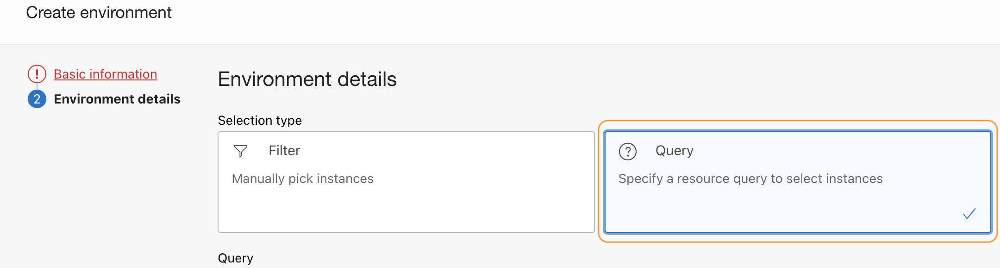
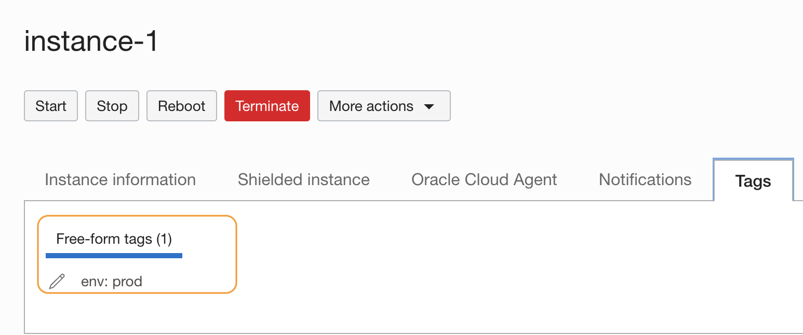
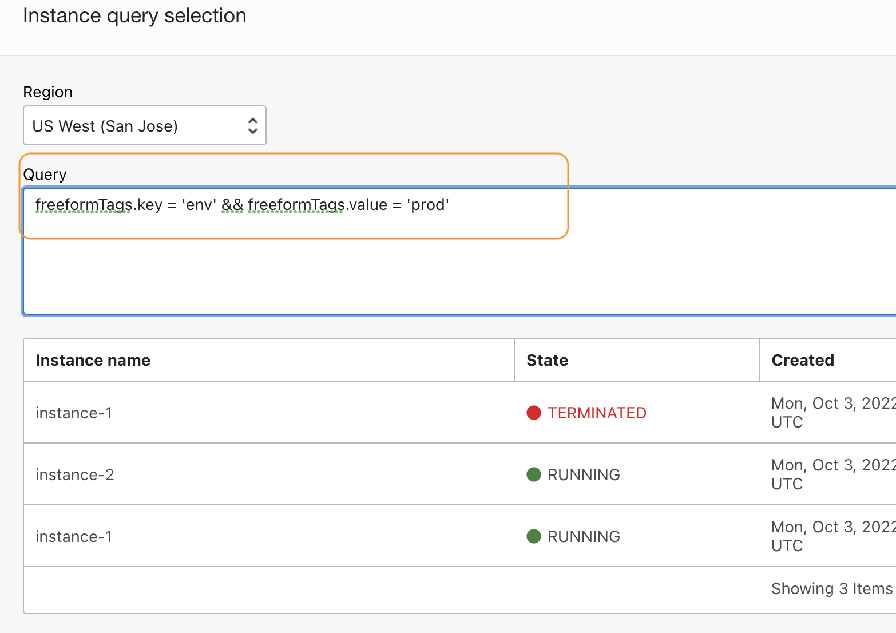
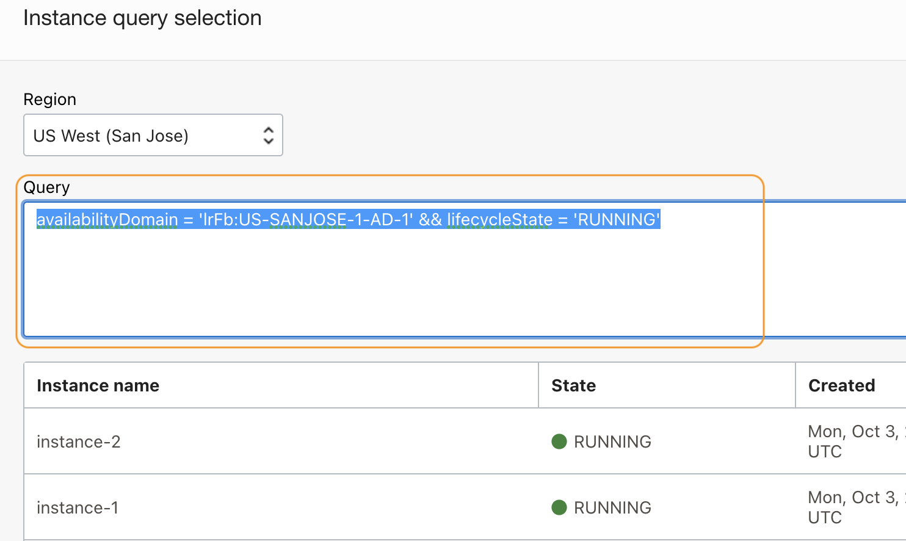
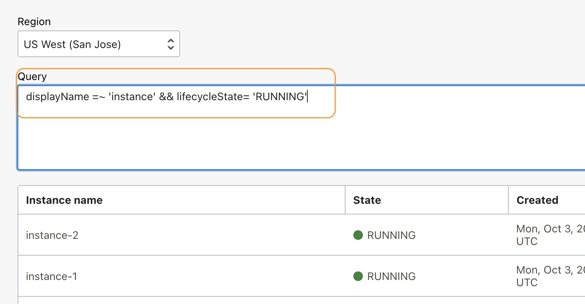
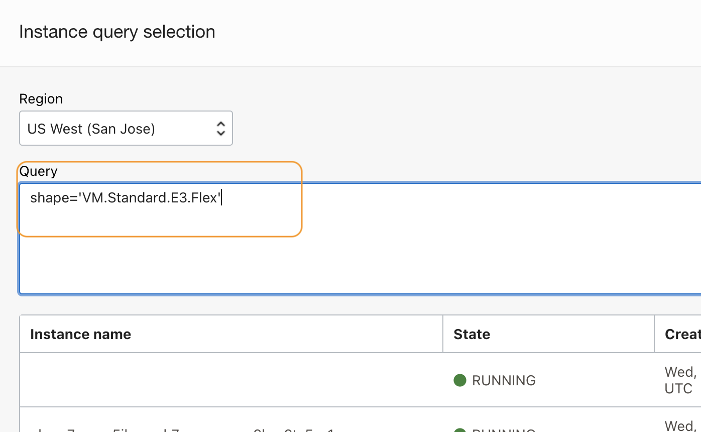

# Sample illustration of OCI Devops deployment pipeline to update the `deployment environment - Instances dynamically` .


### Audience: Experience and Experts of OCI Devops.

### Objective

The sample here focuses on updating the deployment environment - instance group dynamically.


Specific instructions to download only this sample.
---

```
    $ git init oci-devops-instance-env-dynamic-update
    $ cd oci-devops-instance-env-dynamic-update
    $ git remote add origin https://github.com/oracle-devrel/oci-devops-examples
    $ git config core. sparsecheckout true
    $ echo "oci-deployment-examples/oci-devops-instance-env-dynamic-update/*">>.git/info/sparse-checkout
    $ git pull --depth=1 origin main

```


Procedure
---

- A **devops environment** is the target platform for your software. You create references to different destination environments for DevOps deployment.

- There will be use cases where you may want to fetch the instances within a defined devops environment based on dynamic add/deletion of new instances.
- Read more about `Managing Environments` [here](https://docs.oracle.com/en-us/iaas/Content/devops/using/environments.htm).

### Using static declaration of Devops Instance Environment.

- In this case, we will be using the `Filter` method and where in the instances are manually picked.
- Filter mode will not update dynamically against instance addition/deletion.



- Here we manually pick the instances based on our desired choice.




### Using dynamic declaration of devops Instance Environment.

- In this case, we will be using `Query` and adding the desired condition against the possible keys.
- In this way, the instances will be added /updated dynamically.



- Let us see some of the common instance queries.

#### Using a tag

- Add a free form tag to instances and use the same within the query.



```java
freeformTags.key = 'env' && freeformTags.value = 'prod' 
```



- When using the tag always prefer to use the `lifecycleState` to avoid a delay in holding the deployment against a not running instance. As you may know, we can have many instances with the same tag with different stages.

```java
freeformTags.key = 'env' && freeformTags.value = 'prod' && lifecycleState= 'RUNNING'
```
#### Using most common compute instance attributes.

- Using `availabilityDomain`

```java
availabilityDomain = 'xxxx-AD-X' && lifecycleState = 'RUNNING'
```



- Using `displayName`

```java
displayName =~ 'instance' && lifecycleState= 'RUNNING'
```




- Using `shape`

```java
shape='VM.Standard.E3.Flex'
```




- You may also use various other parameters of instanes like `definedTags`, `lifecycleState`,

#### Operators supports

- All the below operators are supported with instance query syntax.

```java
'.', '=', '!=', '==', '!==', '=~', '!=~', '>', '>=', '<', '<='}
```

- Refer [here](https://docs.oracle.com/en-us/iaas/Content/Search/Concepts/querysyntax.htm#conditions) for more .


## Read more


- OCI Devops - https://docs.oracle.com/en-us/iaas/Content/devops/using/home.htm.
- OCI Reference architectures  -  https://docs.oracle.com/solutions/
- OCI Devops samples - https://github.com/oracle-devrel/oci-devops-examples

Contributors
===========

- Author: [Rahul M R](https://github.com/RahulMR42).
- Collaborators  : NA
- Last release: October 2022

### Back to examples.
----

- 🍿 [Back to OCI Devops Deployment sample](./../README.md)
- 🏝️ [Back to OCI Devops sample](./../../README.md)


