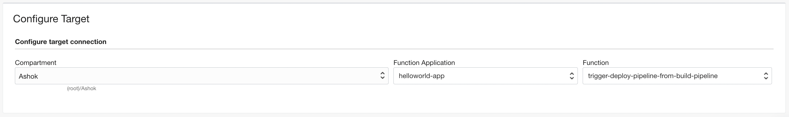

# OCI DevOps Cascaded Pipelines

## Trigger Build Pipeline from Build Pipeline

### Prerequisites
* Two build pipelines

#### 1. Deploy Function
**Step 1:**
Clone the repository code.
```
$ git init cascaded-pipelines
$ cd cascaded-pipelines
$ git remote add origin https://github.com/oracle-devrel/oci-devops-examples
$ git config core.sparsecheckout true
$ echo "oci-pipeline-examples/oci-cascaded-pipelines/same-region/trigger-deploy-from-build/*">>.git/info/sparse-checkout
$ git pull --depth=1 origin main
```

**Step 2:**
Change to function directory.
```
$ cd node-function
```

**Step 3:**
In `func.yaml`, update `deploy_pipeline_id` and `display_name_prefix_for_new_run` with appropriate values as below.

```
config:
  deploy_pipeline_id: "<DEPLOY-PIPELINE-OCID>"
  display_name_prefix_for_new_run: "AutoTriggeredCascade2_"
```

**Step 4:**
Deploy the function with below command.
```
$ fn -v deploy --app <app-name>
```
Note: Refer https://docs.oracle.com/en-us/iaas/Content/Functions/Tasks/functionscreatingapps.htm for creating new application.

#### 2. Configure Service Connector Hub
**Step 1:**

Open Menu > `Observability & Management` > `Service Connectors`

**Step 2:**

Set Service Connector Source as `Logging` and Target as `Functions`

**Step 3:**

Configure Source as below


* Choose Compartment, Log Group, Logs of your DevOps Project.
* set `data.buildPipelineId` to the previous pipeline OCID as above.
* set `data.message` to the last successful unique log message like `Completed Build stage.`

**Step 4:**

Configure Target with `Function Application` and `Function` as `trigger-deploy-pipeline-from-build-pipeline` as below



