Sample illustration of [RUST](https://www.rust-lang.org/) application with [ROCKET](https://rocket.rs/) web framework.

------------

Objective 
---

- Create OCI Devops build pipeline.
- Build a Rust Rocket simple sample application.
- Push the artifact to OCI Container repo.
- Use OCI Deployment pipeline and deploy to OCI OKE.


Procedure
---

- Create an OCI container registry . https://docs.oracle.com/en-us/iaas/Content/Registry/home.htm 

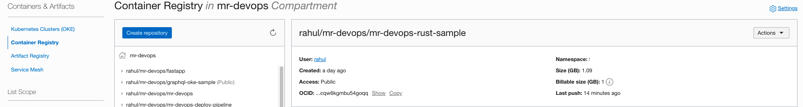

- Create an OCI artifact registry . https://docs.oracle.com/en-us/iaas/Content/artifacts/home.htm 

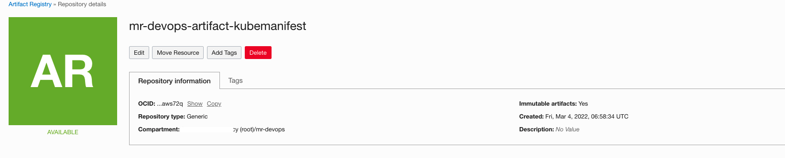

- Set policies & create a devops project - https://docs.oracle.com/en-us/iaas/Content/devops/using/home.htm.

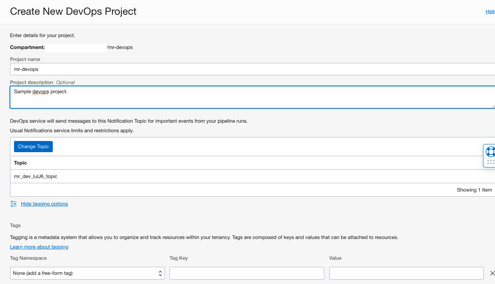

- Create devops artifacts. - https://docs.oracle.com/en-us/iaas/Content/devops/using/artifacts.htm 

- Create an artifact with type `Docker image` for build to push the artifact.  Ensure use your `container repo` url.

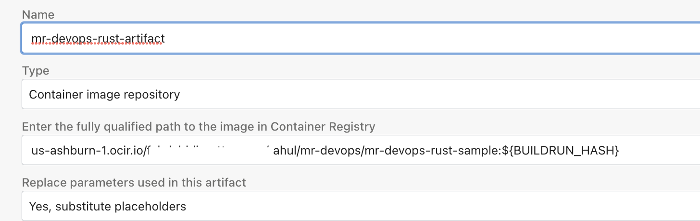 

   
- Create an artifact as type `Kubernetes manifest`. Ensure to add your `artifact repo` path.

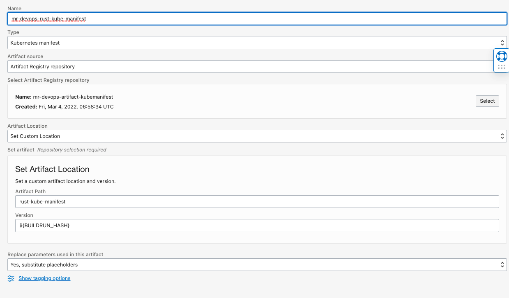

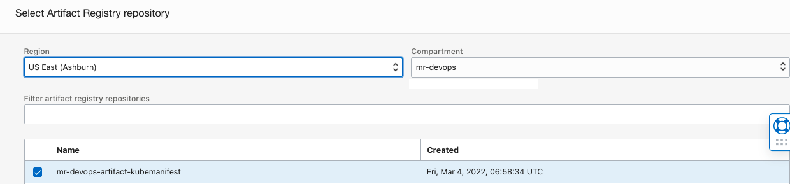


- You can clone this repo and push to an OCI Code repo .Or create GitHub repo by `importing` this repo to your github profile.

    - Managing code repo for OCI Devops - https://docs.oracle.com/en-us/iaas/Content/devops/using/managing_coderepo.htm 


- Create an OCI devops build pipeline. https://docs.oracle.com/en-us/iaas/Content/devops/using/create_buildpipeline.htm 

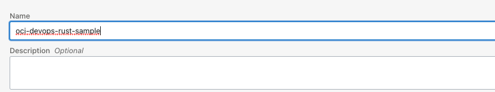

- Add a `manage build` stage to the build pipe line . https://docs.oracle.com/en-us/iaas/Content/devops/using/add_buildstage.htm 

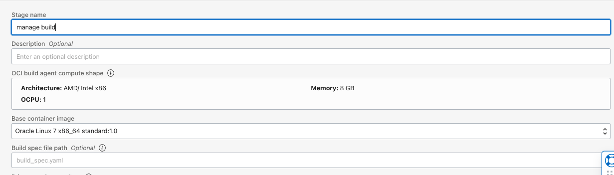

- Accordingly select the `code repo /connection type /repo name`.

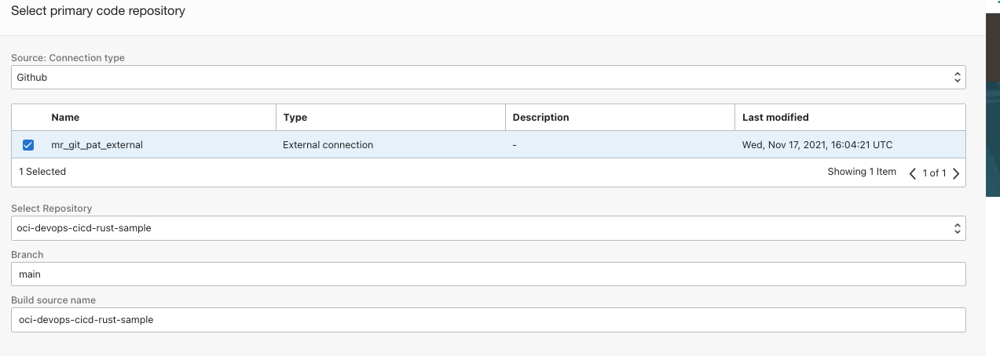 

- Add an `Upload artifact` stage to the build pipeline.

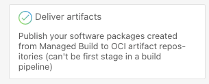

- Select the two `artifacts` created.

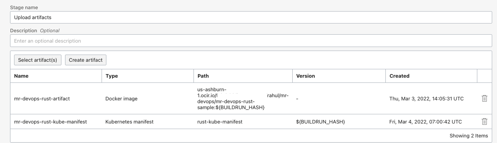

- Associate the build stage artifact names .

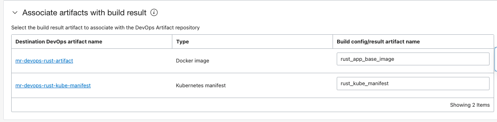

- Snippet from [build_spec.yaml.](build_spec.yaml)

```
outputArtifacts:
  - name: rust_app_base_image
    type: DOCKER_IMAGE
    # this location tag doesn't effect the tag used to deliver the container image
    # to the Container Registry
    location: rust_app_base:latest

  - name: rust_kube_manifest
    type: BINARY
    # this location tag doesn't effect the tag used to deliver the container image
    # to the Container Registry
    location: ${OCI_PRIMARY_SOURCE_DIR}/deployment_manifest.yaml
```

- Create a new OKE (With public endpoint and public or private workers) - https://docs.oracle.com/en-us/iaas/Content/ContEng/home.htm .You may reuse an existing one accordingly . Use `Access cluster` option to set your access to `OKE`.

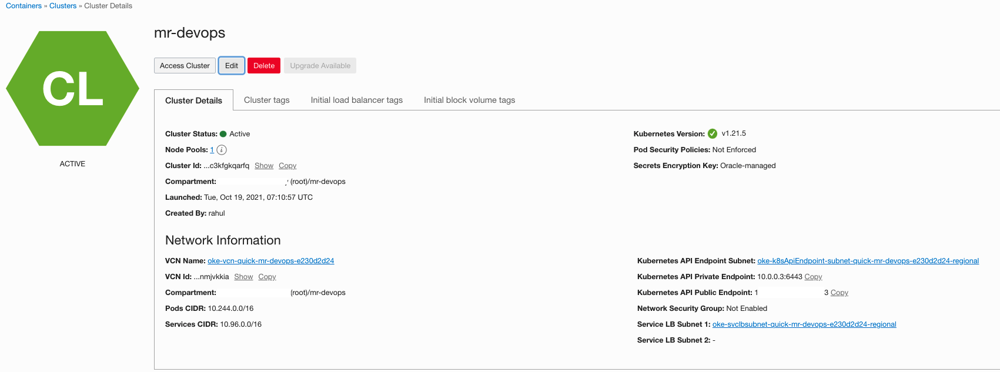

- Create a new devops environment as type `Kubernete Cluster`.-https://docs.oracle.com/en-us/iaas/Content/devops/using/create_oke_environment.htm  

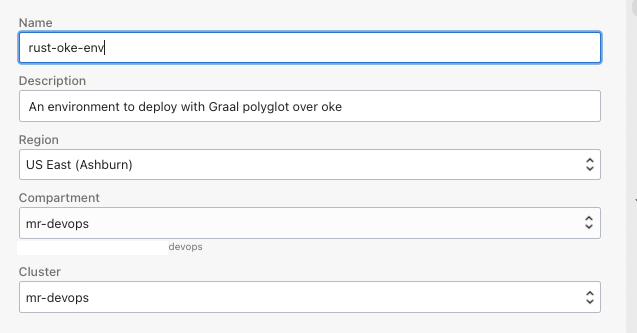

- Create a new devops deployment pipeline. - https://docs.oracle.com/en-us/iaas/Content/devops/using/deployment_pipelines.htm 

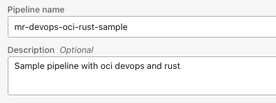

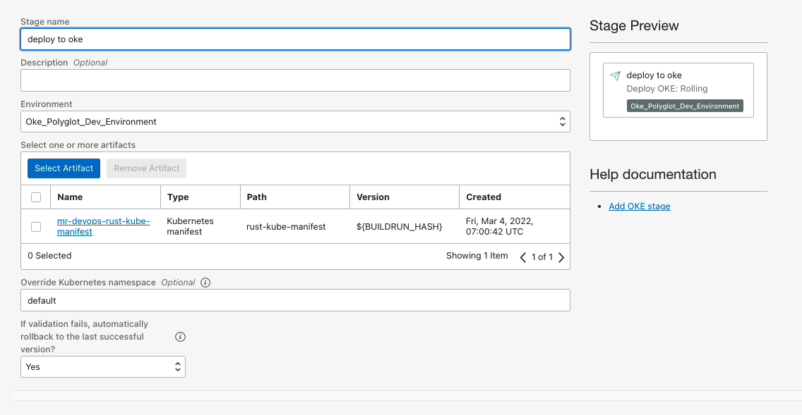

- Create a `deployment parameter` as `namespace` and give a namespace value.

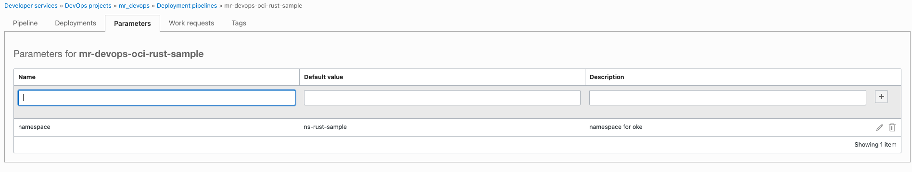

- Add a new stage `invoke deployment` to the `build pipeline`. - https://docs.oracle.com/en-us/iaas/Content/devops/using/triggerdeploy_stage.htm

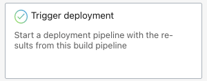

- Associate the deployment pipeline. 

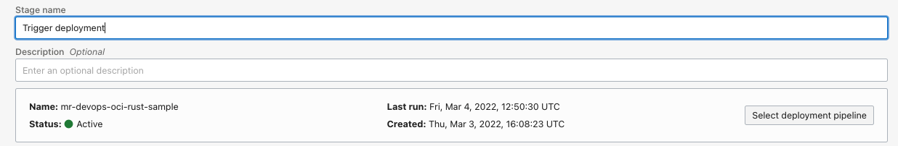


Test the pipeline & Application
-----

- Let test now . Use a `manual run` and invoke the build pipeline.

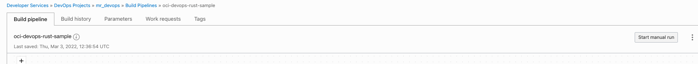

- Wait for all the stages to complete 

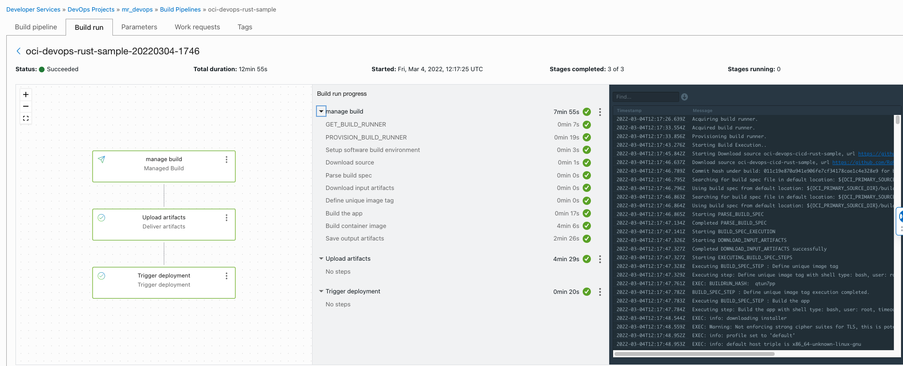

- After the `Trigger deployment` stage ,switch to `deployment pipeline` and follow the completion of stage.

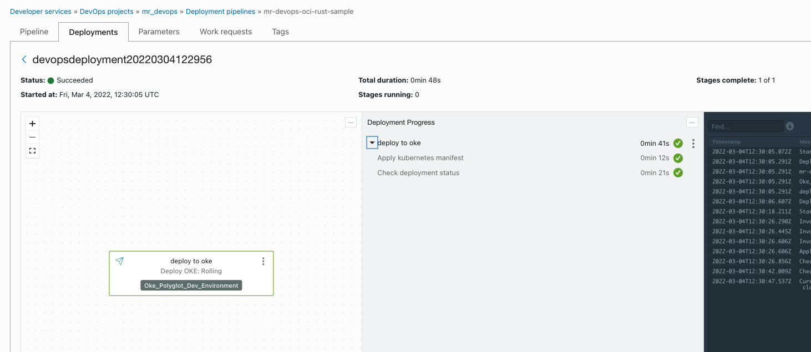

- Once it done switch to `cloud shell` or a `terminal` where you have access to the `OKE`.

- Use `OKE Access Cluster` option via console to set the `kubernetes context`.

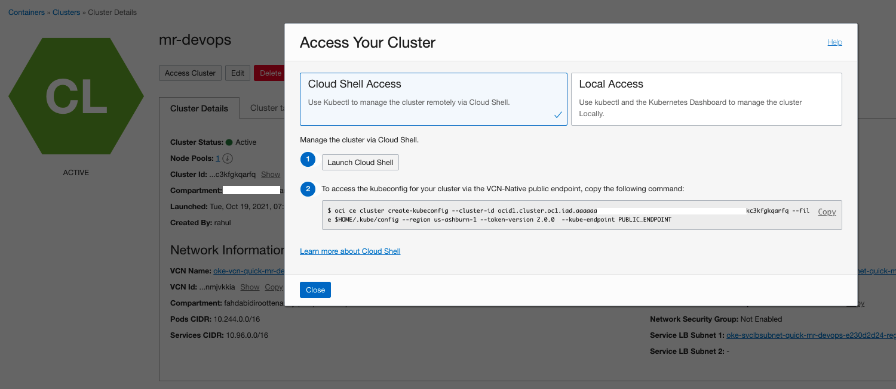

- Use `kubectl` commands and validate the application.

```
kubectl get ns <namespace>
```

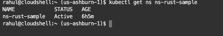

- Fetch the application loadbalancer EXTERNAL-IP to access the app.

```
kubectl get all -n <namespace>

```

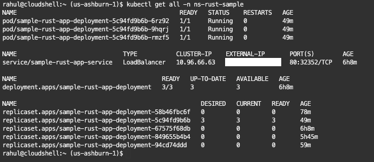

- Launch the application via the browser or via curl.

```
curl http://EXTERNAL-IP/v0/hello
```

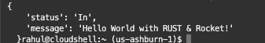


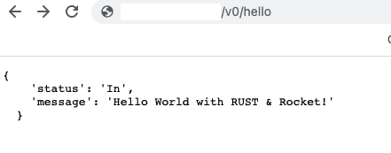

- Incase of a wrong url you may get an exception as well like below.

```
We lost with the path '/wrongpath'
```

Read more 
----

- OCI Devops - https://docs.oracle.com/en-us/iaas/Content/devops/using/home.htm.
- OCI Reference architectures  -  https://docs.oracle.com/solutions/
- OCI Devops samples - https://github.com/oracle-devrel/oci-devops-examples 

Contributors 
===========

- Author : Rahul M R.
- Colloboroators : NA
- Last release : May 2022

### Back to examples.
----

- 🍿 [Back to OCI Devops Pipeline sample](./../README.md)
- 🏝️ [Back to OCI Devops sample](./../../README.md)

