Sample illustration of JAVA application with [Micronaut](https://micronaut.io/) and [OCI Devops.](https://docs.oracle.com/en-us/iaas/Content/devops/using/home.htm)

------------

Target Audience : Intermediate/Advanced towards OCI

Objective 
---

- Create OCI Devops build pipeline.
- Build a Java Micronaut simple sample application.
- Push the artifact to OCI Container repo.
- Use OCI Deployment pipeline and deploy to OCI OKE.

Specific instructions to download only this sample.
---

```
    $ git init oci_devops_sample
    $ cd oci_devops_sample
    $ git remote add origin <url to this git repo>
    $ git config core.sparsecheckout true
    $ echo "oci-pipeline-examples/oci-java-micronaut-devops-example/*">>.git/info/sparse-checkout
    $ git pull --depth=1 origin main

```

Procedure
---

- Create an OCI container registry . https://docs.oracle.com/en-us/iaas/Content/Registry/home.htm 

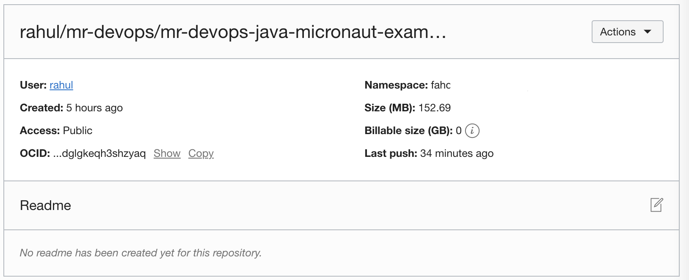

- Set policies & create a devops project - https://docs.oracle.com/en-us/iaas/Content/devops/using/home.htm.

- Create an OCI devops build pipeline. https://docs.oracle.com/en-us/iaas/Content/devops/using/create_buildpipeline.htm 

- Create a OCI Connection with GITHUB using the PAT or move the code to OCI code repo. - https://docs.oracle.com/en-us/iaas/Content/devops/using/managing_coderepo.htm 

- We need a code repo to build the managed build stage inside an OCI build pipeline.

- You may change the  `gradle version` to latest by updating the values in the file [gradle.properties.](gradle.properties)

- Add a managed build statge to the build pipeline. - 

https://docs.oracle.com/en-us/iaas/Content/devops/using/add_buildstage.htm#add_buildstage 

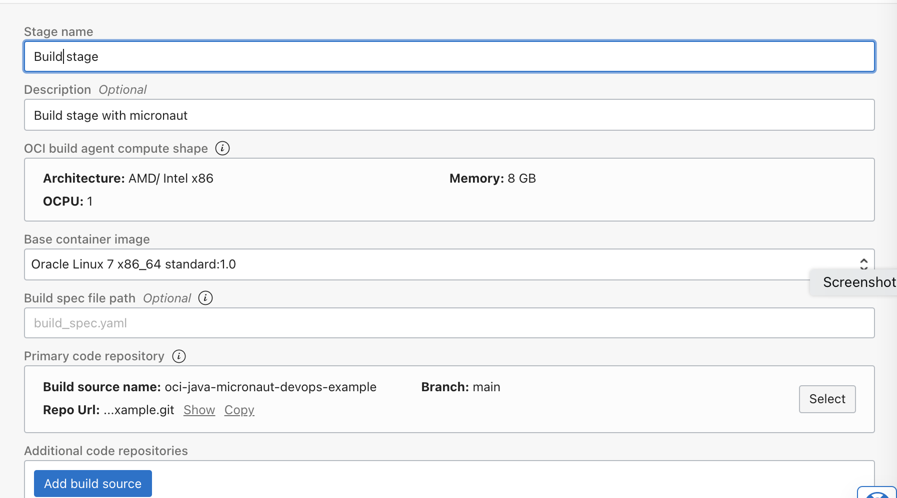

- Create Artifacts - one with the container repo URL and another one for the deployment spec (deployment_spec.yaml). - https://docs.oracle.com/en-us/iaas/Content/devops/using/artifacts.htm 


- Add a deliver artifact stage to the OCI deployment using the artifact reference (with OCI container repo). - https://docs.oracle.com/en-us/iaas/Content/devops/using/add_deliverartifact.htm 


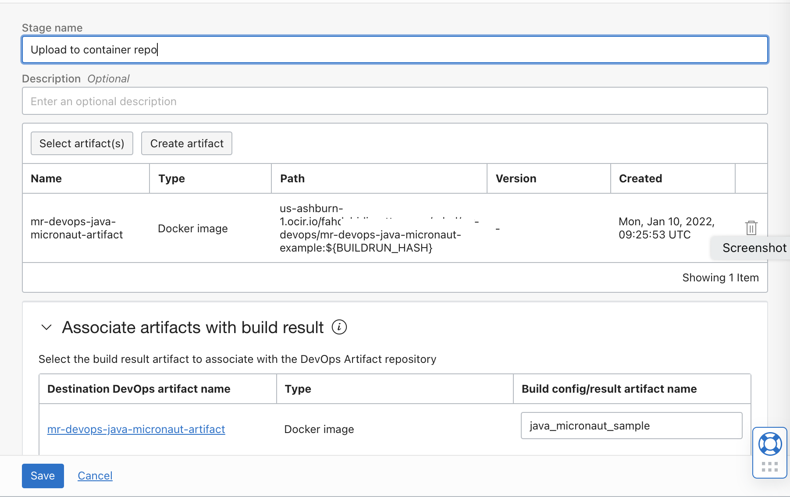


- Create an OKE cluster ,or ensure you have one to use for the deployment. https://docs.oracle.com/en-us/iaas/Content/ContEng/home.htm 

- Create an OCI Devops enviroment with OKE cluster. - https://docs.oracle.com/en-us/iaas/Content/devops/using/environments.htm

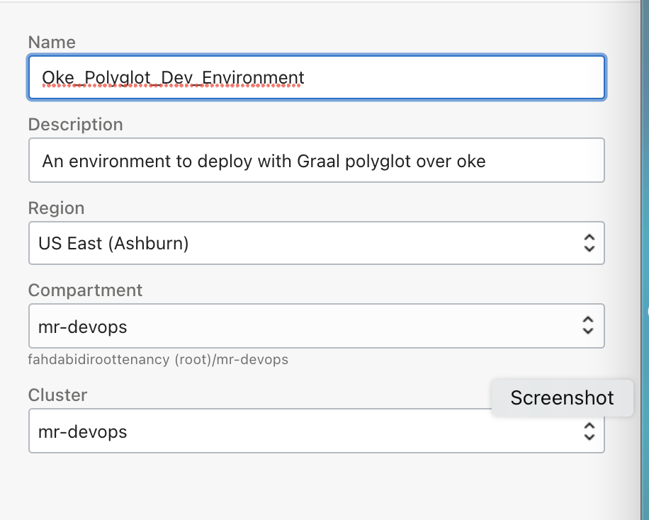

- Create a OCI deployment pipeline  using the OKE cluster enviroment and the artifact (kubernetes manifest) created.

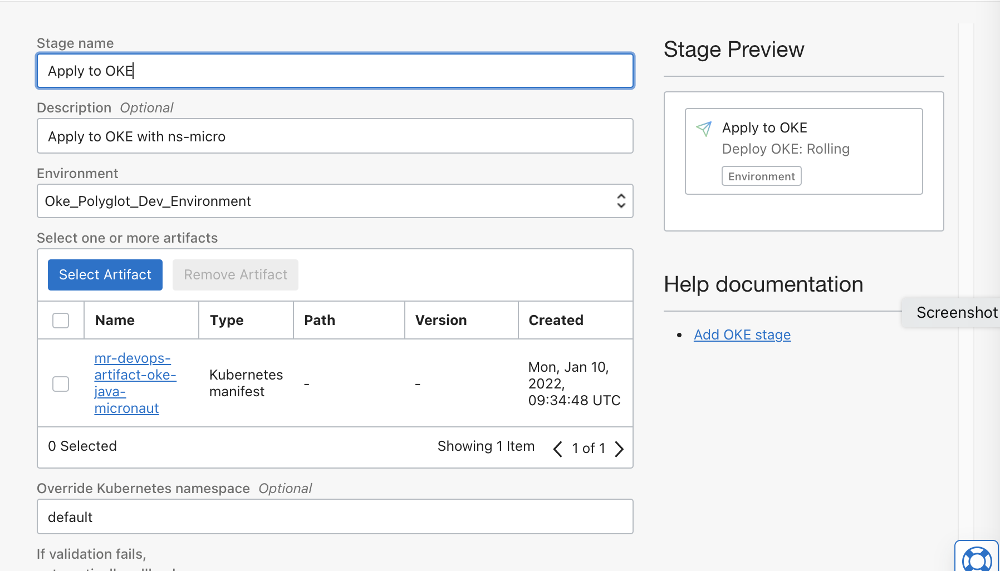

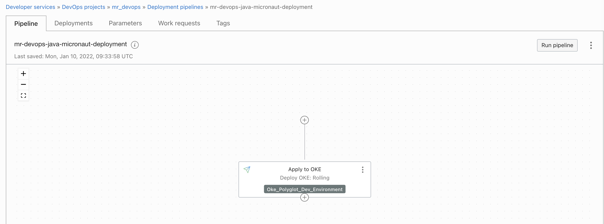

- Ensure to add below deployment parameters for the deployment pipeline.

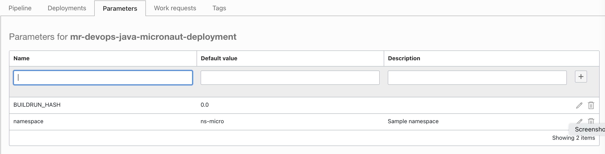

- Connect the deployment pipeline with build pipeline by adding Invoke deployment stage to the existing OCI build pipeline.

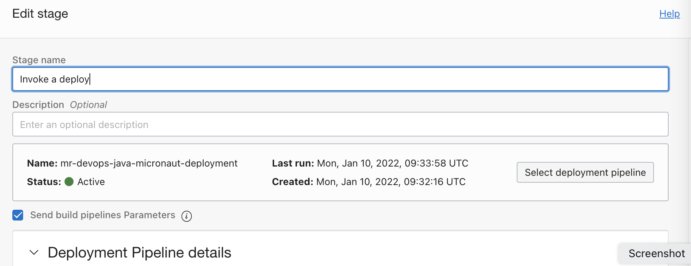


- Final view of our build pipeline is as below .

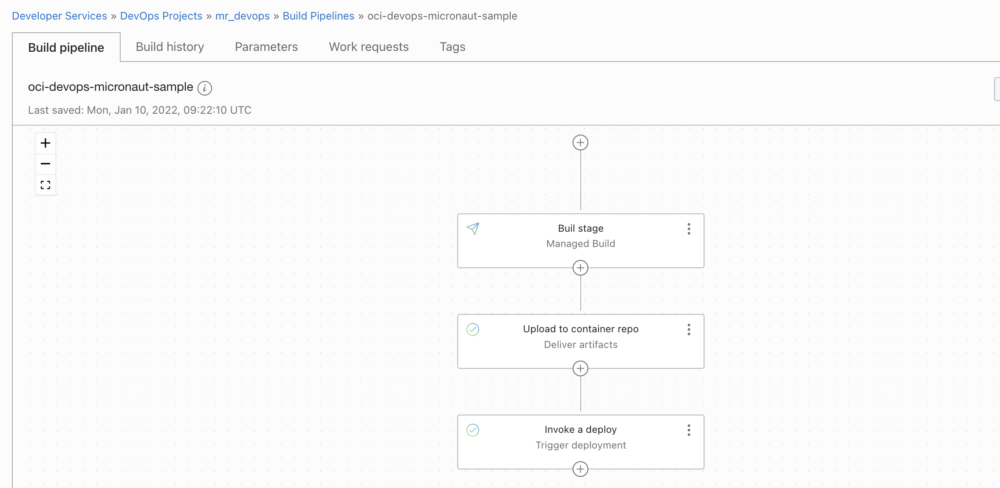


- Do a test Run via `Build pipeline` >`Manual Run`. 

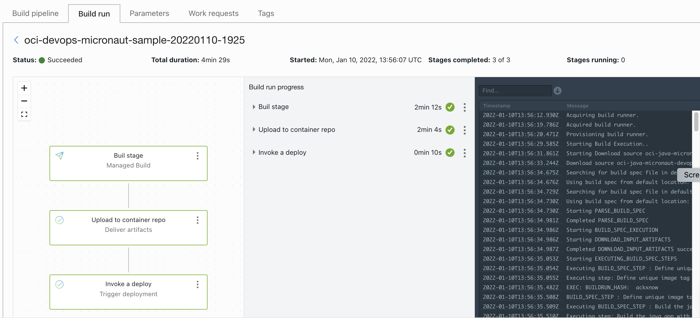

- Connect to the OKE and fetch the Loadbalancer IP to validate the application .

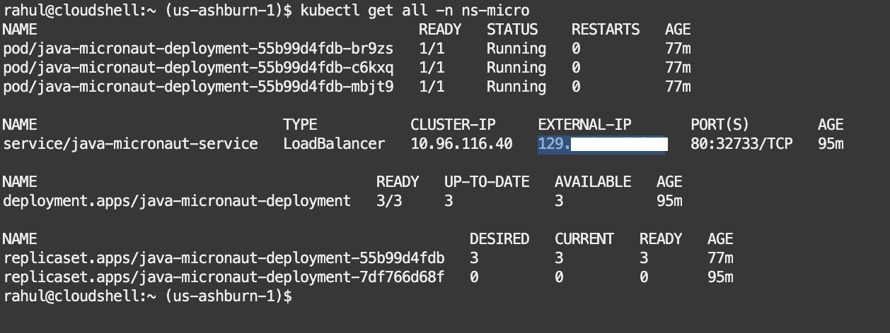

- Launch a browser and use the URL http://< Loadbalancer IP >/hello


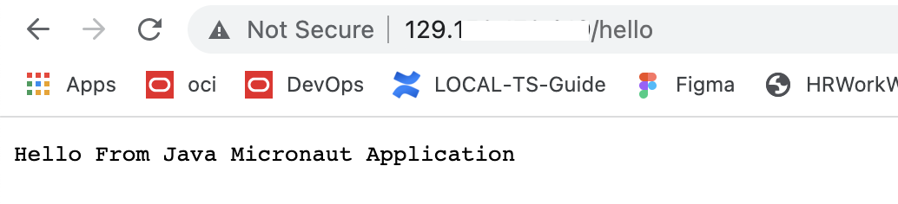

- You can validate the execution via build logs too 

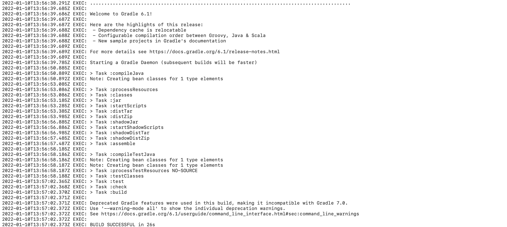

Contributors 
===========

- Author : Rahul M R.
- Colloboroators : NA
- Last release : Feb 2022


### Back to examples.
----

- 🍿 [Back to OCI Devops Pipeline sample](./../README.md)
- 🏝️ [Back to OCI Devops sample](./../../README.md)


